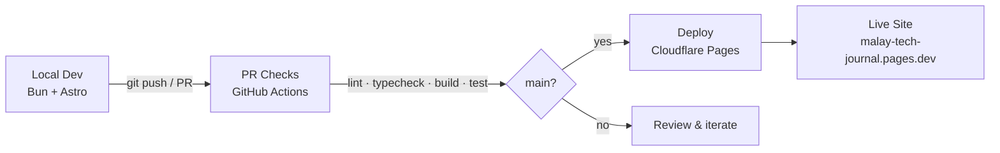

# Malay Tech Journal

**Bilingual (Bahasa Melayu / English) technical blog** covering cloud security,
AI guardrail engineering, and regional defence tech for Malaysian engineers.

🌐 **Live site:** https://malay-tech-journal.pages.dev/

---

## Tech stack

| Layer                     | Technology                            |
| ------------------------- | ------------------------------------- |
| Framework                 | Astro v7 (static output)              |
| Styling                   | Tailwind CSS v4 + daisyUI v5          |
| Runtime / package manager | Bun ≥ 1.1.0                           |
| Language                  | TypeScript (strict)                   |
| Hosting                   | Cloudflare Pages                      |
| Search                    | Pagefind (static index)               |
| Comments                  | Giscus (GitHub Discussions, optional) |

## Quickstart

```bash
bun install
bun run dev        # http://localhost:4321
bun run build      # production build → dist/
bun run typecheck  # type-check only
bun run lint       # ESLint (zero-warnings policy)
```

## Pipeline



## Internationalisation (i18n)

Malay Tech Journal is bilingual: **Bahasa Melayu (`ms`)** and **English (`en`)**.

### Routing model

| Locale                             | URL pattern          | Example              |
| ---------------------------------- | -------------------- | -------------------- |
| Bahasa Melayu (`ms`) — **default** | Root, no prefix      | `/posts/my-post/`    |
| English (`en`)                     | Prefixed with `/en/` | `/en/posts/my-post/` |

The default locale (`ms`) serves at the URL root (`routing.prefixDefaultLocale: false`
in `astro.config.mjs`). Source-of-truth: `src/config.ts` → `SITE.defaultLocale`.

### Adding a locale

1. Add the locale code to `SITE.locales` in `src/config.ts`.
2. Create `src/content/posts/<locale>/` and `src/content/pages/<locale>/`.
3. Add UI strings in `src/i18n/ui.ts`.
4. Run `bun run build` and verify routes.

### Locale helpers (`src/i18n/`)

| Helper                        | Purpose                             |
| ----------------------------- | ----------------------------------- |
| `localePrefix(locale)`        | `''` for default, `'/en'` otherwise |
| `localizedPath(path, locale)` | Prepends correct prefix             |
| `formatDate(date, locale)`    | Locale-aware date formatting        |
| `t(key, locale)`              | UI string lookup                    |

## Deployment

Deployed to **Cloudflare Pages** via Wrangler CLI. Build artifacts come from
`bun run build` → `dist/`. Helper scripts (`deploy.sh`, `new-post.sh`,
`cover_gen.py`) live in the parent `tech-journal/` folder.

## License

MIT — see [LICENSE](./LICENSE).
Original theme ([chirping-astro](https://github.com/kannansuresh/chirping-astro))
also MIT-licensed.
