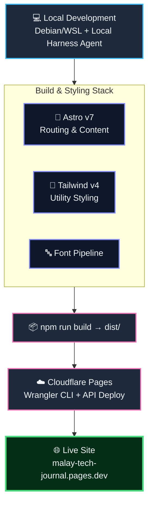

# Malay Tech Journal

Source for **Malay Tech Journal** — a bilingual language but mainly
Bahasa Melayu technical blog covering cloud security, AI guardrail
engineering, and military AI/defence topics for Malaysian engineers.

This project also serves as a case study in local harness agent
capability — testing whether a fully static, production-ready web
project can be scaffolded, built, and deployed end-to-end using 100%
natural-language prompts, without touching any IDE platform.

🌐 **Live site:** https://malay-tech-journal.pages.dev/

---

## About

This is a bilingual technical journal built for Malaysian engineers,
with a focus on:

- Cloud security (CSPM, CWPP, IAM hardening, multi-cloud posture)
- AI guardrail engineering and red-teaming (prompt injection, jailbreak
  defenses)
- Military AI and regional defence tech (drone warfare, JADC2,
  Malaysia/ASEAN defence policy)

## Inspired by

Astro v7 theme created by [kannansuresh](https://github.com/kannansuresh).
The theme provided the original Astro + Tailwind + daisyUI foundation
(i18n routing, Pagefind search, Giscus comments, KaTeX, Expressive
Code), which I have since modified and customized myself for Malay
Tech Journal's agentic web development content, branding, and
deployment pipeline.

## Tech stack

- Astro v7
- Tailwind CSS v4
- Bun / TypeScript
- Cloudflare Pages / Wrangler CLI for hosting
- Custom cover image generation (Python + Pillow) — see parent
  `tech-journal/` tooling folder

## Workflow



## Getting started

```bash
bun install
bun run dev
```

## Building

```bash
bun run build
```

## Internationalisation (i18n)

Malay Tech Journal is bilingual: **Bahasa Melayu (`ms`)** and **English (`en`)**.

### Routing model

| Locale                             | URL pattern          | Example              |
| ---------------------------------- | -------------------- | -------------------- |
| Bahasa Melayu (`ms`) — **default** | Root, no prefix      | `/posts/my-post/`    |
| English (`en`)                     | Prefixed with `/en/` | `/en/posts/my-post/` |

The default locale (`ms`) is served at the URL root with **no path prefix** because
`routing.prefixDefaultLocale: false` is set in `astro.config.mjs`. English content
lives under `/en/...`.

Source-of-truth: `src/config.ts` → `SITE.defaultLocale` (`'ms'`) and `SITE.locales`
(`['ms', 'en']`).

### Adding or switching a locale

1. Add the new locale code to `SITE.locales` in `src/config.ts`.
2. Create a matching content folder: `src/content/posts/<locale>/` and
   `src/content/pages/<locale>/`.
3. Add UI strings for the new locale in `src/i18n/ui.ts`.
4. If making it the default, update `SITE.defaultLocale` and adjust
   `routing.prefixDefaultLocale` in `astro.config.mjs` accordingly.
5. Run `bun run build` and verify all routes resolve correctly.

### Locale helpers

| Helper                        | File                | Purpose                                            |
| ----------------------------- | ------------------- | -------------------------------------------------- |
| `localePrefix(locale)`        | `src/i18n/utils.ts` | Returns `''` for default locale, `'/en'` otherwise |
| `localizedPath(path, locale)` | `src/i18n/utils.ts` | Prepends the correct prefix                        |
| `formatDate(date, locale)`    | `src/i18n/utils.ts` | Locale-aware date formatting                       |
| `t(key, locale)`              | `src/i18n/index.ts` | Returns the UI string for `key` in `locale`        |

## Deployment

Deployed to Cloudflare Pages. Build, deploy, and cleanup are handled
by helper scripts one level up in the parent `tech-journal/` folder
(`deploy.sh`, `new-post.sh`, `cover_gen.py`).

## License

MIT — see [LICENSE](./LICENSE). Original theme also MIT-licensed by
kannansuresh.

## Acknowledgements

This project's underlying theme, chirping-astro, was itself inspired
by the [Chirpy Jekyll theme](https://chirpy.cotes.page/) for its
design language.
