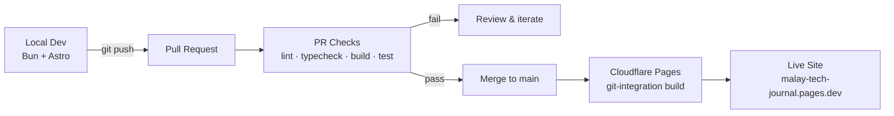

# Malay Tech Journal

[](https://github.com/arifbazli/malay-tech-journal/actions/workflows/deploy.yml)
[](https://github.com/arifbazli/malay-tech-journal/actions/workflows/pr-checks.yml)
[](./LICENSE)

**Bilingual (Bahasa Melayu / English) technical blog** covering cloud security,
AI guardrail engineering, and regional defence tech for Malaysian engineers.
Built entirely through prompt-driven development on a Debian WSL environment
running the Local Agent Harness — no manual IDE work.

🌐 **Live site:** https://malay-tech-journal.pages.dev/

---

## Features

- 🌓 Dark-only theme with purpose-built design tokens (no daisyUI dependency)
- 🌐 Full bilingual routing (Bahasa Melayu / English) with locale-aware dates and hreflang
- 🔍 Pagefind static search — no external service, no runtime cost
- 💬 Optional Giscus comments (GitHub Discussions-backed)
- 🖼️ Automatic Open Graph image generation via Satori, per post
- 🧮 Opt-in KaTeX math and Mermaid diagram rendering
- 📖 Reading time, tags, categories, series navigation, and RSS per locale
- ✅ Strict TypeScript, zero-warning ESLint, Prettier, and markdownlint enforced in CI

## Tech stack

| Layer                     | Technology                                 |
| ------------------------- | ------------------------------------------ |
| Framework                 | Astro v7 (static output)                   |
| Styling                   | Tailwind CSS v4 (dark-only, custom tokens) |
| Runtime / package manager | Bun ≥ 1.1.0                                |
| Language                  | TypeScript (strict)                        |
| Hosting                   | Cloudflare Pages                           |
| Search                    | Pagefind (static index)                    |
| Comments                  | Giscus (GitHub Discussions, optional)      |
| OG images                 | Satori + resvg (auto-generated per post)   |

## Quickstart

```bash
bun install
bun run dev        # http://localhost:4321
bun run build      # production build → dist/
bun run preview    # serve dist/ locally (search only works here, not in dev)
bun run typecheck  # type-check only
bun run lint       # ESLint (zero-warnings policy)
bun run format     # Prettier — auto-fix formatting
```

> Full contributor setup, environment variables, and architecture notes live
> in [AGENTS.md](./AGENTS.md).

## Pipeline



`PR Checks` (`pr-checks.yml`) runs on every PR and push to `main`, and gates
merges via required status checks. The live site is built and published by
**Cloudflare Pages' own git integration** — it watches `main` directly and is
not triggered by, or dependent on, GitHub Actions. A separate `deploy.yml`
workflow builds the same site for GitHub Pages on every push to `main`, but
its publish step only fires if GitHub Pages is enabled on this repo (it
currently is not) — so today it validates the build without publishing
anywhere.

## Internationalisation (i18n)

Malay Tech Journal is bilingual: **Bahasa Melayu (`ms`)** and **English (`en`)**.

### Routing model

| Locale                             | URL pattern          | Example              |
| ---------------------------------- | -------------------- | -------------------- |
| Bahasa Melayu (`ms`) — **default** | Root, no prefix      | `/posts/my-post/`    |
| English (`en`)                     | Prefixed with `/en/` | `/en/posts/my-post/` |

The default locale (`ms`) serves at the URL root (`routing.prefixDefaultLocale: false`
in `astro.config.mjs`). Source-of-truth: `src/config.ts` → `SITE.defaultLocale`.

### Adding a locale

1. Add the locale code to `SITE.locales` in `src/config.ts`.
2. Create `src/content/posts/<locale>/` and `src/content/pages/<locale>/`.
3. Add UI strings in `src/i18n/ui.ts`.
4. Run `bun run build` and verify routes.

### Locale helpers (`src/i18n/`)

| Helper                        | Purpose                             |
| ----------------------------- | ----------------------------------- |
| `localePrefix(locale)`        | `''` for default, `'/en'` otherwise |
| `localizedPath(path, locale)` | Prepends correct prefix             |
| `formatDate(date, locale)`    | Locale-aware date formatting        |
| `t(key, locale)`              | UI string lookup                    |

## Writing a post

Posts live under `src/content/posts/<locale>/<slug>.md` (or `.mdx`). Minimum
required frontmatter:

```yaml
---
title: 'Post title'
description: 'One-sentence summary shown in listings and meta tags.'
pubDate: 2026-01-01
---
```

Pair translations across locales with a shared `translationKey`. See
[AGENTS.md](./AGENTS.md) for the full frontmatter reference (tags,
categories, hero images, `math`, `pinned`, `unlisted`, and more).

## Deployment

**Cloudflare Pages** is the canonical, live deployment — it's connected
directly to this repo's `main` branch via Cloudflare's own git integration
and builds independently of GitHub Actions.

A separate GitHub Actions workflow (`.github/workflows/deploy.yml`) builds
the same site for GitHub Pages on every push to `main`, as a build-health
check and optional secondary target. Its publish step only runs if GitHub
Pages is enabled on the repo (**Settings → Pages**); until then it verifies
the build succeeds without publishing anywhere. Both targets consume the
same `bun run build` → `dist/` output — no separate build config to
maintain.

## Contributing

See [CONTRIBUTING.md](./CONTRIBUTING.md) for setup, coding standards, and PR
expectations. Please review [CODE_OF_CONDUCT.md](./CODE_OF_CONDUCT.md) and
report security issues per [SECURITY.md](./SECURITY.md) rather than filing a
public issue.

## License

MIT — see [LICENSE](./LICENSE).
Original theme ([chirping-astro](https://github.com/kannansuresh/chirping-astro))
also MIT-licensed.
