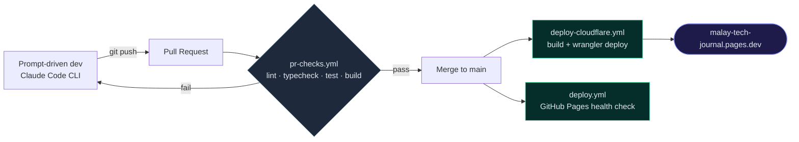

# Malay Tech Journal

Bilingual (Bahasa Melayu / English) blog on cloud security, AI guardrail
engineering, and regional defence tech. Built solo via prompt-driven
development with the Claude Code CLI — no manual IDE edits.

🌐 **Live:** <https://malay-tech-journal.pages.dev/>

## Stack

| Layer     | Technology                 |
| --------- | -------------------------- |
| Framework | Astro v7 (static output)   |
| Styling   | Tailwind CSS v4, dark-only |
| Runtime   | Bun ≥ 1.1.0                |
| Language  | TypeScript (strict)        |
| Hosting   | Cloudflare Pages           |
| Search    | Pagefind (static index)    |
| Comments  | Giscus (optional)          |

Also: auto-generated OG images per post, opt-in KaTeX math and Mermaid
diagrams, per-locale RSS, and a zero-warning ESLint/Prettier/markdownlint CI gate.

## Quickstart

```bash
bun install
bun run dev        # http://localhost:4321
bun run build      # → dist/
bun run preview    # serve dist/ (search only works here, not in dev)
```

Architecture, config reference, and full contributor guide: [AGENTS.md](./AGENTS.md).

## Content

Posts live in `src/content/posts/<locale>/<slug>.md`, one folder per locale
(`ms` default, `en` at `/en/`):

```yaml
---
title: 'Post title'
description: 'One-sentence summary for listings and meta tags.'
pubDate: 2026-01-01
---
```

Pair translations with a matching `translationKey`. Full i18n and
frontmatter reference: [AGENTS.md](./AGENTS.md).

## Pipeline



Cloudflare Pages (`deploy-cloudflare.yml`) is the canonical, live deploy via
Wrangler; `deploy.yml` builds the same site for GitHub Pages as a secondary
health check (not currently published). One-time Cloudflare setup:
[AGENTS.md](./AGENTS.md#cloudflare-pages-one-time-setup).

## Contributing

See [CONTRIBUTING.md](./CONTRIBUTING.md) for setup and PR expectations, and
[SECURITY.md](./SECURITY.md) to report vulnerabilities privately.

## License

MIT — see [LICENSE](./LICENSE). Original theme
([chirping-astro](https://github.com/kannansuresh/chirping-astro)) also
MIT-licensed.
