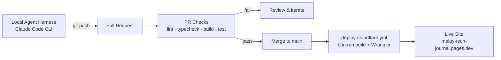
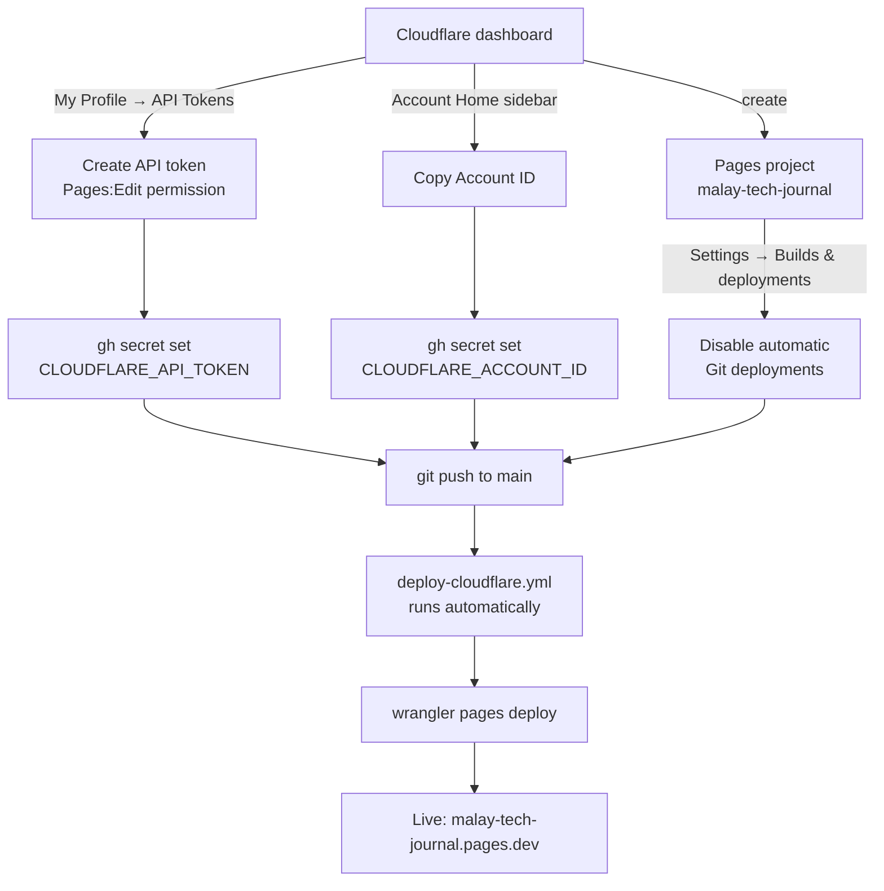

# Malay Tech Journal

**Bilingual (Bahasa Melayu / English) technical blog** covering cloud security,
AI guardrail engineering, and regional defence tech for Malaysian engineers.
Built entirely through prompt-driven development on a Debian WSL environment
running the Local Agent Harness — no manual IDE work.

🌐 **Live site:** https://malay-tech-journal.pages.dev/

---

## Features

- 🌓 Dark-only theme with purpose-built design tokens (no daisyUI dependency)
- 🌐 Full bilingual routing (Bahasa Melayu / English) with locale-aware dates and hreflang
- 🔍 Pagefind static search — no external service, no runtime cost
- 💬 Optional Giscus comments (GitHub Discussions-backed)
- 🖼️ Automatic Open Graph image generation via Satori, per post
- 🧮 Opt-in KaTeX math and Mermaid diagram rendering
- 📖 Reading time, tags, categories, series navigation, and RSS per locale
- ✅ Strict TypeScript, zero-warning ESLint, Prettier, and markdownlint enforced in CI

## Tech stack

| Layer                     | Technology                                 |
| ------------------------- | ------------------------------------------ |
| Framework                 | Astro v7 (static output)                   |
| Styling                   | Tailwind CSS v4 (dark-only, custom tokens) |
| Runtime / package manager | Bun ≥ 1.1.0                                |
| Language                  | TypeScript (strict)                        |
| Hosting                   | Cloudflare Pages                           |
| Search                    | Pagefind (static index)                    |
| Comments                  | Giscus (GitHub Discussions, optional)      |
| OG images                 | Satori + resvg (auto-generated per post)   |

## Quickstart

```bash
bun install
bun run dev        # http://localhost:4321
bun run build      # production build → dist/
bun run preview    # serve dist/ locally (search only works here, not in dev)
bun run typecheck  # type-check only
bun run lint       # ESLint (zero-warnings policy)
bun run format     # Prettier — auto-fix formatting
```

> Full contributor setup, environment variables, and architecture notes live
> in [AGENTS.md](./AGENTS.md).

## Pipeline



Every change starts in the **Local Agent Harness** (Claude Code CLI, run
from a Debian WSL environment) — code is written, reviewed, and pushed from
there, never edited directly on GitHub. `PR Checks` (`pr-checks.yml`) then
runs on every PR and push to `main`, gating merges via required status
checks. On merge, `deploy-cloudflare.yml` builds the site and publishes it
with `wrangler pages deploy`, authenticated via the `CLOUDFLARE_API_TOKEN`
and `CLOUDFLARE_ACCOUNT_ID` repository secrets (see [Setting up the
Cloudflare deploy from scratch](#setting-up-the-cloudflare-deploy-from-scratch)
below for one-time setup). Cloudflare Pages' own Git integration is intentionally
**not** used for this project — auto-deploy must stay off in the Cloudflare
dashboard (**Pages → malay-tech-journal → Settings → Builds &
deployments**), or every merge would trigger two competing deploys of the
same project.

A separate `deploy.yml` workflow builds the same site for GitHub Pages on
every push to `main`, but its publish step only fires if GitHub Pages is
enabled on this repo (it currently is not) — so today it validates the
build without publishing anywhere.

## Internationalisation (i18n)

Malay Tech Journal is bilingual: **Bahasa Melayu (`ms`)** and **English (`en`)**.

### Routing model

| Locale                             | URL pattern          | Example              |
| ---------------------------------- | -------------------- | -------------------- |
| Bahasa Melayu (`ms`) — **default** | Root, no prefix      | `/posts/my-post/`    |
| English (`en`)                     | Prefixed with `/en/` | `/en/posts/my-post/` |

The default locale (`ms`) serves at the URL root (`routing.prefixDefaultLocale: false`
in `astro.config.mjs`). Source-of-truth: `src/config.ts` → `SITE.defaultLocale`.

### Adding a locale

1. Add the locale code to `SITE.locales` in `src/config.ts`.
2. Create `src/content/posts/<locale>/` and `src/content/pages/<locale>/`.
3. Add UI strings in `src/i18n/ui.ts`.
4. Run `bun run build` and verify routes.

### Locale helpers (`src/i18n/`)

| Helper                        | Purpose                             |
| ----------------------------- | ----------------------------------- |
| `localePrefix(locale)`        | `''` for default, `'/en'` otherwise |
| `localizedPath(path, locale)` | Prepends correct prefix             |
| `formatDate(date, locale)`    | Locale-aware date formatting        |
| `t(key, locale)`              | UI string lookup                    |

## Writing a post

Posts live under `src/content/posts/<locale>/<slug>.md` (or `.mdx`). Minimum
required frontmatter:

```yaml
---
title: 'Post title'
description: 'One-sentence summary shown in listings and meta tags.'
pubDate: 2026-01-01
---
```

Pair translations across locales with a shared `translationKey`. See
[AGENTS.md](./AGENTS.md) for the full frontmatter reference (tags,
categories, hero images, `math`, `pinned`, `unlisted`, and more).

## Deployment

**Cloudflare Pages** is the canonical, live deployment. Publishing runs
through `.github/workflows/deploy-cloudflare.yml`: on every push to `main`,
it builds with `bun run build` and deploys the `dist/` output using
[Wrangler](https://developers.cloudflare.com/workers/wrangler/), Cloudflare's
own CLI, authenticated via repository secrets — never Cloudflare's Git
integration, which is intentionally disabled to avoid a double-deploy race.

A separate GitHub Actions workflow (`.github/workflows/deploy.yml`) builds
the same site for GitHub Pages on every push to `main`, as a build-health
check and optional secondary target. Its publish step only runs if GitHub
Pages is enabled on the repo (**Settings → Pages**); until then it verifies
the build succeeds without publishing anywhere. All targets consume the
same `bun run build` → `dist/` output — no separate build config to
maintain.

### Setting up the Cloudflare deploy from scratch

Follow this once per Cloudflare account/repo pairing. All steps run in your
own terminal or the GitHub/Cloudflare web UI — none of this touches code.



1. **Create the Cloudflare Pages project** (skip if it already exists).
   In the Cloudflare dashboard, go to **Workers & Pages → Create → Pages**
   and name the project `malay-tech-journal` — the name must match
   `--project-name` in `deploy-cloudflare.yml`'s deploy step.

2. **Disable Cloudflare's own Git integration**, if the project was ever
   connected to this repo through the dashboard. Go to the project's
   **Settings → Builds & deployments** and turn off automatic deployments
   (or disconnect the GitHub source entirely). This is required — if both
   Cloudflare's Git integration and this repo's `deploy-cloudflare.yml` are
   live at once, every push to `main` triggers two competing deploys of the
   same project.

3. **Create a Cloudflare API token.** Go to
   [**My Profile → API Tokens**](https://dash.cloudflare.com/profile/api-tokens)
   → **Create Token**, and scope it to **Account → Cloudflare Pages →
   Edit** (a pre-built template covering this may also be offered) —
   Wrangler only needs permission to deploy Pages projects, nothing
   broader. Exact template names in Cloudflare's UI may change over time;
   the permission that matters is Pages edit access on this account.

   > ⚠️ Never paste the token itself into a chat, issue, PR, or commit.
   > Treat any token that's been pasted somewhere outside the two places
   > below as compromised, and roll it immediately from the same
   > **API Tokens** page.

4. **Add the token as a GitHub Actions secret.** From the repo root, run:

   ```bash
   gh secret set CLOUDFLARE_API_TOKEN --repo arifbazli/malay-tech-journal
   ```

   This prompts for the token privately (input isn't echoed) and sends it
   straight to GitHub's encrypted secret store — `gh` never writes it to
   disk or shell history, and it never appears in this repo's code.

5. **Add the Cloudflare Account ID as a second secret.** It's visible on
   the Cloudflare dashboard's **Account Home** page (right-hand sidebar) or
   via `wrangler whoami` if Wrangler is already authenticated locally.
   Account IDs identify the account but don't grant access on their own —
   treating it as a secret alongside the token is simply the more
   conservative default:

   ```bash
   gh secret set CLOUDFLARE_ACCOUNT_ID --repo arifbazli/malay-tech-journal
   ```

6. **Verify both secrets exist** (this only confirms presence, never
   reveals values):

   ```bash
   gh secret list --repo arifbazli/malay-tech-journal
   ```

   Expect to see both `CLOUDFLARE_API_TOKEN` and `CLOUDFLARE_ACCOUNT_ID`
   listed.

7. **Trigger a deploy.** Either push any change to `main`, or run the
   workflow on demand without waiting for a commit:

   ```bash
   gh workflow run deploy-cloudflare.yml --repo arifbazli/malay-tech-journal
   ```

8. **Watch it run and confirm success:**

   ```bash
   gh run watch --repo arifbazli/malay-tech-journal --exit-status
   ```

   A successful run ends with Wrangler printing
   `✨ Deployment complete!` and a preview URL. The production alias
   (`https://malay-tech-journal.pages.dev`) updates within a few seconds —
   confirm by checking that a hashed asset filename (e.g.
   `/_astro/BaseLayout.*.css`) changed from before the deploy.

From here on, this setup is permanent: every future merge to `main`
repeats steps 7–8 automatically, with no manual steps required.

## Contributing

See [CONTRIBUTING.md](./CONTRIBUTING.md) for setup, coding standards, and PR
expectations. Please review [CODE_OF_CONDUCT.md](./CODE_OF_CONDUCT.md) and
report security issues per [SECURITY.md](./SECURITY.md) rather than filing a
public issue.

## License

MIT — see [LICENSE](./LICENSE).
Original theme ([chirping-astro](https://github.com/kannansuresh/chirping-astro))
also MIT-licensed.
