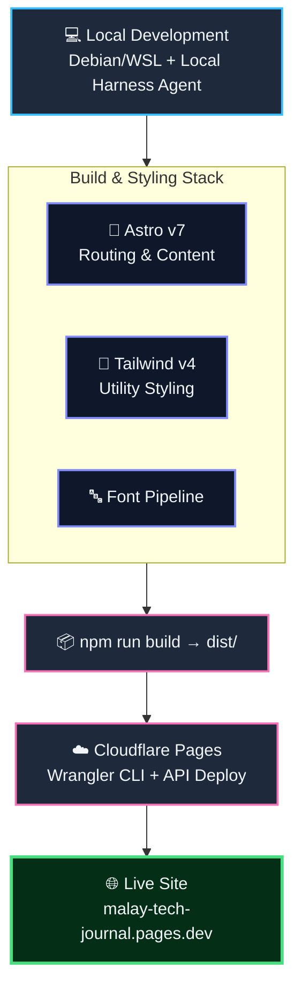

# Malay Tech Journal

Source for **Malay Tech Journal** — a Bahasa Malaysia technical blog
covering cloud security, AI guardrail engineering, and military
AI/defence topics for Malaysian engineers.

🌐 **Live site:** https://malay-tech-journal.pages.dev/

---

## About

This is a bilingual technical journal built for Malaysian engineers,
with a focus on:

- Cloud security (CSPM, CWPP, IAM hardening, multi-cloud posture)
- AI guardrail engineering and red-teaming (prompt injection, jailbreak
  defenses)
- Military AI and regional defence tech (drone warfare, JADC2,
  Malaysia/ASEAN defence policy)

## Inspired by

Astro v7 theme created by [kannansuresh](https://github.com/kannansuresh).
The theme provided the original Astro + Tailwind + daisyUI foundation
(i18n routing, Pagefind search, Giscus comments, KaTeX, Expressive
Code), which I have since modified and customized myself for Malay
Tech Journal's agentic web development content, branding, and
deployment pipeline.

## Tech stack

- Astro v7
- Tailwind CSS v4
- Bun / TypeScript
- Cloudflare Pages / Wrangler CLI for hosting
- Custom cover image generation (Python + Pillow) — see parent
  `tech-journal/` tooling folder

## Workflow



## Getting started

```bash
bun install
bun run dev
```

## Building

```bash
bun run build
```

## Deployment

Deployed to Cloudflare Pages. Build, deploy, and cleanup are handled
by helper scripts one level up in the parent `tech-journal/` folder
(`deploy.sh`, `new-post.sh`, `cover_gen.py`).

## License

MIT — see [LICENSE](./LICENSE). Original theme also MIT-licensed by
kannansuresh.

## Acknowledgements

This project's underlying theme, chirping-astro, was itself inspired
by the [Chirpy Jekyll theme](https://chirpy.cotes.page/) for its
design language.
