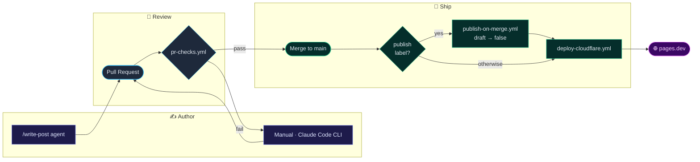

# Malay Tech Journal

Bilingual (Bahasa Melayu / English) blog on cloud security, AI guardrails,
and regional defence tech. Built via prompt-driven development — multiple
CLI coding agents and harnesses, no manual IDE edits.

🌐 **Live:** <https://malay-tech-journal.pages.dev/>

## Stack

| Layer     | Technology                 |
| --------- | -------------------------- |
| Framework | Astro v7 (static output)   |
| Styling   | Tailwind CSS v4, dark-only |
| Runtime   | Bun ≥ 1.1.0                |
| Language  | TypeScript (strict)        |
| Hosting   | Cloudflare Pages           |
| Search    | Pagefind (static index)    |
| Comments  | Giscus (optional)          |

## Quickstart

```bash
bun install
bun run dev      # http://localhost:4321
bun run build    # → dist/
bun run preview  # serve dist/ (search only works here, not in dev)
```

## Content

Posts: `src/content/posts/<locale>/<slug>.md` (`ms` default, `en` at
`/en/`), paired across locales by `translationKey`. New posts can also
come from the `/write-post` agent pipeline (research → draft → PR,
`draft: true`). Full schema and i18n reference: [AGENTS.md](./AGENTS.md).

## Pipeline



Every PR runs full CI; merging always deploys via Wrangler, but a content
PR only goes _live_ if it carried the `publish` label first. Setup:
[AGENTS.md](./AGENTS.md#cloudflare-pages-one-time-setup).

## More

- [AGENTS.md](./AGENTS.md) — architecture, config, and content schema
- [CONTRIBUTING.md](./CONTRIBUTING.md) · [SECURITY.md](./SECURITY.md) · [LICENSE](./LICENSE) (MIT)
