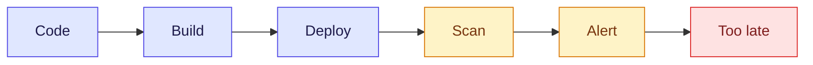
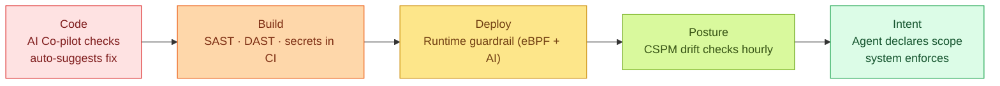
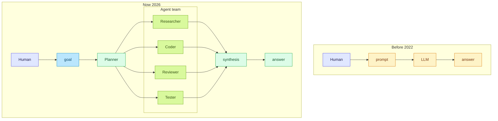
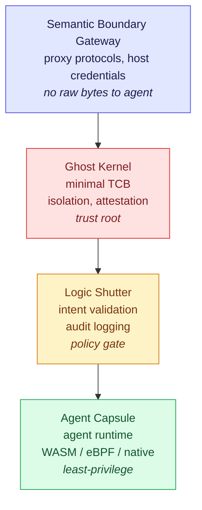

> Field notes. For Gen Z entering the world of cloud, AI, and security. July 2026 edition — with additions on **Agentic Operating Systems**, the latest trend everyone's talking about.

## Introduction

We're not living in the same era our older colleagues entered the industry five years ago. Back then, a Cloud Security Engineer needed to understand firewalls and that was enough. Now? AI has become an agent. Agents have become operating systems. And we need to secure things that no longer make human decisions.

These four trends are moving in parallel. Understand one but not the other three and you're already behind.

```
1. Cloud Security 2026  →  not just "patches and compliance"
2. AI Evolution 2026    →  from LLM to agent
3. Engineering Evolution → from prompt to agentic engineering
4. Agentic OS           →  a new OS designed for agents, not humans
```

Let's go through them one by one.

---

## 1. Cloud Security 2026 — not just "patches and compliance"

### Trend: **Shift-left + runtime AI guardrails + intent-driven posture**

The old security model looked like this:



Now:



What Gen Z needs to understand:

- **Identity is the new perimeter.** If an attacker has credentials, the perimeter is irrelevant. IAM, RBAC, and least-privilege beat firewalls.
- **Don't hard-code secrets.** Use Vault, AWS Secrets Manager, or Doppler. Tokens in `.env` pushed to GitHub = automatic breach.
- **Supply chain attacks are real.** SolarWinds, Log4Shell, xz-utils backdoor — all exploited your dependencies, not your code. SCA (Software Composition Analysis) is not optional.
- **AI guardrails at runtime** — modern CSPM platforms now have AI that learns your app's baseline, then alerts on anomalies. Not pattern-matching anymore — pattern-*learning*.
- **🆕 Intent-driven security** — instead of asking "what resources does this process access?", ask "**what is this process trying to do?**". This is the foundation of Agentic OS — we'll get into it in section 4.

### Tool stack Gen Z should learn (junior level)

| Layer | Example tool | Why it matters |
|---|---|---|
| IaC scan | Checkov, tfsec, Trivy | Scan Terraform/K8s at pre-commit |
| Container scan | Trivy, Snyk Container | Catch vulns in images |
| Runtime | Falco, Tetragon (eBPF) | Detect unusual syscalls in pods |
| CSPM | e.g. Wiz, Lacework, Orca | Multi-cloud posture |
| CIEM | e.g. CloudKnox, Sonrai | Least-privilege enforcement |
| Secret | Vault, Doppler, AWS Secrets Manager | No plaintext anywhere |
| 🆕 Agent observability | Langfuse, OpenTelemetry, Helicone | Trace what your agent does, debug when it wanders |

> 💡 **Smart start:** If you're just getting into security, **Checkov + Trivy** only. Both are free, lightweight, and run on your own laptop.

---

## 2. AI Evolution 2026 — from LLM to Agent

### What's changed?

Frontier models today aren't just "answer questions" — they've become **agents**:

| Generation | Characteristic | Example |
|---|---|---|
| GPT-3 era (2020) | Text completion | "Write an email" |
| ChatGPT era (2022) | Instruction-tuned, multi-turn | Can chat, code, summarize |
| Copilot era (2023) | Tool use, internet access | Can browse, execute code |
| Agent era (2024-2025) | Multi-step planning, self-correct | AutoGPT, Devin, Claude with tools |
| Multi-agent (2025-2026) | Agents collaborate, specialize, debate | Crew-style workflows, swarms |
| 🆕 Agent-native OS (2026) | OS-level support for agent runtime | Alibaba Anolis Agentic OS, Tencent AgenticOS research |

**What's changing fastest for Gen Z:**

- **Reasoning models** — o1, o3, DeepSeek-R1, Claude extended thinking. Models now **"think"** before answering. Can solve math/physics/cybersecurity reasoning that was impossible before.
- **Open-weight models going mainstream** — DeepSeek, Qwen, Llama 4 — all run on a laptop (MacBook M-series can run 70B quantized). Cloud lock-in is no longer absolute.
- **Context windows up to 1M tokens** — you can feed a full book, or an entire codebase, in a single prompt. The workflow of "paste the repo, ask for vulns" is now real.
- **Multimodal native** — text + image + audio + video in one model. You can give a UI screenshot and ask "is this phishing?".
- **🆕 Agents operating agents** — not just agents calling tools, but agents calling **sub-agents**, which call sub-sub-agents. Microsoft, Alibaba, and many startups are now building orchestration infra for this.

### Human + AI collaboration trend



**Gen Z reality:** you won't compete with AI. You compete with **other Gen Z who knows how to use AI**. Prompting is now *basic literacy*, like Excel in 2010.

---

## 3. Engineering Evolution — from Prompt to Agentic

This is the **most important part** to understand. Because the employment market has already shifted.

### Stage 1: **Prompt Engineering** (2022-2023)

You learned good prompt structure:
- Role prompting ("You are a senior security engineer...")
- Few-shot examples
- Chain-of-thought ("Think step by step")
- Negative prompting ("Don't use deprecated libraries")

This skill is **still relevant** but has become baseline. Anyone can copy-paste templates from Twitter.

### Stage 2: **Context Engineering** (2024)

Problem: LLMs forget, hallucinate, or fill up the context window.

Learn:
- RAG (Retrieval-Augmented Generation) — give LLM access to your database
- Prompt caching — to avoid paying for repeated tokens
- Token budgeting — context window management
- Memory patterns — short-term vs long-term

### Stage 3: **Tool Use / Function Calling** (2024-2025)

LLMs are no longer text-in-text-out. They can call functions:

```python
# You don't write code to answer questions.
# You write functions. LLM decides when to call them.

def get_aws_iam_policy(username: str) -> dict:
    """Get IAM policy for a user"""
    return iam_client.get_user_policy(UserName=username)

# LLM understands "user asked about user X's permissions" → call tool → give answer
```

New skills: **tool design, schema engineering, error handling for non-deterministic systems**.

### Stage 4: **Agentic Engineering** (2025-2026) — *where we are now*

Agent = LLM + memory + tools + planning + self-critique loop.

```python
# A real agent example
agent = Agent(
    goal="Audit this repo for security issues",
    llm=ClaudeOpus,
    tools=[read_file, run_checkov, grep_secrets, search_cve_db],
    memory=VectorStore(docs=repo_embeddings),
    planner=ReActPlanner(),       # think → act → observe → repeat
    critic=SelfCritiqueLoop(),    # "is my answer complete?"
    max_iterations=10
)
result = agent.run()
```

**Skills Gen Z needs for the agentic era:**

1. **System design for non-determinism** — you design guardrails, retry logic, observability for systems that **sometimes get it wrong**. Traditional engineering assumes deterministic components. Agents aren't.
2. **Evaluation & benchmarking** — how do you know your agent is "good"? LLM-as-judge, regression test sets, golden trajectories.
3. **Cost engineering** — agent loops can burn USD 50 per task. Know when to use Haiku vs Opus, what to cache, where to early-stop.
4. **Security for agents** — *prompt injection*, tool poisoning, excessive agency. An agent with 47 tools = 47 attack surfaces. OWASP Top 10 for LLM Applications is now required reading.
5. **Human-in-the-loop design** — when should an agent ask for confirmation? When can it auto-proceed? This isn't just UX — it's a security boundary.

### Stage 5: **Agentic OS Engineering** (2026-) — *where we're headed*

This is the **trend everyone's talking about right now** and the reason this post was updated. If steps 1-4 are about *building agents*, step 5 is about *building an OS for agents*. Details in section 4.

---

## 4. 🆕 Agentic OS — a new paradigm you need to understand

### Why is everyone suddenly talking about "operating systems"?

Because the problem with agents today isn't **"my agent isn't smart enough"**. The problem is:

```
"My agent is smart enough.
But when it escapes the sandbox, it can do things I didn't authorize."
```

Real example:

> You tell an agent: *"Summarize the experimental results from project X and send the summary to me."*
> What should happen: agent reads files from `project_x/`, summarizes, sends to you.
> What *can happen* if the agent is compromised: agent reads the files, exfiltrates to an external server, sends to the attacker, then summarizes for you.

**Old permission model (POSIX/Linux)**: "this process can access file A and network B". If an attacker controls that process, they can combine those capabilities to attack.

**Agentic OS model**: "this agent can only perform *task* T. It doesn't ask for file A or network B — the system decides what capabilities it needs based on the task declaration."

### What is an Agentic OS?

> **AgenticOS** = an operating system designed from the ground up for AI agents, not for humans typing commands.

The original concept comes from a Tencent Research paper (Jun 2026), and Alibaba's Anolis Agentic OS first release. The core idea:

**Traditional OS = resource manager.** Process requests file/socket/process, OS checks permission, grants or denies.
**Agentic OS = intent filter.** Agent declares *"I want to perform task T"*, OS synthesizes the least-capability environment sufficient for T alone.

### Four-layer AgenticOS architecture



Each layer has a specific job:
- **Ghost Kernel** — minimum trusted code. Isolation, scheduling, measurement. Doesn't expose device files or debugging interfaces. Kept small enough to be formally verified.
- **Logic Shutter** — validates agent intent against the declared Manifest. Issues capability tokens. Logs audit. Attaches information-flow labels to data.
- **Agent Capsule** — the actual runtime for agent code. Follows Manifest-Only Runtime: before starting, the agent submits a structured intent declaration. Capabilities outside the manifest don't exist in the capsule address space.
- **Semantic Boundary Gateway** — proxies all external protocols. The agent can't access raw byte streams, sockets, or pipes. Agent calls `FetchJSON(domain="github.com", path="/api/v1")` — the system handles TLS, DNS, connection pooling.

### Intent ABI — not POSIX anymore

**POSIX API** (old model): `open()`, `read()`, `write()`, `socket()`, `exec()`, `fork()`, `mmap()`...

**Intent ABI** (new model): `FetchJSON(domain, path, method)`, `UploadArtifact(target, data)`, `SendMessage(channel, content)`, `RunTask(intent, budget)`.

Intent ABI principles:
- **No raw byte streams** — the agent can't construct a TCP byte stream itself
- **No arbitrary execution** — `exec()` and `fork()` are banned. Toolchain capabilities decomposed into concrete semantic interfaces.
- **Reified capabilities** — network permission bound to 5-tuple ⟨domain, path_prefix, method, data_type, budget⟩
- **Auditable output** — every external effect = structured event, bound to Manifest + capability token
- **Constrained information flow** — input/output carry labels, policy engine analyzes source→sink paths

### What this means for Cloud Security

People are only now connecting the dots:

1. **CSPM will become intent-driven** — instead of "this EC2 instance has a public IP", ask "what does the agent running on this instance declare?". Microsoft Defender, Wiz, and other vendors are already building features like this.
2. **Cloud Security becomes policy-as-code for intent** — Manifests can be treated like Terraform plans, but for agent tasks. Review what the agent declares, approve before it runs.
3. **Audit trails become mandatory** — not just "who accessed what", but "why did this agent access this, for what task, which Manifest authorized it".
4. **Agent runtime becomes a first-class cloud workload** — same as VMs, containers, functions. Cloud providers will offer managed agent runtimes with AgenticOS primitives built-in. Alibaba Anolis Agentic OS has already released. AWS, Azure, GCP will likely follow.
5. **OWASP Top 10 for LLM Applications will merge with Cloud Security** — LLM01 (Prompt Injection), LLM06 (Excessive Agency), LLM08 (Vector and Embedding Weaknesses) — all already overlap with cloud security concerns.

### Current reality: lots of concepts, limited production

Honestly, AgenticOS is still **research-paper stage** for most teams. But:
- Alibaba Anolis Agentic OS has released a production preview
- Several agent frameworks (LangChain, AutoGen, CrewAI) are experimenting with Manifest-based capabilities
- eBPF + WASM sandboxing is mature and can serve as building blocks
- OWASP already has a working group on agentic security

**For Gen Z entering the industry**: you don't need to become a kernel engineer. But you need to **understand this paradigm shift** so that when your boss asks "how do we secure an agent with production access?", your answer isn't a 2023 template.

---

## 5. The four trends converging — why you need to understand all of them together

Cloud security in 2026 will be driven by **agentic AI** + **intent-driven posture**:

- **Autonomous SOC** — agents that monitor logs, triage alerts, and escalate only the suspicious ones to humans. Not replacing analysts, but reducing alert fatigue. Gartner predicts 50% of SOCs will deploy AI decision support by end 2026.
- **Agent-driven remediation** — agent detects a misconfigured S3 bucket, understands context, writes a PR to fix it, asks a human to approve. But now — with Agentic OS — the agent can declare "I need to fix this misconfig", the system synthesizes the capability, and the agent just does it. Less back-and-forth.
- **Red team becomes an agent swarm** — one agent finds the vuln, one exploits, one defends. Captured in 30 minutes, not 30 days.
- **AI co-pilot for SOC analysts** — "summarize this alert", "write a Sigma rule for this pattern", "classify this IOC".
- **🆕 Intent review board** — like code review, but for agent Manifests. Before an agent goes to production, its Manifest gets reviewed: are these capabilities least-privilege? Do high-risk actions require human approval?

**Gen Z reality entering the industry today:**

- Your first job probably **won't** involve writing code or detection rules. It might involve **reviewing agent output**, or **writing eval suites for agents**, or **reviewing agent Manifests**.
- Your portfolio isn't just a GitHub full of side projects — it could be **a demonstrably secure agent workflow**, or **a custom Intent ABI plugin** for a common task.
- Interviews might ask: *"if you gave an agent production AWS access, what 5 safeguards would you put in place?"* — not *"what Lambda function returns hello world?"*

---

## 6. Action plan for Gen Z — week by week

Not read-and-forget. This is concrete (updated with 2026 trends):

| Week | Do what |
|---|---|
| 1 | Install **Checkov**. Scan a Terraform repo. Understand every finding. |
| 2 | Install **Trivy**. Scan a container image. Understand CVE reporting. |
| 3 | Play with **Claude / GPT** — build a simple agent with LangChain or Claude SDK. Give it 3 tools. |
| 4 | Try **prompt injection** on your own agent. List 5 attack vectors. |
| 5 | Read **OWASP Top 10 for LLM Applications** (free, online). Highlight what's relevant to your work. |
| 6 | Write one blog post / TikTok / LinkedIn note — "what I learned". Teaching = learning. |
| 7 | Join a **Capture The Flag (CTF)** — TryHackMe, HackTheBox, or a Cloud Security CTF. |
| 8 | Build one **agentic project** end-to-end — an agent that audits your AWS security posture. Publish on GitHub. |
| 9 | 🆕 Try writing a **Manifest** for your agent. Specify intent, capability boundaries, human-confirmation points. New skill: Manifest-as-code. |
| 10 | 🆕 Play with **Langfuse** or **OpenTelemetry** — trace your agent. See how many calls, how many tokens, where it wanders. |
| 11 | 🆕 Read the **AgenticOS** paper (arxiv 2606.21129). Highlight 3 ideas you find most interesting. Write a reflection. |
| 12 | 🆑 Try the **Alibaba Anolis Agentic OS preview** or build a mini-AgenticOS concept using WASM + a policy engine. |

> 🎯 **12-week target:** You have a portfolio covering cloud security + agent engineering + intent-driven architecture. Three layers. One narrative.

---

## Closing

Cloud Security 2026 is not about installing a firewall. AI 2026 is not about chatting with a chatbot. Engineering 2026 is not about writing functions. **Agentic OS 2026 is not about running Linux and putting an agent on top**.

These four things have converged. **Agentic OS will become the default runtime** for cloud workloads. Gen Z who understand **all four** will have an edge — not because you're good at one thing, but because you can see how they connect.

Don't learn these in isolation. Learn them together.

Cloud. AI. Agentic. Intent-driven.

One mindset.

---

**Next read:** For the operational side of Cloud Security 2026 — how CI, IaC scanning, and agentic remediation work together — see [**Shift-Left → Auto-Remediation → Agentic Remediation**](/en/posts/cse-03-shift-left-agentic/).

---

*References:*
- *Tencent Research — AgenticOS: An Intent-Oriented Secure Operating System Architecture for Autonomous AI Agents (arxiv 2606.21129, Jun 2026)*
- *Cloud Security Alliance — Securing the Agentic Control Plane (Mar 2026)*
- *Alibaba Cloud — Anolis Agentic OS release announcement (Jun 2026)*
- *Microsoft — CNAPP evolution: How Microsoft aligns with leading cloud risk management platforms (Jun 2026)*
- *OWASP Top 10 for LLM Applications (2025)*
- *NIST SP 800-218A — Secure Software Development for AI Systems*
- *Anthropic — Building Effective Agents (2025)*
- *Elastic — Why 2026 is the year to upgrade to an agentic AI SOC*
- *Gartner — 50% of SOCs to deploy AI decision support by 2026*
- *DeepSeek-R1, OpenAI o3, Claude 4 release notes*
