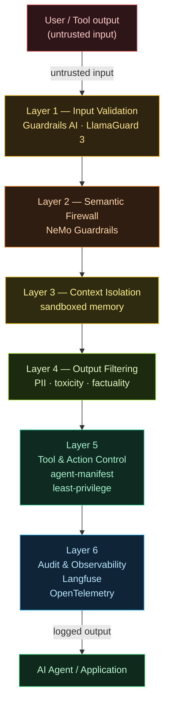
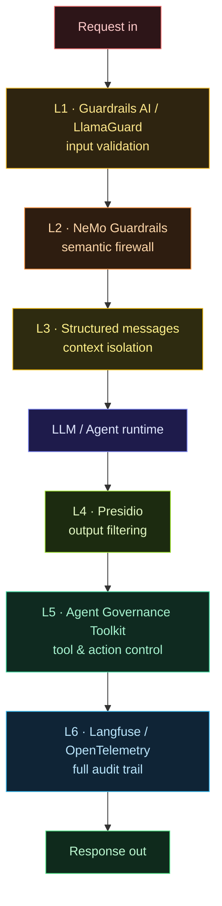

> Technical notes. A practical reference for engineers deploying LLMs or agents to production safely.

## Introduction

Most teams do the same thing: install one input filter, add a system prompt that says "don't do anything harmful", then declare the system "secured".

That's not security. That's security theatre.

Proper production guardrails have **6 distinct layers** — each catching what the others miss. If you have fewer than 4, you have gaps that can be exploited.

This post: a full map of all 6 layers, which tools to use for each, and what vendors consistently don't tell you about the cost of false positives.

---

## Why one layer isn't enough

Prompt injection has been **OWASP LLM #1 for three consecutive years** (2024, 2025, 2026). One reason: there's no single fix that works.

```
Attacker bypasses input filter → inject via tool output (indirect injection)
Attacker bypasses semantic check → use multi-step reasoning to leak data
Attacker bypasses output filter → exfil via timing side-channel
```

**Defense-in-depth** = the only proven approach. Each layer is independent. If one fails, the others still catch it.

---

## 6 Production Guardrail Layers

Every input flows through all 6 layers. Each layer catches what the previous layer missed. If any one fails, the others still hold.



### Layer 1: Input Validation

**Catches:** Malicious input, injection attempts, jailbreak patterns, PII in input.

**Tools:**

- `Guardrails AI` — Python library, validator chains for input schemas
- `LlamaGuard 3` (Meta) — 8B classifier, detects unsafe content by category
- `PromptGuard` — cuts injection success rate by 67% (Scientific Reports 2025)
- Custom regex/blocklist — cheap, fast, but brittle

**False positive cost:** An overly aggressive input filter = terrible user experience. Benchmark yourself first — don't blindly copy thresholds from docs.

```python
from guardrails import Guard
from guardrails.hub import DetectPII, DetectJailbreak

guard = Guard().use_many(
    DetectPII(["EMAIL_ADDRESS", "PHONE_NUMBER"], on_fail="exception"),
    DetectJailbreak(on_fail="exception"),
)

validated = guard.validate(user_input)
```

---

### Layer 2: Semantic Firewall

**Catches:** Indirect prompt injection (via tool output, retrieved docs), topic drift, policy violations that aren't visible from pattern matching.

**Tools:**

- **NVIDIA NeMo Guardrails** (`llama-3.1-nemoguard-8b-content-safety`) — model-based semantic check, not regex. Designed specifically for agentic flows.
- **Colang flows** (in NeMo) — define conversation rails declaratively

```yaml
# NeMo Guardrails config
models:
  - type: main
    engine: openai
    model: gpt-4o

rails:
  input:
    flows:
      - check jailbreak
      - check injection
  output:
    flows:
      - check sensitive data
```

**When to use:** Layer 1 handles patterns. Layer 2 handles semantics. Two different things — you need both.

**New (2026):** NeMo now has a dedicated **Agentic Security** module — detects code injection, SQL injection, XSS, template injection in agent tool calls.

---

### Layer 3: Context Isolation

**Catches:** System prompt leakage, data/instruction boundary confusion, cross-session contamination.

**Core principles (OWASP cheat sheet):**

- Separate the system prompt from user input structurally — not just a `---` in one string
- Label each context section: `[SYSTEM]`, `[USER]`, `[TOOL_OUTPUT]`
- Never inject user-controlled content directly into the system prompt

```python
# Correct — structural separation
messages = [
    {"role": "system", "content": HARDCODED_SYSTEM_PROMPT},
    {"role": "user",   "content": sanitized_user_input},
    # Tool outputs come in as role="tool", not role="system"
    {"role": "tool",   "content": tool_output, "tool_call_id": call_id},
]
```

**Don't do this:**

```python
# WRONG — user can escape from context
prompt = f"System: {system_prompt}\nUser said: {user_input}\nNow answer:"
```

---

### Layer 4: Output Filtering

**Catches:** PII in output, toxic content, hallucinations (for high-stakes use cases), sensitive internal data leakage.

**Tools:**

- `Guardrails AI` validators — `DetectPII`, `ToxicLanguage`, `ValidURL`
- `Microsoft Presidio` — PII detection + anonymization, enterprise-grade
- `LlamaGuard 3` — can also be used for output screening, not just input
- Custom output schema validation — if you expect JSON, validate strictly

**The false positive math vendors always skip:**

> If you have 10,000 requests/day and your output filter has a 2% false positive rate:
> 200 legitimate responses get blocked every day.
> That's real user experience degradation.

Tune thresholds based on your use case, not default settings.

---

### Layer 5: Tool & Action Control

**Catches:** Tool misuse, excessive agency, unauthorized actions, privilege escalation through tool chaining.

This is the **most commonly skipped layer** — even though an agent with 47 tools = 47 attack surfaces.

**New framework (Apr 2026):**

**Microsoft Agent Governance Toolkit** (open source) — covers 10/10 OWASP Agentic Top 10:

```bash
pip install agent-governance
```

```python
from agent_governance import PolicyEngine, GovernanceGate

policy = PolicyEngine.from_manifest("agent-manifest.yaml")
gate = GovernanceGate(policy)

# Every tool call must pass through the gate
@gate.enforce
async def call_tool(tool_name: str, args: dict):
    return await tools[tool_name](**args)
```

**Manifest-based capability declaration:**

```yaml
# agent-manifest.yaml
agent: security-auditor-v1
capabilities:
  read:
    - s3://my-bucket/reports/**
    - github://org/repo/**.tf
  write: [] # read-only agent
  network:
    - api.github.com
    - api.aws.amazon.com
human_confirmation_required:
  - delete_resource
  - send_email
  - deploy_change
```

**OWASP Agentic Top 10 (Dec 2025) — the 10 risks this layer addresses:**

| #   | Risk                            | Mitigation                                      |
| --- | ------------------------------- | ----------------------------------------------- |
| 1   | Goal hijacking                  | Manifest validation at every step               |
| 2   | Tool misuse                     | Allowlist tool calls in Manifest                |
| 3   | Identity abuse                  | SPIFFE/SPIRE workload identity                  |
| 4   | Memory poisoning                | Validate memory store input/output              |
| 5   | Cascading failures              | Circuit breaker + timeout                       |
| 6   | Rogue agents                    | Agent creation requires explicit capability     |
| 7   | Data exfiltration via reasoning | Output + information-flow labeling              |
| 8   | Privilege escalation            | Least-privilege Manifest, no runtime escalation |
| 9   | Insecure tool chaining          | Composition analysis before execution           |
| 10  | Audit evasion                   | Mandatory structured logging per call           |

---

### Layer 6: Audit & Observability

**Catches:** Anomalies in agent behavior, drift from normal usage patterns, retroactive forensics after incidents.

**Tools:**

- `Langfuse` — open source LLM observability, traces every call + token usage
- `OpenTelemetry` + custom spans — for enterprises already on OTel
- `Helicone` — proxy-based logging, zero code change required

**Minimum you must log:**

```python
{
  "timestamp": "2026-07-06T01:40:00Z",
  "agent_id": "security-auditor-v1",
  "session_id": "sess_abc123",
  "manifest_hash": "sha256:abc...",
  "tool_called": "read_s3_object",
  "capability_id": "cap_read_reports",
  "input_digest": "sha256:...",
  "output_digest": "sha256:...",
  "policy_decision": "ALLOW",
  "latency_ms": 234
}
```

**Red flags in logs:**

- Agent calls a tool not in its manifest → immediate alert
- Output size suddenly 10x normal → possible exfiltration
- Unusual tool call sequence → possible capability composition attack
- Agent creates a sub-agent → verify authorization

---

## Full production stack for 2026



**Real-world latency:**

- L1 + L4: ~2-5ms added
- L2 (NeMo 8B model): ~50-100ms — worth it for high-risk flows
- L5: ~1-3ms per tool call
- L6: async, near-zero impact

---

## Additional frameworks worth knowing

**AEGIS Framework (Forrester 2026)** — enterprise-level, integrates:

- Governance + Identity (SPIFFE/SPIRE)
- Data classification + information flow
- Zero Trust principles for agent runtime
- Threat operations (SOC integration)

For startups/small teams: start with L1 + L3 + L5. Build up from there.
For enterprise: all 6 layers, AEGIS for the governance layer on top.

---

## Closing

One guardrail layer = one point of failure. Six layers = real defense-in-depth.

Start small. L1 + L3 + L6 as minimum viable. Add L2, L4, L5 based on your use case's risk profile.

And remember: **the audit trail (L6) must be there from day one** — not an afterthought. When an incident happens, you want to trace what the agent did, not guess.

**Where this goes next:** once you have the audit trail feeding into your SIEM, the question becomes who closes the loop — who actually fixes the misconfig the guardrails flagged? In 2026, the answer is increasingly _an AI agent_, not a human. The full vendor landscape (Palo Alto Cortex Cloud 2.0, Wiz, Orca, Tenable, Aqua, Sysdig, Upwind, BigID, Check Point) and the Cortex Cloud 3-stage model (prevent → react → unify) is mapped in [**Shift-Left → Auto-Remediation → Agentic Remediation**](/en/posts/cse-03-shift-left-agentic/).

---

_References:_

- _OWASP Top 10 for LLM Applications 2025 + Agentic Applications Dec 2025_
- _NVIDIA NeMo Guardrails — Agentic Security module (2026)_
- _Microsoft Agent Governance Toolkit (Apr 2026, open source)_
- _Forrester AEGIS Framework for Agentic AI (2026)_
- _PromptArmor — ICLR 2026 (arxiv 2507.15219)_
- _LLM Guardrails: Production Safety Layers Reference 2026 — Digital Applied_
- _OWASP LLM Prompt Injection Prevention Cheat Sheet_
