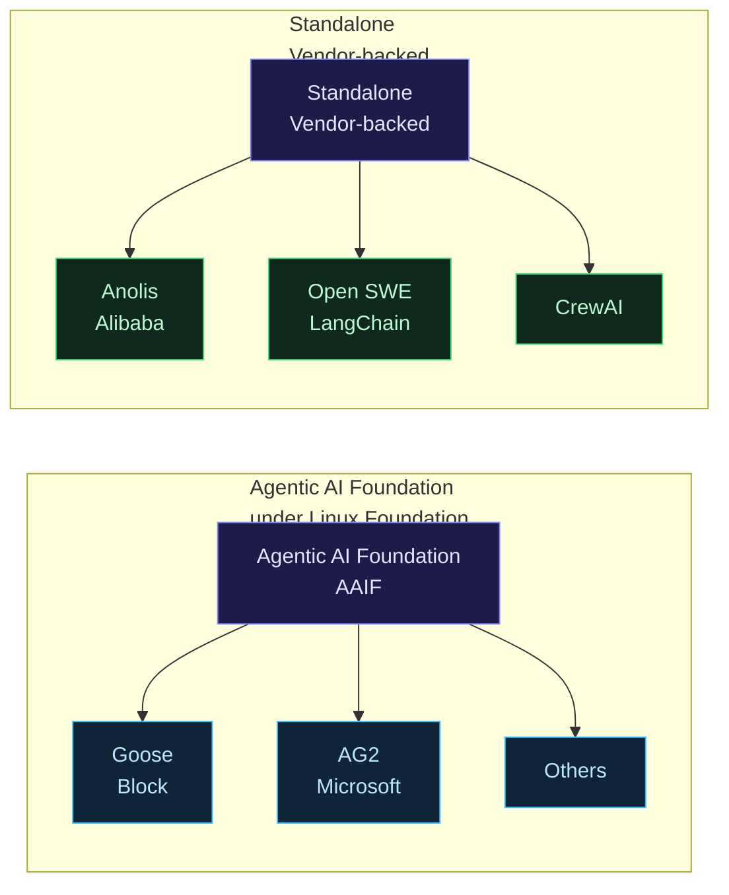
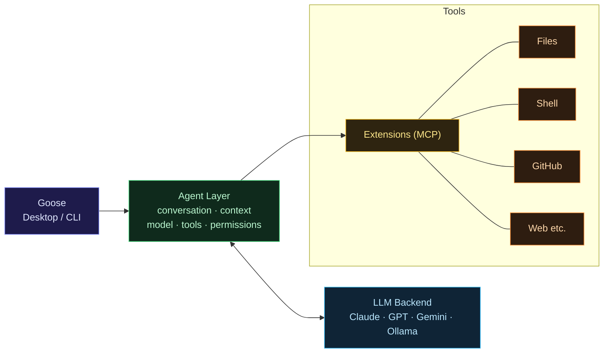
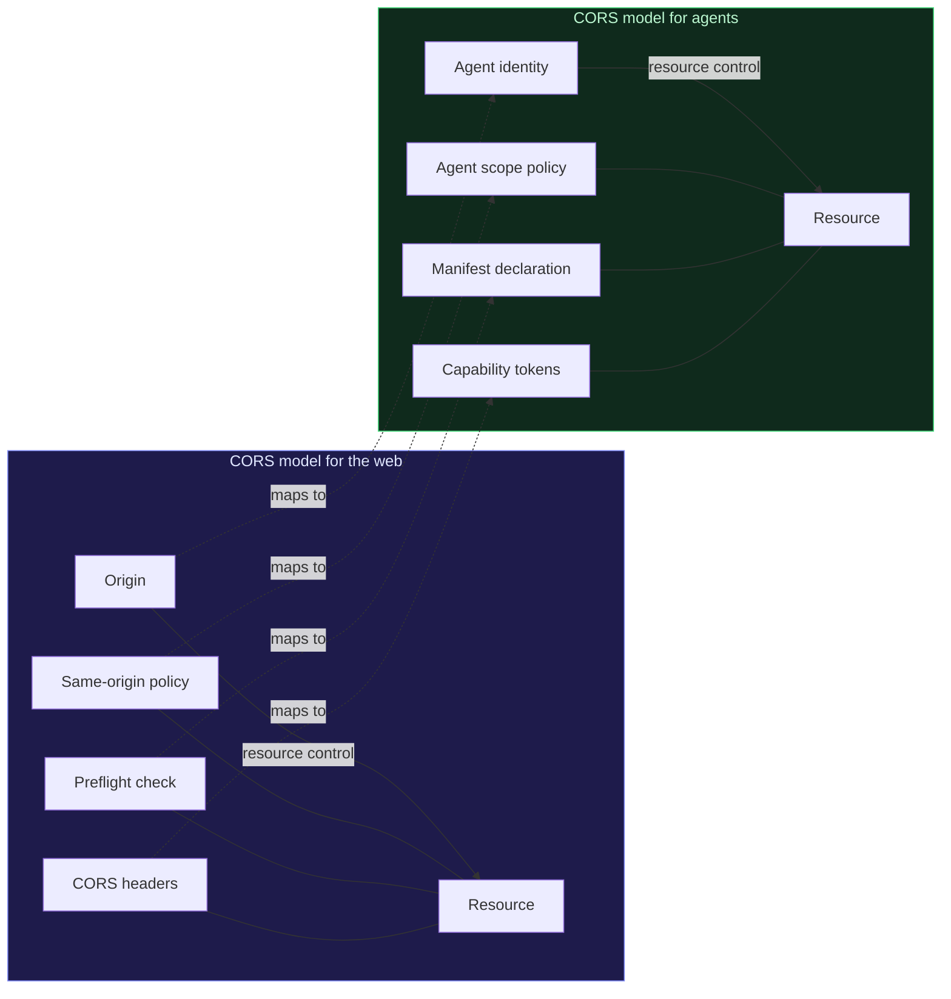
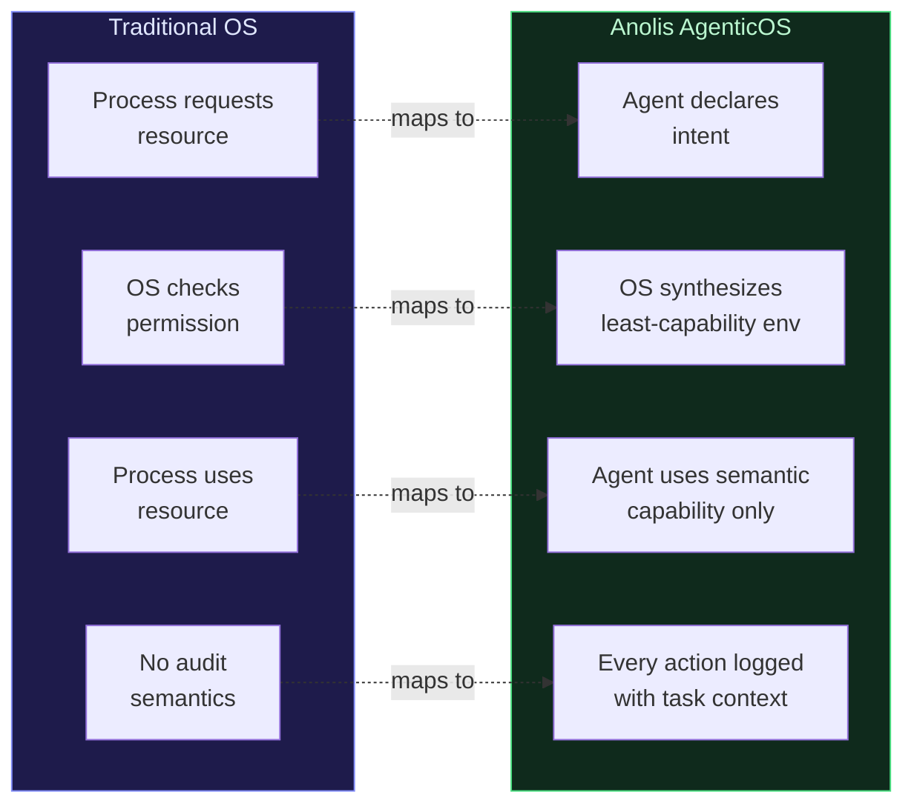

> Technical notes. On the open source ecosystem building infrastructure for AI agents — and what we need to understand from a security perspective.

## Introduction

Two years ago, "AI agent" meant AutoGPT that sometimes ran, sometimes looped until you force-killed it.

Now, in 2026 — there are **serious, production-ready open source AI operating systems** with thousands of contributors and corporate backing. Goose by Block has 50,000+ GitHub stars. Alibaba has released Anolis AgenticOS in a production preview. The Linux Foundation now has the **Agentic AI Foundation (AAIF)** governing multiple projects simultaneously.

This isn't a hype cycle anymore. This is infrastructure people are already running in production.

This post: breakdown of the ecosystem, what each project does, and most importantly — **what security guardrails are built in and what we have to add ourselves**.

---

## Open Source Agentic AI Landscape 2026



---

## 1. Goose (Block → Linux Foundation)

**GitHub:** `aaif-goose/goose` — 50,000+ stars, Apache 2.0
**Stack:** Rust (67%) + TypeScript (27%)
**Status:** Production — used internally by Block, now open source

### What is Goose?

Goose is not just a coding assistant. It's an **on-machine AI agent** that can:

- Install software, execute commands, edit files
- Run tests, debug, deploy
- Automate research, data analysis, writing
- Connect to external APIs and services via MCP (Model Context Protocol)

Unlike most AI tools — Goose **runs on your own machine**, not in a cloud sandbox. That means it has access to your real environment.

### Why did Block hand it to the Linux Foundation?

Block released Goose as an internal tool, then open sourced it. After the community grew quickly, they handed governance to the **AAIF (Agentic AI Foundation)** under the Linux Foundation — because:

1. Neutral governance — so other vendors are confident contributing without fear of lock-in
2. Interoperability standards — Goose implements **ACP (Agent Communication Protocol)** so agents can communicate with each other
3. Long-term sustainability — Linux Foundation has a proven track record (Linux, Kubernetes, etc.)

### Goose architecture



### Security guardrails in Goose — what's included

For the full 6-layer reference architecture (and why one layer is never enough), see [**AI guardrails — 6 layers you must have in production**](/en/posts/age-02-6-lapisan/).

**Built-in:**

- Permission checks before every tool call
- Confirmation prompts for destructive actions (delete, deploy)
- Session isolation — each session has its own context
- Local execution — data doesn't go to the cloud without explicit intent

**Discussion underway in the community:**
GitHub Discussion #6328 — "Agent Guardrails and Controls: Applying the CORS Model to Agents" — Block engineers proposed using the **CORS model** (Cross-Origin Resource Sharing) as an analogy for agent permissions:



**What's still missing (needs to be added manually):**

- Comprehensive audit logging
- Intent-based access control (AgenticOS style)
- Cross-agent communication security (when agents call agents)
- Formal Manifest declaration

---

## 2. Anolis AgenticOS (Alibaba Cloud)

**Released:** Jun 2026, production preview
**Base:** Built on Anolis OS (Alibaba's RHEL-compatible Linux distro)
**Status:** First "agent-native OS" in production

### What makes it different from a traditional OS?

Anolis AgenticOS implements concepts from the AgenticOS paper (Tencent Research, Jun 2026) — an OS designed from the ground up for agents, not humans:



### Built-in security features

**Intent Declaration (Manifest):**

```yaml
# agent-manifest.yaml in Anolis AgenticOS
agent: data-analyzer-v1
intent: 'analyze sales report Q2 2026 and generate summary'
capabilities:
  read:
    - /data/reports/q2-2026/**
  write:
    - /output/summaries/**
  network: [] # no network access needed for this task
human_confirmation:
  - any_delete_operation
  - any_external_write
```

**Ghost Kernel isolation:** The Agent Capsule has no access to raw syscalls. Everything goes through Logic Shutter → Semantic Boundary Gateway.

**Audit trail:**

```json
{
  "agent_id": "data-analyzer-v1",
  "manifest_hash": "sha256:abc...",
  "action": "ReadFile",
  "path": "/data/reports/q2-2026/sales.csv",
  "authorized_by": "cap_read_reports",
  "timestamp": "2026-07-06T01:00:00Z",
  "policy_decision": "ALLOW"
}
```

---

## 3. Open Source Agentic AI Stack (AAIF)

AAIF (Agentic AI Foundation) now has several projects:

| Project   | From      | Function                                |
| --------- | --------- | --------------------------------------- |
| **Goose** | Block     | On-machine general agent                |
| **AG2**   | Microsoft | AutoGen 2.0 — multi-agent framework     |
| **ACP**   | Community | Agent Communication Protocol standard   |
| **MCP**   | Anthropic | Model Context Protocol (tool interface) |

**Open SWE** (LangChain, 2026) — for internal coding agents:

- Built on Deep Agents + LangGraph
- Focus on software engineering tasks
- Security: built-in code review before execution

---

## 4. Security guardrails for open source agent OS — what needs to be done

This is the most important section for Cloud Security Engineers.

### Current gaps in open source agent OSes

| Feature               | Goose              | Anolis AgenticOS             |
| --------------------- | ------------------ | ---------------------------- |
| Intent declaration    | ❌ Manual          | ✅ Built-in Manifest         |
| Audit logging         | ⚠️ Basic           | ✅ Structured, cryptographic |
| Capability isolation  | ⚠️ Extension-level | ✅ OS-level (Ghost Kernel)   |
| Cross-agent security  | ❌ In progress     | ⚠️ Partial                   |
| Guardrail integration | ❌ DIY             | ⚠️ Partial                   |

### Stack to add for Goose (or any open source agent)

**Layer 1: Wrap with NeMo Guardrails**

```python
# Goose extension wrapper with guardrail
from nemoguardrails import RailsConfig, LLMRails

config = RailsConfig.from_path("./guardrails_config")
rails = LLMRails(config)

async def guarded_goose_call(user_input: str) -> str:
    # Check input first
    response = await rails.generate_async(
        messages=[{"role": "user", "content": user_input}]
    )
    return response
```

**Layer 2: Microsoft Agent Governance Toolkit**

```bash
pip install agent-governance
```

```python
from agent_governance import PolicyEngine, GovernanceGate

# Define policy from Manifest
policy = PolicyEngine.from_manifest("goose-manifest.yaml")
gate = GovernanceGate(policy)

@gate.enforce
async def execute_tool(tool_name: str, args: dict):
    return await goose.run_tool(tool_name, **args)
```

**Layer 3: Langfuse for audit trail**

```python
from langfuse import Langfuse
langfuse = Langfuse()

# Trace every Goose session
with langfuse.trace(name="goose-session") as trace:
    span = trace.span(name="tool-call", input={"tool": "shell", "cmd": cmd})
    result = await goose.execute(cmd)
    span.end(output=result)
```

**Layer 4: CORS-inspired permission model (from Discussion #6328)**

```yaml
# goose-cors-policy.yaml
agent_scopes:
  - agent: 'goose-dev'
    allowed_origins:
      - local_filesystem: '/home/user/projects/**'
      - shell: ['npm', 'git', 'pytest'] # allowlist commands
      - network: ['api.github.com', 'registry.npmjs.org']
    denied:
      - shell: ['rm -rf', 'sudo', 'curl | bash']
      - network: ['*'] # deny all network except allowlist
    require_confirmation:
      - any_git_push
      - any_package_install
      - any_file_delete
```

---

## 5. Comparison: Goose vs Anolis AgenticOS from a security perspective

| Aspect             | Goose (AAIF)                    | Anolis AgenticOS                   |
| ------------------ | ------------------------------- | ---------------------------------- |
| **Maturity**       | Production (general agent)      | Production preview (OS-level)      |
| **Security model** | CORS-inspired, DIY guardrail    | Intent-based, OS-enforced          |
| **Use case**       | Developer on-machine tasks      | Cloud workload, multi-agent        |
| **Guardrail**      | External (must set up yourself) | Built-in (Manifest + Ghost Kernel) |
| **Audit**          | Langfuse (external)             | Native structured logging          |
| **Community**      | 50,000+ stars, active           | Smaller, newer                     |
| **License**        | Apache 2.0                      | TBD                                |
| **Best for**       | Dev productivity, automation    | Enterprise agent runtime           |

---

## 6. What security engineers should do now

**For teams wanting to use Goose or similar open source agents:**

1. **Don't expose without guardrails** — Default Goose install has no input guardrail. Add NeMo Guardrails or Guardrails AI before exposing to users.

2. **Define an explicit Manifest** — Even though Goose doesn't enforce a Manifest at the OS level, write one. Use it for review and audit.

3. **Audit trail from day one** — Set up Langfuse or OpenTelemetry before production. When an incident happens, you want to trace what the agent did.

4. **Test with a red team suite** — Use Garak to test your agent before deploying.

5. **Monitor tool call patterns** — An agent that suddenly has many `shell` calls or accesses outside its normal scope = anomaly.

6. **Watch Anolis AgenticOS development** — If you want an agent runtime for cloud workloads, Anolis will be a proper option within 6-12 months.

---

## Closing

The open source agentic AI ecosystem is maturing quickly:

- **Goose** is production-ready for developer tasks, needs external guardrails
- **Anolis AgenticOS** brings security to the OS level, with built-in Manifest and isolation
- **AAIF** under the Linux Foundation provides serious governance structure

For Cloud Security Engineers: **these are the new workloads you'll be securing in 12-24 months**. The same way you once had to learn to secure containers (Docker/Kubernetes) — now is the time to learn to secure agent runtimes.

Start with Goose. Understand its architecture. Test the guardrails. Then see how Anolis solves the same problem at the OS level.

---

_References:_

- _GitHub: aaif-goose/goose — 50,000+ stars, Apache 2.0_
- _GitHub Discussion #6328 — Agent Guardrails and Controls: Applying the CORS Model to Agents_
- _The New Stack — Why Block handed Goose to the Linux Foundation_
- _Block Engineering Blog — Agent Guardrails (Jan 2026)_
- _Alibaba Cloud — Anolis AgenticOS release (Jun 2026)_
- _DEV Community — The Open Source Agentic AI Stack: What AAIF Projects Do_
- _LangChain — Open SWE: Open-Source Framework for Internal Coding Agents_
- _Microsoft Agent Governance Toolkit (Apr 2026)_
- _Tencent Research — AgenticOS paper (arxiv 2606.21129)_
