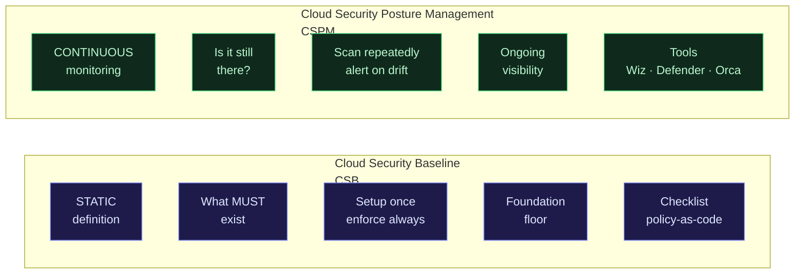
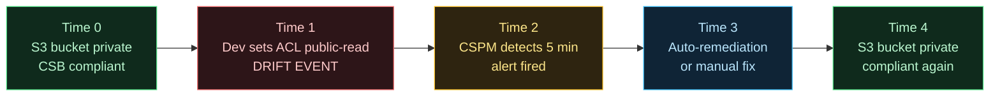
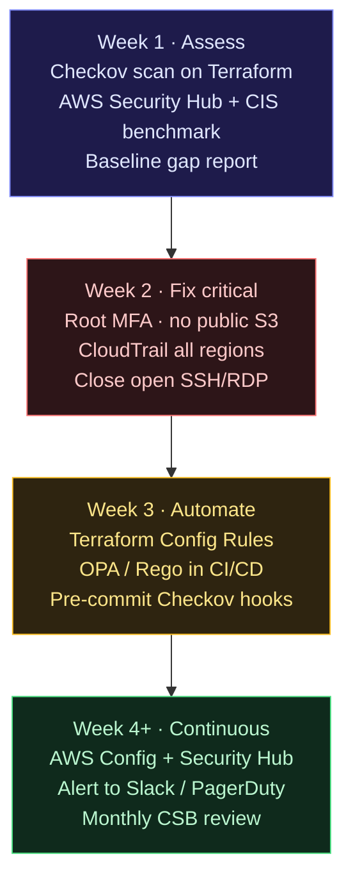

> Field notes in English. For Cloud Security Engineers who want to understand the relationship between Cloud Security Baseline, CSPM, and how to enforce posture automatically.

## Introduction

There's a pattern that shows up almost every time an organization gets breached through cloud:

> It's not a zero-day exploit. It's not a nation-state attacker with sophisticated tools.
> **Default configuration that was never changed.**

Root account without MFA. S3 bucket public by default. CloudTrail disabled. Security group allowing `0.0.0.0/0`. All exist because cloud providers set defaults for convenience during onboarding — not for security.

**Cloud Security Baseline (CSB)** is the answer to this: a set of minimum controls that must exist from day one, before any workload deploys.

---

## What is Cloud Security Baseline?

Cloud Security Baseline = **set of security controls that must be enforced on every account/subscription/project**, without exception, before any workload is allowed to run.

How it differs from regular security hardening:

```
Security Hardening:          Cloud Security Baseline:
- Per-workload               - Per-account/subscription
- After deploy               - Before first workload
- Specific to service        - Universal for all resources
- Optional (best practice)   - Mandatory (non-negotiable floor)
```

**CSPM vs CSB:**



CSB is **what you define**. CSPM is **the tool that ensures CSB stays that way**.

---

## Benchmarks that form the basis of CSB

You don't need to invent CSB from scratch. There are established benchmarks to start with:

### CIS Benchmarks (most widely used)

| Benchmark             | Latest version    | Platform |
| --------------------- | ----------------- | -------- |
| CIS AWS Foundations   | v7.0.0 (Apr 2026) | AWS      |
| CIS Azure Foundations | v6.0.0 (Apr 2026) | Azure    |
| CIS GCP Foundations   | v3.0.0            | GCP      |
| CIS Kubernetes        | v1.9.0            | K8s      |

AWS Security Hub now supports **CIS AWS Foundations Benchmark v5.0** (announced Oct 2025) — you can enable it directly from the console, auto-scans every resource.

### Microsoft Cloud Security Benchmark (MCSB)

Microsoft publishes MCSB covering multi-cloud (AWS + Azure in one framework). The "Posture and Vulnerability Management" section explicitly defines:

> _"Define the security configuration baselines for different resource types in the cloud. Use configuration management tools to establish the configuration baseline automatically before or during resource provisioning."_

### NIST SP 800-53 Rev 5

For regulated industries (government, healthcare, finance) — NIST controls are mandatory. You can map CIS controls to NIST for dual compliance.

---

## CSB Minimum — what every account must have

This is **the floor that cannot be compromised** — based on CIS AWS v7.0 + MCSB + field experience:

### 1. Identity & Access (IAM)

```
✅ Root account MFA enabled
✅ Root account access keys DELETED (not disabled, deleted)
✅ MFA required for all human users
✅ Password policy: min 14 chars, complexity, no reuse for 24 passwords
✅ No inline policies (all managed policies)
✅ Principle of least privilege enforced
✅ No wildcard (*) in Action or Resource for production roles
✅ Access keys rotated every 90 days
✅ Inactive users/roles disabled after 90 days
```

### 2. Logging & Monitoring

```
✅ CloudTrail enabled — ALL regions, ALL management events
✅ CloudTrail log file validation enabled
✅ CloudTrail logs sent to S3 + CloudWatch Logs
✅ S3 bucket for CloudTrail: private, versioning on, MFA delete
✅ VPC Flow Logs enabled for all VPCs
✅ Config Rules enabled (AWS Config)
✅ GuardDuty enabled in all regions
✅ Security Hub enabled + CIS benchmark enabled
```

### 3. Networking

```
✅ No Security Group with inbound 0.0.0.0/0 to port 22 (SSH)
✅ No Security Group with inbound 0.0.0.0/0 to port 3389 (RDP)
✅ Default VPC not used for production workloads
✅ VPC endpoints for S3 and DynamoDB (prevent traffic to internet)
✅ Network ACLs reviewed, no allow-all rules
```

### 4. Storage & Data

```
✅ S3 Block Public Access enabled — account level
✅ S3 bucket versioning enabled for critical data
✅ EBS encryption by default enabled
✅ RDS encryption at rest enabled
✅ S3 Server-Side Encryption (SSE-S3 minimum, SSE-KMS for sensitive)
✅ Secrets in Secrets Manager / Parameter Store, not plaintext
```

### 5. Billing & Governance

```
✅ Billing alerts configured (threshold not a big number)
✅ Budget alerts configured
✅ Cost anomaly detection enabled
✅ Resource tagging policy enforced (Owner, Environment, CostCenter)
✅ AWS Organizations SCPs (Service Control Policies) to restrict regions
```

---

## How to enforce CSB automatically

Manual checklists aren't sustainable. Here's how to make CSB enforce itself:

### Option 1: AWS Config Rules (built-in, free tier available)

```hcl
# Terraform — deploy CIS-aligned Config Rules
resource "aws_config_config_rule" "mfa_enabled_for_iam_console" {
  name = "mfa-enabled-for-iam-console-access"

  source {
    owner             = "AWS"
    source_identifier = "MFA_ENABLED_FOR_IAM_CONSOLE_ACCESS"
  }
}

resource "aws_config_config_rule" "root_mfa_enabled" {
  name = "root-account-mfa-enabled"

  source {
    owner             = "AWS"
    source_identifier = "ROOT_ACCOUNT_MFA_ENABLED"
  }
}

resource "aws_config_config_rule" "s3_block_public" {
  name = "s3-account-level-public-access-blocks"

  source {
    owner             = "AWS"
    source_identifier = "S3_ACCOUNT_LEVEL_PUBLIC_ACCESS_BLOCKS"
  }
}
```

### Option 2: OPA/Rego Policy-as-Code

```rego
# csb_baseline.rego — enforce CSB in CI/CD pipeline
package csb.baseline

# DENY: S3 bucket with public access
deny[msg] {
    resource := input.resource.aws_s3_bucket[name]
    resource.acl == "public-read"
    msg := sprintf("CSB VIOLATION: S3 bucket '%v' must be private", [name])
}

# DENY: Security group allowing SSH from anywhere
deny[msg] {
    resource := input.resource.aws_security_group[name]
    rule := resource.ingress[_]
    rule.from_port <= 22
    rule.to_port >= 22
    rule.cidr_blocks[_] == "0.0.0.0/0"
    msg := sprintf("CSB VIOLATION: Security group '%v' allows SSH from 0.0.0.0/0", [name])
}

# DENY: IAM user without MFA
deny[msg] {
    resource := input.resource.aws_iam_user[name]
    not resource.force_destroy
    not input.resource.aws_iam_user_login_profile[name]
    msg := sprintf("CSB VIOLATION: IAM user '%v' has no MFA configured", [name])
}
```

### Option 3: Checkov pre-commit (easiest to start)

```yaml
# .pre-commit-config.yaml
repos:
  - repo: https://github.com/bridgecrewio/checkov
    rev: 3.2.0
    hooks:
      - id: checkov
        args:
          - --framework
          - terraform
          - --check
          - CKV_AWS_1 # S3 bucket access logging
          - CKV_AWS_8 # EC2 no public IP
          - CKV_AWS_18 # S3 no public access
          - CKV_AWS_41 # CloudTrail enabled
          - --soft-fail # warn first, switch to hard-fail when ready
```

---

## Drift Detection — CSPM to monitor CSB

CSB defines the baseline. Drift happens when someone or something changes configuration from that baseline. CSPM tools monitor for this drift in real-time.

### How drift happens



Without CSPM, drift might go undetected for days or weeks.

### Tools for drift detection 2026

| Tool                   | Strength                                                   | Free tier?            |
| ---------------------- | ---------------------------------------------------------- | --------------------- |
| **AWS Config**         | Native AWS, CIS benchmark built-in                         | Yes (limited rules)   |
| **AWS Security Hub**   | Aggregate findings, CIS v5.0 support                       | Yes (30 day trial)    |
| **Checkov + CI/CD**    | Pre-deploy scan, policy-as-code                            | ✅ Open source        |
| **tfdrift-falco**      | Real-time Terraform drift detection via Falco + CloudTrail | ✅ Open source (2026) |
| **Wiz**                | Deep posture + graph-based risk                            | Enterprise (paid)     |
| **Orca Security**      | Agentless, full stack visibility                           | Enterprise (paid)     |
| **Defender for Cloud** | Azure-native + multi-cloud                                 | Partially free        |

**For small teams / startups:** AWS Config + Checkov in CI/CD is enough for CSB enforcement. Free, automated, covers 80% of common misconfigs.

**For enterprise:** Wiz or Orca for broad visibility, Defender for Azure-native, tfdrift-falco for real-time IaC drift.

---

## CSB and AI/Agentic workloads — new gap in 2026

Traditional CSB (CIS, NIST) doesn't cover AI/agent workloads. This **gap is getting critical**:

| Traditional control | Gap for AI workload                                                |
| ------------------- | ------------------------------------------------------------------ |
| IAM least privilege | Agent has identity — needs scoped, time-bound capability           |
| S3 access control   | Agent can read/write S3 — needs audit trail per-task, not per-user |
| CloudTrail logging  | Log "service_account_X accessed S3" — but why? for what task?      |
| Network restriction | Agent can call external APIs — needs per-intent network policy     |

**CSB extension for AI workloads (current best practice):**

```yaml
# ai-workload-baseline.yaml
ai_baseline:
  agent_identity:
    - each agent has dedicated IAM role (not shared)
    - role cannot assume human user roles
    - session duration maximum 1 hour
  audit:
    - every agent action has task_id in logs
    - CloudTrail + Langfuse/OTel for full trace
  network:
    - agent roles in SCP — restrict to allowed API endpoints
    - egress filter via VPC endpoint policy
  data_access:
    - agent cannot access production data without explicit tag approval
    - S3 bucket policy: deny if "ai-approved" tag absent
```

The shift-left controls above catch most of the agent identity and audit gaps. But they don't address **what happens when a misconfig slips through CI and lands in production** — that's where auto-remediation and agentic remediation come in. See the full 2026 vendor landscape and the Palo Alto Cortex Cloud deep dive in the next post: [**Shift-Left → Auto-Remediation → Agentic Remediation**](/en/posts/cse-03-shift-left-agentic/).

---

## Practical workflow: set up CSB from scratch

For a new account or auditing existing accounts:



---

## Closing

CSB is **security floor**, not ceiling.

You can have perfect CSB and still get breached — if an attacker exploits the application layer, insecure code, or zero-day. But CSB ensures you don't get breached for preventable reasons: root without MFA, S3 accidentally public, CloudTrail off.

In the large and fast-moving world of cloud, automated CSB and continuous CSPM are the minimum viable security posture. Not optional. Not "we'll do it later". **From day one an account exists.**

---

_References:_

- _CIS AWS Foundations Benchmark v7.0.0 — Tenable Audits (Apr 2026)_
- _CIS Azure Foundations Benchmark v6.0.0 — NIST NCP (Apr 2026)_
- _AWS Security Hub — CIS AWS Foundations Benchmark v5.0 support (Oct 2025)_
- _Microsoft Cloud Security Benchmark — Posture and Vulnerability Management_
- _ISACA — Cloud Security Posture Management: Control Plane for Modern Cloud Risk (2026)_
- _CloudToolStack — Cloud Security Baseline 2026: What Every Account Should Have_
- _higakikeita/tfdrift-falco — Real-time Terraform Drift Detection via Falco (2026)_
- _OpenMalo — CSPM Practical Guide 2026_
