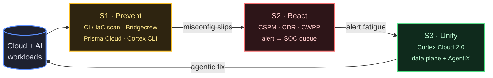

> Industry analyst field notes. Vendor positioning as of July 2026 — every claim sourced inline.

## TL;DR

Cloud security in 2026 has three operating models — shift-left (prevent), auto-remediation (react), and agentic remediation (unify). Each vendor sits at a different point on the line, and each picks a different answer to the question "should the AI be allowed to touch production?". **Palo Alto Cortex Cloud 2.0** is the first platform to claim _end-to-end_ agentic remediation across code-to-cloud-to-SOC, with a published **90% MTTR reduction** and FedRAMP High+Moderate authorization. **Wiz** (now Google Cloud) is closest in scope but skews _recommend-with-deep-context_ via the Green Agent. **Orca** deliberately holds a human in the loop and refuses full autonomy. The shift from CSPM-as-ticket-queue to CNAPP-as-agent-workforce is the defining industry move of 2026.

---

## Part A — Vendor Landscape

Three models in 2026: shift-left (prevent), auto-remediation (react), agentic (unify). Each vendor answers "should AI touch production?" differently.

### Palo Alto — Cortex Cloud 2.0

Prisma Cloud + Cortex CDR merged Feb 13 2025 ([PR](https://investors.paloaltonetworks.com/news-releases/news-release-details/palo-alto-networks-introduces-cortex-cloud-future-real-time)); **Cortex AgentiX** added early 2026 ([blog](https://www.paloaltonetworks.com/blog/cloud-security/cloud-security-platform-cortex-cloud-2-0/)). Built on Redlock, Twistlock, Bridgecrew, Cider. Autonomy: agent proposes, executes on approved scope. Metric: **90% MTTR** (4d → 1–2h).

> "Driven by autonomy from Cortex AgentiX—trained on more than a billion real-world responses—Cortex Cloud turns analysis into action while keeping you in control. Every step is visible and auditable."
> — [Introducing Cortex Cloud 2.0](https://www.paloaltonetworks.com/blog/cloud-security/cloud-security-platform-cortex-cloud-2-0/)

### Wiz (Google Cloud)

**$32B Wiz acquisition** closed March 11 2026 — Google's largest ([PR](https://www.googlecloudpresscorner.com/2026-03-11-Google-Completes-Acquisition-of-Wiz)). Agentic layer: **Green Agent** (remediation), **Red Agent** (exploitability), **MCP server** on **Security Graph** ([blog](https://www.wiz.io/blog/introducing-wiz-mcp)). Autonomy: deep-context recommendation, one-click human execution. Metric: "Zero Criticals".

> "By delivering the right context and guidance to the person best positioned to fix the issue, the Green Agent helps turn every team member into a security expert and every finding into a fix."
> — [Introducing the Green Agent](https://www.wiz.io/blog/introducing-wiz-green-agent)

### Orca Security

**Opus acquisition** (May 2025) added orchestration ([BusinessWire](https://www.businesswire.com/news/home/20250513831405/en/Orca-Security-Acquires-Opus-to-Pioneer-Agentic-AI-Powered-Cloud-Security-Remediation-and-Prevention)). Built on **Unified Data Model**. Autonomy: **recommend-first, autonomous-later**. Metric: not disclosed.

> "Orca's AI agents start with recommending action, backed by transparent reasoning. This keeps a human in the loop, in the near term, to validate conclusions and next steps."
> — [Agentic Cloud Security Platform](https://orca.security/resources/blog/introducing-agentic-cloud-security-platform/)

### Tenable — Hexa AI

**Hexa AI** (RSAC 2026) is the agentic engine for **Tenable One** ([PR](https://investors.tenable.com/news-releases/news-release-details/introducing-tenable-hexa-ai-agentic-engine-supercharges-security)). Built on **Exposure Data Fabric** (40,000+ deployments). Autonomy: **dial-it-yourself** per workflow.

> "Hexa AI combines machine speed with human control, to the extent desired by customers. Everything Tenable Hexa AI does is logged, so you can always audit any action it takes."
> — [Tenable Hexa AI blog](https://www.tenable.com/blog/hexa-ai-agentic-ai-for-exposure-management)

### 1-liners

- **Aqua — Compass** (Apr 22 2026): MCP server; eBPF runtime → agentic containment; agent investigates, human approves. Not disclosed.
- **Sysdig — Sage** (Aug 2025): "first agentic AI cloud security analyst"; runtime multi-step reasoning. Not disclosed.
- **Upwind — Agentic Pack** (May 13 2026): Blue/Green/Red/Choppy agents on runtime-first data layer. Runtime-first, human executes.
- **BigID — Agentic Risk Remediation** (DSPM): AI-guided prioritization; **GigaOm DSPM Leader 2025**. Recommendation-first.
- **Check Point — CloudGuard**: rule-based auto-remediation; ~70% alert-volume drop. Narrow scope, not LLM-driven.

> "The agent performs investigation, correlation, and policy generation, while the final decision remains with the security team."
> — [Aqua Security blog](https://www.aquasec.com/blog/autonomous-runtime-security-turning-runtime-intelligence-into-agentic-response/)

### Comparison Table

| Vendor                         | Shift-Left Maturity (1-5)                | Auto-Remediation (1-5)                   | Agentic Capability (1-5)                       | Human-in-Loop Model                                 | 2026 Position                                                        |
| ------------------------------ | ---------------------------------------- | ---------------------------------------- | ---------------------------------------------- | --------------------------------------------------- | -------------------------------------------------------------------- |
| **Palo Alto Cortex Cloud 2.0** | 5 (Bridgecrew lineage, ASPM, Cortex CLI) | 5 (one-click + AI-generated playbooks)   | 5 (Cortex AgentiX, trained on 1B+ responses)   | Tiered: SAFE/RISKY/UNSAFE scoring, full audit trail | **Leader** — only unified code-cloud-SOC stack with FedRAMP High+Mod |
| **Wiz** (Google Cloud)         | 5 (IDE-to-prod, AI-BOM)                  | 4 (Green Agent one-click + MCP)          | 4 (Green/Red/MCP agents)                       | Recommend-with-deep-context, human executes         | **Leader** — strongest context model, broadest agent ecosystem       |
| **Orca**                       | 4 (Unified Data Model, code repo scans)  | 3 (auto-remediation rules + PR-gen)      | 4 (Threat Investigation, AppSec Triage agents) | Recommend-first, human validates (deliberate)       | **Leader** — opinionated stance; strongest Unified Data Model        |
| **Tenable Hexa AI**            | 4 (Tenable Cloud Security, IaC scans)    | 4 (orchestrated workflows, MCP)          | 4 (mission-ready + custom agents)              | **Dial-it-yourself** — per-workflow toggle          | **Strong Challenger** — broadest exposure dataset, opt-in autonomy   |
| **Aqua Compass**               | 3 (Secure AI, image scanning)            | 4 (runtime containment policies)         | 4 (MCP server, agentic runtime response)       | Agent investigates, human approves enforcement      | **Niche Leader** — runtime-first, unique containment angle           |
| **Sysdig Sage**                | 3 (Falco, image scanning)                | 3 (multi-step reasoning on threats)      | 3 (collaborative agent workflows)              | Conversational, human-driven                        | **Challenger** — runtime-focused, agent UX differentiator            |
| **Upwind Agentic Pack**        | 3 (runtime context layer)                | 3 (Green agent for remediation guidance) | 4 (Blue/Green/Red/Choppy named agents)         | Runtime-context-first, human executes               | **Niche Challenger** — runtime-first data layer                      |
| **BigID**                      | 2 (DSPM focus)                           | 4 (agentic remediation routing)          | 3 (Agentic Risk Remediation)                   | Recommendation-first                                | **DSPM Leader** — data-layer specialization                          |
| **Check Point CloudGuard**     | 4 (IaC, CI/CD hooks)                     | 4 (rule-based auto-remediation)          | 2 (AI-native exposure, not agentic)            | Rule-based, narrow scope                            | **Legacy Leader** — broadest install base, conservative autonomy     |

---

## Part B — Palo Alto Cortex Cloud: A 3-Stage Map

Palo Alto is the only vendor that explicitly organizes the journey as **prevent → react → unify** — the strategy that "Traditional CNAPPs only react after an issue emerges, creating a dangerous lag in the era of AI-driven development" ([Palo Alto, Cortex Cloud 2.0](https://www.paloaltonetworks.com/blog/cloud-security/cloud-security-platform-cortex-cloud-2-0/)).

### Stage 1 — Prevent (shift-left)

The **Bridgecrew / Prisma Cloud / Cortex CLI** surface area. Goal: catch the misconfig before the PR merges.

| Product                                                          | Function                                                | Data Feeds Forward                                  |
| ---------------------------------------------------------------- | ------------------------------------------------------- | --------------------------------------------------- |
| **Cortex CLI for Code Security**                                 | Scans IaC, SCA, secrets, OSS license compliance locally | Findings tagged by policy → API server              |
| **IaC misconfiguration scanner**                                 | Terraform, CloudFormation, ARM, Kubernetes, Dockerfile  | Findings flow to ASPM Command Center                |
| **ASPM (Application Security Posture Mgmt)**                     | Cross-repo PR/CI posture, policy-as-code                | Pre-deployment gates + post-deployment verification |
| **Cortex CLI** + IDE plugins                                     | VS Code, JetBrains inline remediation hints             | Developer-accepted fixes auto-commit                |
| **CI/CD hooks** (GitHub Actions, GitLab, Jenkins, HCP Terraform) | Block merges on critical findings                       | "Fix PR" auto-generated for human review            |
| **SCA scanner**                                                  | Open-source dependency CVE check, license risk          | Vulnerability signals to runtime engine             |

### Stage 2 — React (legacy rule-based)

Where **Prisma Cloud CSPM** + **Cortex CDR** lived pre-merger. Limits that Stage 3 was designed to fix:

- **Reactive** — alerts fire after deploy
- **Siloed** — CSPM doesn't see CDR runtime signal
- **Ticket-closure ≠ root-cause** — closing Jira doesn't prevent re-introduction
- **One-alert-at-a-time** — no attack-path correlation, no blast-radius

### Stage 3 — Unify (Cortex Cloud 2.0)

The **2026 differentiator**. Single data plane across code, supply chain, cloud, and SOC.

| Capability                              | Function                                                                                                                                                                      | Data Source                            |
| --------------------------------------- | ----------------------------------------------------------------------------------------------------------------------------------------------------------------------------- | -------------------------------------- |
| **Cortex Agentic Assistant**            | LLM-powered investigation, threat hunting, playbook generation                                                                                                                | Native MCP integration, XQL queries    |
| **Cortex AgentiX**                      | Agent runtime — trained on **1B+ real-world security responses**                                                                                                              | All Cortex Cloud signals               |
| **AI-Powered Prioritization (Urgency)** | Replaces CVSS with exploitability + reachability + KEV + EPSS + business context                                                                                              | Vulnerability Risk Score (CVRS, 0-100) |
| **Attack-path analysis**                | Correlates identities + network + vulns → crown-jewel reachability                                                                                                            | Graph model across all layers          |
| **One-click remediation + auto-fix**    | `POST /public_api/appsec/v1/issues/fix/trigger_fix_pull_request` ([API docs](https://docs-cortex.paloaltonetworks.com/r/Cortex-Cloud-Platform-APIs/Trigger-Fix-Pull-Request)) | Bulk PR creation from any issue set    |
| **Cortex XSIAM (SOC integration)**      | Cloud alerts → XSIAM cases; SOC analyst sees the same finding as cloud engineer                                                                                               | Unified XDR/XSIAM data plane           |
| **NHI / machine-identity context**      | IAM analysis at workload level (service accounts, roles, permissions)                                                                                                         | Cloud IAM APIs + audit logs            |
| **AI-coding-assistant integration**     | Code fixes via Cody/Sourcegraph + Claude (per [AWS case study](https://aws.amazon.com/partners/success/palo-alto-networks-anthropic-sourcegraph/))                            | IDE + repo                             |
| **OSS / build coverage**                | SCA, license compliance, supply-chain SBOM                                                                                                                                    | npm, PyPI, Maven, Go registries        |

### Data-Flow Narrative (S1 → S2 → S3)

A developer writes Terraform on Monday. **Stage 1** scans the PR in CI — finds an overpermissive IAM role, blocks the merge, suggests a fix, the developer accepts. **Stage 2** monitors the deployed role at runtime against the least-privilege baseline. If a developer clicks "override", **Stage 3** correlates the role with an exploitable CVE on a publicly-exposed container, calculates the attack path to a crown-jewel S3 bucket, ranks it Critical under the **Cortex Vulnerability Risk Score**, and the **Agentic Assistant** generates a one-click auto-fix PR. Whole loop: detection → root-cause → fix-PR → verification, in minutes.

### Human-in-Loop Checkpoints

Documented checkpoints:

- **Issue Exception Approval Workflow** — admin-configurable approval chain ([AgentiX docs](https://docs-cortex.paloaltonetworks.com/r/Cortex-AgentiX/Cortex-AgentiX-Documentation/Configure-the-issue-exception-approval-workflow?contentId=cJaBFcoPu7%7EYZiQlMLjqpQ))
- **RCI (Remediation Confidence Indicator)** — SAFE / RISKY / UNSAFE per finding
- **RBAC-aligned execution** — agent runs under user IAM
- **Management audit log** — Action Center / Issue Rules / Auth events ([docs](https://docs-cortex.paloaltonetworks.com/r/Cortex-CLOUD/Cortex-Cloud-Runtime-Security-Documentation/Management-audit-log-messages))
- **XQL Resolution SLA + Timer** — track via XQL ([notes](https://docs-cortex.paloaltonetworks.com/r/Cortex-CLOUD/Cortex-Cloud-Posture-Management-Release-Notes/Investigation-and-Response?contentId=8HWL5YBUIxPgTMdBraviiQ))

### Metrics & Certifications

- **90% MTTR reduction** (Feb 2025 launch blog): 4 days → 1–2 hours ([Palo Alto blog](https://www.paloaltonetworks.com/blog/2025/02/announcing-innovations-cortex-cloud/))
- **75% decrease in analyst workload** (same source)
- **100% incident close rates** (vendor benchmark, not third-party validated)
- **FedRAMP High + Moderate** — **only CNAPP in the FedRAMP Marketplace** with both designations, in 3 months from launch ([May 2025 blog](https://www.paloaltonetworks.com/blog/cloud-security/cortex-cloud-stands-alone-to-secure-mission-critical-workloads-with-fedramp-high-and-moderate/))
- **100% MITRE ATT&CK detection, zero FP** — vendor claim, no independent methodology

### Critical Gaps (what's still black-box)

Palo Alto's "every step is visible and auditable" claim has practical limits. Cortex AgentiX's "1B+ real-world responses" training corpus is opaque — no model card, no third-party hallucination benchmark. CVRS scoring formula documents inputs (EPSS, KEV, Reachability) but **not the weighting**. The MITRE ATT&CK 100% detection claim has no independent methodology cited. Audit logs exist; **aggregate agent decision quality dashboards** (false-positive rate, auto-fix rollback rate, override frequency) are not publicly published. For a "trust" platform, a public trust dashboard would close the loop — its absence is the gap between marketing and verifiable guarantee.

---

## The Strategic Take

Three philosophies of trust in 2026:

1. **Full autonomy, opinionated** — Palo Alto Cortex Cloud 2.0. Trained on a billion responses; you can override; we execute.
2. **Deep context, human-led** — Wiz Green Agent. Every signal to the right person; the click is safe.
3. **Recommend-first, deliberate** — Orca, Aqua Compass. AI proposes; humans approve; no production touch without permission.

The right pick depends on **risk tolerance** (regulated industries lean #3), **headcount pressure** (understaffed teams lean #1), and **audit requirements**. What is no longer acceptable in 2026 is the old Stage-2 posture: CSPM that generates 10,000 alerts, hands them to a SOC analyst, and calls it "security operations". The agentic shift is real, vendor consensus is clear — the question is no longer _whether_ to delegate remediation to AI, but _which_ autonomy model your organization can defend in a post-mortem.

---

## Disclaimer

This article is **industry analyst commentary**, not vendor endorsement, financial advice, or legal opinion. All product names (Palo Alto Networks, Cortex Cloud, Prisma Cloud, Cortex AgentiX, Wiz, Orca Security, Tenable, Aqua Security, Sysdig, Upwind, BigID, Check Point, Bridgecrew, Twistlock, Redlock, Cider, NeMo Guardrails, LlamaGuard, AWS Config, AWS Security Hub, Cloudflare, Google Cloud, GitHub, etc.) are trademarks of their respective owners; mention here is for factual industry reference only.

**Vendor metrics quoted in this article (90% MTTR reduction, 75% analyst workload reduction, 100% incident close rate, 100% MITRE ATT&CK detection, ~70% alert-volume drop, $32B acquisition price, FedRAMP authorizations, etc.) are taken from vendor-published sources cited inline.** These are vendor-reported benchmarks unless otherwise noted; the author has not independently verified them. Readers should consult each vendor's current documentation for the latest claims.

**Quotations are verbatim excerpts** from publicly available vendor blogs, press releases, and analyst reports, used under fair-use principles for industry commentary, with attribution preserved.

**No material conflict of interest to disclose.** The author does not hold employment, equity, advisory, or paid engagement with any vendor named in this article. The site does not run affiliate links or vendor-sponsored content.

For enterprise procurement decisions, always conduct your own vendor evaluation, request current benchmark data under NDA, and consult qualified security and legal professionals before deployment.
