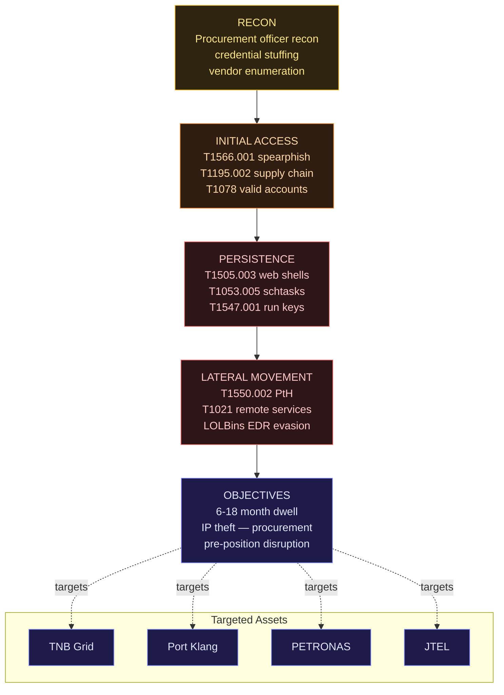

## Context: Malaysia's Biggest Defence Transition in a Decade

In June 2026, Malaysia launched two documents shaping its defence strategy for the next five years: the **National Defence Strategic Plan (PSPN) 2026-2030** and the **Defence Capacity Force Plan (RTKP)**. For the first time in Malaysian defence history, both documents explicitly include AI as an operational component, not just a support tool.

This is a case study on what's being built, the threats being faced, and the gaps that still exist.

---

## Part 1 — What Malaysia Is Building

### PSPN 2026-2030: Three AI Pillars

PSPN outlines three AI pillars in the defence context:

**Pillar 1 — Situational Awareness (SA) Enhancement**

AI integration for real-time intelligence fusion from multiple sources:

- SIGINT (Signals Intelligence) from coastal surveillance radar
- IMINT (Imagery Intelligence) from Razak-1 satellite and MEASAT partnership
- HUMINT feeds from CGSS (Central Government Security Service)
- Open-source intelligence aggregation

System under development: **TINDAK (Tactical Intelligence Network for Defence and Kinetic operations)** — a fusion platform in pilot phase with ATM (Malaysian Armed Forces).

**Pillar 2 — Unmanned Systems Integration**

Malaysia adopted the **STRIDE** framework for drone control:

- **S**urveillance — ISR drones for maritime patrol
- **T**ransport — logistic UAVs for forward operating bases
- **R**esponse — rapid deployment drones for SAR
- **I**ntelligence — persistent surveillance platforms
- **D**efence — counter-UAS systems
- **E**ngagement — armed UAV capability (limited, Special Forces operations only)

Key contracts: BAE Systems Malaysia for C2 (Command and Control) infrastructure, Deftech for ground stations.

**Pillar 3 — Cyber Defence AI**

**PSEP (Defence Executive Strategic Plan) Cyber Command** — formally established August 2025 with mandate to:

- Protect the Classified Defence Network (RSP / Rangkaian Sulit Pertahanan)
- Monitor and respond to cyber threats against defence assets
- Develop offensive cyber capability (limited and highly classified)

---

### NACSA Cryptology Centre — Technical Hub

**NACSA (National Cyber Security Agency)** operates a **Cryptology Centre** functioning as:

1. **Key Management Infrastructure** — for encrypted comms within ATM
2. **AI-assisted threat detection** — anomaly detection on defence networks
3. **Crypto research** — post-quantum cryptography readiness
4. **Standards development** — Malaysian Cybersecurity Standards (MCS) for critical sectors

The Cryptology Centre also serves as a hub for collaboration with the **GCSC (Global Commission on the Stability of Cyberspace)** and limited intelligence exchange with Five Eyes partners.

---

### TNB AI Grid — The Critical Infrastructure Often Overlooked

Tenaga Nasional Berhad (TNB) is a defence component that rarely appears in defence documents — but it is a critical dependency.

**TNB Grid AI System (2025):**

- Predictive maintenance for 33kV transmission lines
- Anomaly detection for substation operations
- Load balancing AI for peak demand management
- Integration with Emergency Response Centre (ERC)

Why is this relevant in a defence context? **The power grid is Priority Target 1** in state-level cyber attacks. All defence systems — communications, surveillance, command centres — depend on a stable grid.

And TNB's grid has internet-facing components. This is an attack surface.

---

## Part 2 — The Threats Being Faced

### CL-STA-1062: Threat to ASEAN Critical Infrastructure

**CL-STA-1062** is a threat actor documented by several cybersecurity firms (including CrowdStrike and Mandiant) as a likely state-sponsored group operating in alignment with Chinese interests, focused on ASEAN critical infrastructure.

**Documented kill chain** (5 stages, 6–18 month dwell):



**Documented TTPs (Tactics, Techniques, Procedures):**

```
Initial Access:
- Spearphishing against procurement officers (T1566.001)
- Supply chain compromise via third-party software vendors (T1195.002)
- Valid accounts via credential stuffing against VPN portals (T1078)

Persistence:
- Web shells on internet-facing servers (T1505.003)
- Scheduled tasks with disguised names (T1053.005)
- Registry run keys (T1547.001)

Lateral Movement:
- Pass-the-hash (T1550.002)
- Remote services exploitation (T1021)
- Living-off-the-land binaries (LOLBins) to evade EDR

Objectives:
- Long-term persistence (6–18 month dwell time)
- Intellectual property theft (procurement plans, technical specifications)
- Pre-positioning for future disruption
```

**Malaysia Exposure:**

Infrastructure identified as high-risk based on public threat intelligence:

- Port Klang Authority systems (maritime logistics)
- PETRONAS upstream operations
- TNB grid management systems
- Jabatan Telekomunikasi (JTEL) systems

In defence context: **pre-positioning for wartime disruption** is the primary concern. Not disruption now — but "left of boom" positioning.

---

### Drone Threat Landscape

ASEAN is experiencing a dramatic increase in drone incidents:

**2025 Incidents (Public Record):**

- Myanmar: Multiple documented drone strikes by non-state actors
- Philippines: Commercial drone surveillance near military installations (suspected)
- Malaysia: 3 reported incidents of unregistered drones near Labuan air base (RMAF confirmed)

**Technical threat for Malaysia:**

The STRIDE framework Malaysia adopted assumes a benign or semi-benign drone environment. The **realistic 2026 threat** includes:

1. **Swarm attacks** — multiple low-cost drones overwhelming point defences
2. **AI-guided kamikaze drones** — commercial hardware modified for impact
3. **EW (Electronic Warfare) disruption** — GPS spoofing, comms jamming
4. **ISR drones** — persistent surveillance that is cheap and hard to detect

**Counter-UAS gap:** Malaysia has Rada RPS-42 radar systems for certain installations. But coverage is not comprehensive, and soft-kill options (jamming, spoofing) require more procurement.

---

### Supply Chain Risk for Defence AI

This is a less-discussed but highly material risk.

**Scenario:** ATM procurement AI systems using components from third-party vendors. That vendor has sub-vendors. One sub-vendor has an insider with firmware access.

This is not hypothetical — it is a **documented attack pattern** in the Ukraine conflict and multiple Middle East operations.

**Malaysia-specific concern:**

Defence procurement for AI systems often involves:

- Hardware from multiple origins (including jurisdictions with potentially differing interests)
- Software from international vendors with global supply chains
- Integration by local system integrators with varying security maturity

NACSA has supply chain security guidelines. But enforcement and verification in defence procurement is an area requiring more investment.

---

## Part 3 — Gap Analysis

### Gap 1: Talent Pipeline

**Problem:** Malaysia needs an estimated 2,000+ AI-specialised cybersecurity engineers for the defence sector within 5 years. The current pipeline is insufficient.

**Why:** Qualified STEM graduates often choose the private sector (higher salaries) over GLCs or ATM. Brain drain to Singapore continues.

**What's being done:** UTM and UPM have MoUs with ATM for defence AI research. But time-to-deployment for academic pipelines is 4–6 years.

**Gap:** Interim capacity — what does ATM do for the next 4 years while the pipeline matures?

### Gap 2: Classified Network Segmentation

**Problem:** RSP (Classified Defence Network) and commercial networks have crossing points. Every crossing point is a potential lateral movement vector.

**Example:** ATM logistics systems that must integrate with commercial shipping platforms for procurement. This interface — if not properly controlled — can become an entry point for CL-STA-1062 style intrusions.

**Status:** NACSA has technical standards for network crossings. Implementation audit is an ongoing process.

### Gap 3: AI Model Integrity

**Problem:** AI models used in defence applications (threat classification, image recognition, anomaly detection) can be attacked via:

- **Model poisoning** — corrupting training data
- **Adversarial examples** — inputs that fool classifiers
- **Model extraction** — stealing model capabilities

Vendor guardrails don't address these because they occur at the model level, not the application level.

**Status:** MINDEF has AI security guidelines but adversarial ML testing is a nascent capability within Malaysia's defence establishment.

---

## Part 4 — Lessons for Security Engineers

What can civilian AI security engineers learn from Malaysia's defence AI journey?

### 1. Your Threat Model Must Include State Actors

Most corporate threat models focus on opportunistic cybercriminals and ransomware groups. Defence experience shows that **state-sponsored actors operate with 6–18 month dwell times** and work with patience vastly different from opportunistic attackers.

If you're building critical infrastructure AI — cloud security platforms, financial AI, healthcare AI — your threat model needs to include patient, well-resourced adversaries.

### 2. AI Systems Are Soft Targets in the Supply Chain

Defence procurement learned this the hard way. For enterprise AI:

- Audit all third-party components in your AI stack
- Verify integrity of model artifacts (hash checking)
- Monitor unusual behaviour from AI systems that might suggest model compromise

### 3. Power and Connectivity Assumptions

Defence planning highlights that AI depends on power and connectivity that can fail. Enterprise AI resilience planning needs to include:

- Degraded mode operations (when AI is unavailable)
- Offline fallback procedures
- Human override protocols that are practised, not just documented

### 4. The Explainability vs Security Trade-off

Explainable AI is a regulatory requirement. But in defence, explainability can leak tactical information. In the enterprise context — explainability in fraud detection can leak detection logic to adversaries.

**The balance to find:** Explainability for compliance and oversight, with protection for detection logic.

---

## Status Summary

| Component                    | Status             | Maturity   |
| ---------------------------- | ------------------ | ---------- |
| PSPN AI Pillar 1 (SA)        | Piloting           | Medium     |
| STRIDE Drone Framework       | Deployed (partial) | Low-Medium |
| PSEP Cyber Command           | Operational        | Medium     |
| NACSA Cryptology Centre      | Operational        | High       |
| TNB Grid AI                  | Production         | Medium     |
| Counter-CL-STA-1062 measures | In progress        | Low-Medium |
| Counter-UAS coverage         | Partial            | Low        |
| AI Model Security            | Nascent            | Low        |
| Talent Pipeline              | Development        | Low        |

---

## Conclusion

Malaysia is making serious investments in defence AI. PSPN 2026-2030 provides the framework, PSEP Cyber Command provides the institutional home, and NACSA provides the technical backbone.

But the gaps that exist are real:

- Talent pipeline is insufficient for the 5-year horizon
- Supply chain security for defence AI needs more rigour
- Counter-UAS is genuinely behind the threat curve
- AI model integrity testing is nascent

For security engineers outside of defence — the lessons are the same: threat models need to be more sophisticated, supply chains need to be audited, and AI systems need offline fallbacks.

Defence is not only about military. It is also about infrastructure, grid systems, and the AI systems we build today.

---

_Sources: MINDEF Malaysia PSPN 2026-2030 (public summary), NACSA Annual Report 2025, CrowdStrike Adversary Intelligence (CL-STA-1062 TTP documentation), Mandiant APT40 and Related Groups Analysis, Jane's Defence Weekly Malaysia reporting, TNB Annual Report 2025, ASEAN Counter-UAS Working Group documentation_
