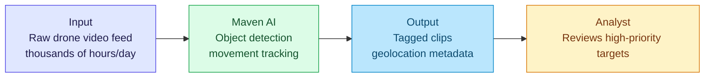
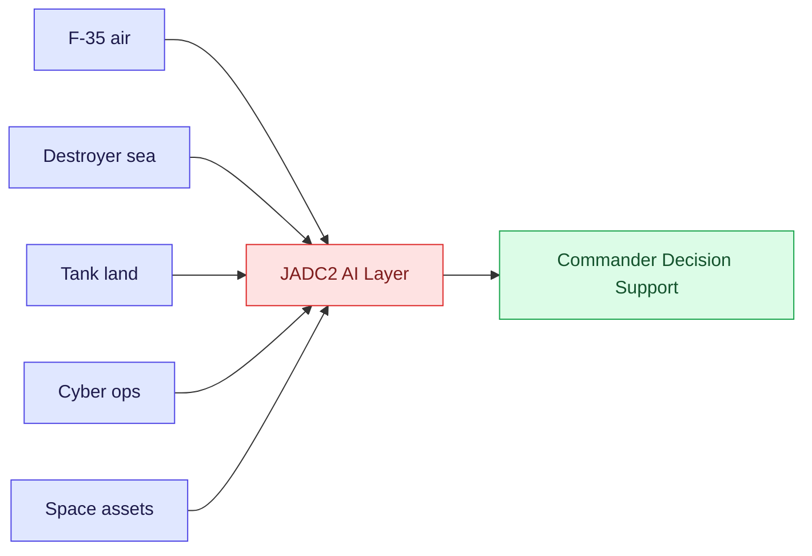
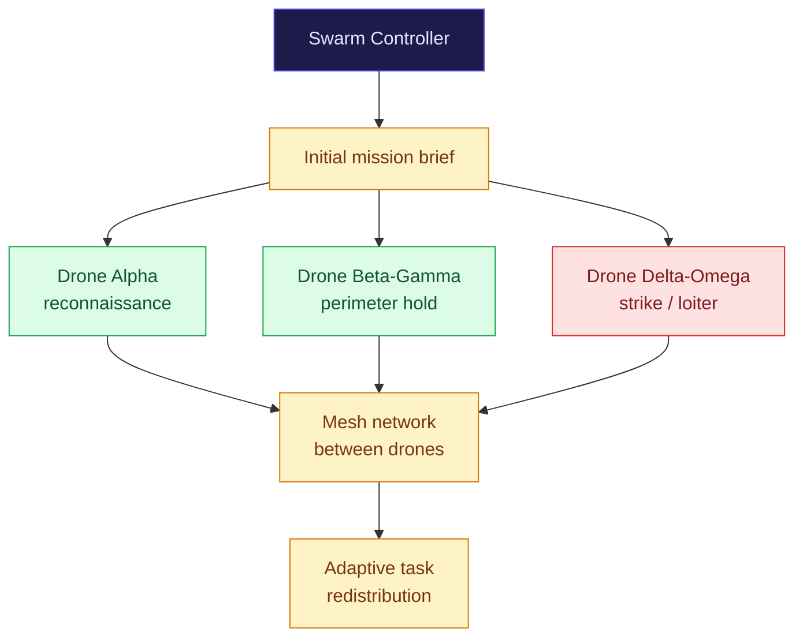

> Field notes. For engineers who want to understand why AI is more than a chatbot — it's already a weapon, a sentinel, and the nervous system of modern warfare.

## War Has Changed

In 2018, more than 3,000 Google engineers signed a protest letter and resigned. The reason: their company was building AI for military drone image analysis — **Project Maven**.

The letter read: *"We believe Google should not be in the business of war."*

Three years later, the contract moved to Palantir. Project Maven continued — larger, more capable.

This isn't a story about Silicon Valley vs the Pentagon. It's a story about the reality that **AI has entered the battlefield**, whether we like it or not.

---

## Project Maven — AI Eyes for Drones

**Project Maven** (formally the *Algorithmic Warfare Cross-Functional Team*) was launched by the US Department of Defense in 2017. Original objective: use AI to process thousands of hours of drone video from Middle Eastern operations.

Before Maven, video analysis required human analysts — slow, fatiguing, and unscalable as drone fleets grew. Maven brought **computer vision** to:

- Identify objects: vehicles, buildings, personnel
- Track movement across frames
- Prioritize which clips analysts needed to review first

After the Google controversy, **Palantir** took over in 2019 via the **Palantir Gotham** platform — now widely used by the US Army for intelligence and logistics.

> **Fact:** Palantir Gotham is used across 300+ US military and intelligence operations. In 2023, the US Army signed a new $250M contract for AI-powered logistics and targeting support.

---

## JADC2 — The AI Brain for Multi-Domain Warfare

**JADC2** (Joint All-Domain Command and Control) is the most ambitious concept in modern military history. Imagine this:

Aircraft, warships, ground forces, cyber units, and satellite weapon systems — all speaking the same AI "language," in real time.

The old problem: each military branch ran its own communication systems. In warfare, slow information = lives lost.

JADC2 aims to solve this with:

- **AI-powered data fusion** — unify sensors across all domains
- **Predictive analytics** — anticipate enemy movement based on patterns
- **Decision support** — surface recommendations to commanders in seconds, not minutes

This is no small project. US Congress has allocated over **$1 billion for JADC2** since 2020, with key programs including the **Advanced Battle Management System (ABMS)** for the Air Force and **Project Overmatch** for the Navy.

---

## DARPA ACE — AI Beats Human Pilot 5-0

In August 2020, in a quietly held test in Nevada, something remarkable happened.

**DARPA ACE** (Air Combat Evolution) — an AI trained for aerial dogfighting — faced off against an experienced F-16 pilot in an air-to-air simulation. Result: **AI won 5-0.**

The pilot described the AI as "aggressive" and "inhuman" — it had no fear instinct, no fatigue, and could execute maneuvers that would render a human pilot unconscious from G-force.

> *"It flies nothing like a human… it does things that, if I were to do them, I would have been unconscious."*
> — US Air Force pilot post-ACE test

In 2023, DARPA continued with the **X-62A VISTA** — a modified F-16 that flew autonomously in actual combat scenarios (without weapon systems, but in real airspace).

**For engineers:** Autonomous systems in safety-critical environments are no longer theoretical. They've been tested in real-world conditions.

---

## Drone Swarms — A Thousand Eyes in the Sky

### China: World Record, 1,000+ Simultaneous Drones

**China Aerospace Science and Technology Corporation (CASC)** demonstrated drone swarms exceeding **1,000 units** in 2021 and 2023. These aren't ordinary drones — they communicate with each other, distribute tasks autonomously, and can overwhelm conventional point-defense systems.

Swarm coordination concept:

This renders legacy air defense systems irrelevant — you cannot shoot down 1,000 units simultaneously.

### US: Replicator Initiative

The US responded with the **Replicator Initiative**, announced by Deputy Secretary of Defense Kathleen Hicks in 2023 — targeting deployment of **1,000+ autonomous drones** across multiple domains by 2025, led by the **Defense Innovation Unit (DIU)**.

Focus: **attritable drones** — cheap, expendable assets, not high-value platforms like the F-35. The strategy was directly inspired by lessons from the Ukraine conflict.

### Ukraine: The World's First Live AI Drone Warfare Lab

The Ukraine conflict since 2022 became the **first real-world test** of AI-assisted drone warfare at scale:

| System | Type | AI Role |
|---|---|---|
| FPV drones | Reconnaissance + strike | AI flight stabilisation; pilot focuses on targeting |
| Switchblade 300/600 | Loitering munition (US-supplied) | Autonomous target acquisition and terminal guidance |
| Shahed-136 | Loitering munition (Iran/Russia) | Autonomous navigation to GPS waypoint, pattern matching |
| Modified DJI drones | Improvised strike | Commercial autopilot repurposed for grenade drops |

The DJI case is a supply chain security wake-up call: consumer drones designed for aerial photography were modified into weapons. This has direct implications for every hardware vendor in the AI stack.

---

## AI in Cyber Warfare

The battlefield isn't only physical. AI has penetrated **cyber warfare** deeply:

**GhostWriter (Russia)** — large-scale disinformation campaign using AI-generated content to spread pro-Russia narratives across Poland, the Baltic states, and Ukraine before and during the conflict.

**Volt Typhoon (China)** — confirmed by FBI and CISA in 2024: Chinese APT group used AI-assisted reconnaissance to silently infiltrate critical US infrastructure, positioning for potential future disruption — operating undetected for years.

**Most significant disclosure:** In February 2024, **Microsoft and OpenAI revealed** that nation-state actors — including Russia (APT28/Forest Blizzard), China (Salmon Typhoon), Iran (Crimson Sandstorm), and North Korea — were using **GPT and large language models** to:

- Write attack code
- Research new vulnerabilities
- Generate more convincing phishing emails
- Translate technical documents for intelligence operations

> *"These actors were not using these tools to develop novel attack capabilities, but rather to improve their productivity and efficiency in existing operations."*
> — Microsoft Threat Intelligence, February 2024

---

## For the Engineer: 4 Takeaways

:::note
**Key engineering implications from military AI deployments:**

1. **Dual-use is real** — computer vision, LLMs, cloud security, autonomous systems: skills you build have defence applications. Understand the ethics before someone else decides for you.

2. **AI supply chain = national security** — DJI drones in Ukraine. Huawei equipment in critical infrastructure globally. Every component in an AI system has a geopolitical dimension.

3. **AI safety scales with stakes** — when AI is wrong in a chatbot, you get a weird answer. When AI is wrong in a targeting system, people die. Reliability, explainability, and human oversight are non-negotiable at this level.

4. **Know what your work builds toward** — Google engineers found out about Maven after it was running. Ask the question early.
:::

---

## Closing

Military AI is no longer a secret Pentagon pilot project. It is **operational reality** — tested in live conflict, funded in the billions, and being raced between great powers.

This series doesn't take a position on whether this is good or bad. It is a **factual field report** for engineers who want to understand the world they're building technology for.

Next in this series: Malaysia and Defence AI — do we have a strategy?
