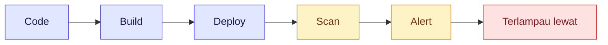
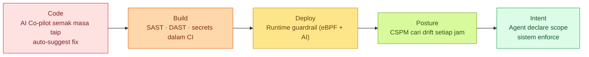
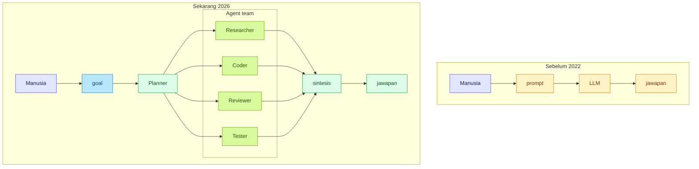
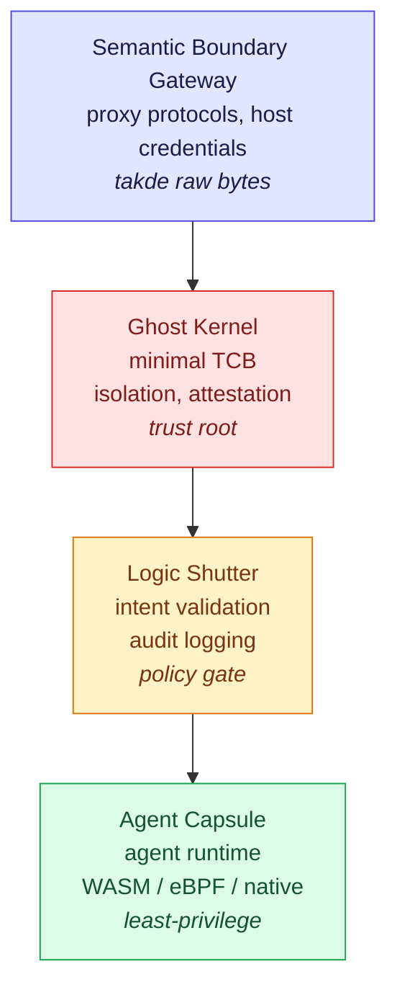

> Catatan dalam Bahasa Melayu. Untuk Gen Z yang baru masuk dunia cloud, AI, dan security. Edisi Julai 2026 — dengan tambahan tentang **Agentic Operating System**, trend terbaru yang orang tengah cakap sekarang.

## Pendahuluan

Kita tak hidup dalam zaman yang sama dengan abang kita masuk kerja lima tahun lepas. Dulu Cloud Security Engineer kena faham firewall je cukup. Sekarang? AI dah jadi agent. Agent dah jadi operating system. Dan kita kena secure benda yang bukan manusia punya decision lagi.

Empat trend ni bergerak serentak. Kalau kau faham satu tapi tak faham tiga lagi, kau tertinggal.

```
1. Cloud Security 2026  →  bukan setakat "patches and compliance"
2. AI Evolution 2026    →  dari LLM ke agent
3. Engineering Evolution → dari prompt ke agentic engineering
4. Agentic OS           →  OS baru yang direka untuk agent, bukan untuk manusia
```

Kita pergi satu per satu.

---

## 1. Cloud Security 2026 — bukan setakat "patches and compliance"

### Trend: **Shift-left + runtime AI guardrails + intent-driven posture**

Dulu security model kita macam ni:



Sekarang:



Yang Gen Z kena faham:

- **Identity is the new perimeter.** Kalau attacker dah dapat credentials, perimeter tak relevan dah. IAM, RBAC, dan least-privilege > firewall.
- **Secrets jangan hard-code.** Pakai Vault, AWS Secrets Manager, atau Doppler. Token dalam `.env` yang push ke GitHub = automatic breach.
- **Supply chain attack real.** SolarWinds, Log4Shell, xz-utils backdoor — semua exploit dependency kau, bukan code kau. SCA (Software Composition Analysis) bukan optional.
- **AI guardrail masa runtime** — platform CSPM moden sekarang ada AI yang belajar baseline app kau, then alarm bila ada anomaly. Bukan pattern-matching dah — pattern-*learning*.
- **🆕 Intent-driven security** — instead of asking "what resources does this process access?", tanya "**what is this process trying to do?**". Ni asas kepada Agentic OS nanti — kita akan masuk dalam detail kat section 4.

### Tool stack Gen Z patut belajar (peringkat junior)

| Layer | Tool contoh | Kenapa penting |
|---|---|---|
| IaC scan | Checkov, tfsec, Trivy | Scan Terraform/K8s masa pre-commit |
| Container scan | Trivy, Snyk Container | Catch vuln dalam image |
| Runtime | Falco, Tetragon (eBPF) | Detect syscall pelik dalam pod |
| CSPM | Contoh: Wiz, Lacework, Orca | Multi-cloud posture |
| CIEM | Contoh: CloudKnox, Sonrai | Least-privilege enforcement |
| Secret | Vault, Doppler, AWS Secrets Manager | No plaintext anywhere |
| 🆕 Agent observability | Langfuse, OpenTelemetry, Helicone | Trace apa agent kau buat, debug bila dia wander |

> 💡 **Bijak mula:** Kalau baru nak masuk security, **Checkov + Trivy** je dulu. Dua tool ni free, ringan, dan boleh run kat laptop sendiri.

---

## 2. AI Evolution 2026 — dari LLM ke Agent

### Apa yang dah berubah?

Model frontier sekarang bukan setakat "jawab soalan" — dah jadi **agent**:

| Generasi | Ciri | Contoh |
|---|---|---|
| GPT-3 era (2020) | Text completion | "Tulislah email" |
| ChatGPT era (2022) | Instruction-tuned, multi-turn | Boleh chat, code, summarize |
| Copilot era (2023) | Tool use, internet access | Boleh browse, execute code |
| Agent era (2024-2025) | Multi-step planning, self-correct | AutoGPT, Devin, Claude with tools |
| Multi-agent (2025-2026) | Agents collaborate, specialize, debate | Crew-style workflows, swarms |
| 🆕 Agent-native OS (2026) | OS-level support for agent runtime | Alibaba Anolis Agentic OS, Tencent AgenticOS research |

**Yang berubah paling cepat untuk Gen Z:**

- **Reasoning models** — o1, o3, DeepSeek-R1, Claude extended thinking. Model sekarang **"berfikir"** sebelum jawab. Boleh solve math/physics/cybersecurity reasoning yang dulu mustahil.
- **Open-weight models jadi mainstream** — DeepSeek, Qwen, Llama 4 — semua run kat laptop (MacBook M-series boleh run 70B quantized). Cloud lock-in dah tak absolut.
- **Context window sampai 1M tokens** — boleh bagi satu buku penuh, atau satu codebase penuh, dalam satu prompt. Workflow "paste the repo, tanya apa vuln" dah jadi real.
- **Multimodal native** — text + image + audio + video dalam satu model. Kau boleh bagi screenshot UI, tanya "ini phishing ke?".
- **🆕 Agents operating agents** — bukan setakat agent panggil tool, tapi agent panggil **sub-agent**, yang panggil sub-sub-agent. Microsoft, Alibaba, dan banyak startup sekarang build infra untuk orchestration ni.

### Trend manusia + AI collaboration



**Gen Z realiti:** kau takkan compete dengan AI. Kau compete dengan **Gen Z lain yang tau cara pakai AI**. Prompting dah jadi *basic literacy*, macam Excel tahun 2010.

---

## 3. Evolution Engineering — dari Prompt ke Agentic

Ini **bahagian paling penting** untuk kau faham. Sebab employment market dah shift.

### Tahap 1: **Prompt Engineering** (2022-2023)

Kau belajar struktur prompt yang bagus:
- Role prompting ("You are a senior security engineer...")
- Few-shot examples
- Chain-of-thought ("Think step by step")
- Negative prompting ("Don't use deprecated libraries")

Skill ni **masih relevan** tapi dah jadi baseline. Semua orang boleh copy-paste template dari Twitter.

### Tahap 2: **Context Engineering** (2024)

Masalah: LLM lupa, hallucinates, atau context window penuh.

Belajar:
- RAG (Retrieval-Augmented Generation) — bagi LLM access kat database kau
- Prompt caching — untuk elak bayar token berulang
- Token budgeting — context window management
- Memory patterns — short-term vs long-term

### Tahap 3: **Tool Use / Function Calling** (2024-2025)

LLM bukan lagi text-in-text-out. Dia boleh panggil function:

```python
# Kau tak tulis code untuk jawab soalan.
# Kau tulis function. LLM decide bila nak panggil.

def get_aws_iam_policy(username: str) -> dict:
    """Get IAM policy for a user"""
    return iam_client.get_user_policy(UserName=username)

# LLM akan faham, "user tanya pasal permission user X" → call tool → bagi jawapan
```

Skill baru: **tool design, schema engineering, error handling untuk non-deterministic system**.

### Tahap 4: **Agentic Engineering** (2025-2026) — *kita kat sini sekarang*

Agent = LLM + memory + tools + planning + self-critique loop.

```python
# Contoh agent yang real
agent = Agent(
    goal="Audit repo ni untuk security issues",
    llm=ClaudeOpus,
    tools=[read_file, run_checkov, grep_secrets, search_cve_db],
    memory=VectorStore(docs=repo_embeddings),
    planner=ReActPlanner(),       # think → act → observe → repeat
    critic=SelfCritiqueLoop(),    # "adakah jawapan aku lengkap?"
    max_iterations=10
)
result = agent.run()
```

**Skill Gen Z kena ada untuk agentic era:**

1. **System design untuk non-determinism** — kau design guardrail, retry logic, observability untuk sistem yang **kadang-kadang salah**. Tradisional engineering assume component deterministik. Agent tak.
2. **Evaluation & benchmarking** — macam mana kau tau agent kau "bagus"? LLM-as-judge, regression test set, golden trajectories.
3. **Cost engineering** — agent loop boleh burn USD 50 satu task. Penting tau bila nak guna Haiku vs Opus, mana perlu cache, mana boleh early-stop.
4. **Security untuk agent** — *prompt injection*, tool poisoning, excessive agency. Agent dengan 47 tools = 47 attack surface. OWASP Top 10 for LLM Applications dah jadi bacaan wajib.
5. **Human-in-the-loop design** — bila agent kena mintak confirm? Bila boleh auto-proceed? Ini bukan UX je, ni security boundary.

### Tahap 5: **Agentic OS Engineering** (2026-) — *arah mana kita pergi*

Ini **trend yang orang tengah cakap sekarang** dan pasal ni post ni updated. Kalau step 1-4 pasal *bina agent*, step 5 pasal *bina OS untuk agent*. Detail dalam section 4.

---

## 4. 🆕 Agentic OS — paradigm baru yang kau kena faham

### Kenapa tiba-tiba orang cakap pasal "operating system"?

Sebab masalah agent sekarang bukan lagi **"agent aku tak cukup pandai"**. Masalah dia:

```
"Agen aku dah cukup pandai.
Tapi bila dia keluar dari sandbox, dia boleh buat benda yang aku tak authorize."
```

Contoh real:

> Kau suruh agent: *"Ringkaskan experimental results project X dan hantar summary kat aku."*
> Yang sepatutnya: agent baca file dari folder `project_x/`, summarize, hantar kat kau.
> Yang *boleh jadi* kalau agent compromised: agent baca file tu, exfiltrate ke server luar, hantar kat attacker, baru summarize untuk kau.

**Permission model lama (POSIX/Linux)**: "process ni boleh access file A dan network B". Kalau attacker dapat control process tu, dia boleh combine capability tu untuk attack.

**Agentic OS model**: "agent ni boleh buat *task* T je. Dia tak tanya untuk file A atau network B — sistem yang decide apa capabilities dia perlukan berdasarkan task declaration."

### Apa itu Agentic OS?

> **AgenticOS** = operating system yang direka dari bawah untuk AI agent, bukan untuk manusia yang taip command.

Konsep asal dari paper Tencent Research (Jun 2026), dan Alibaba Anolis Agentic OS release pertama. Idea besarnya:

**OS tradisional = resource manager.** Process mintak file/socket/process, OS check permission, bagi atau tak.
**Agentic OS = intent filter.** Agent declare *"aku nak buat task T"*, OS synthesize least-capability environment yang cukup untuk T je.

### Empat lapis arsitektur AgenticOS



Setiap layer ada kerja spesifik:
- **Ghost Kernel** — minimum trusted code. Isolasi, scheduling, measurement. Tak expose device file atau debugging interface. Saiz dia kecil supaya boleh formally verified.
- **Logic Shutter** — semak intent agent vs Manifest yang declare. Issue capability token. Log audit. Attach information-flow label pada data.
- **Agent Capsule** — runtime sebenar untuk agent code. Ikut Manifest-Only Runtime: sebelum start, agent submit structured intent declaration. Capabilities luar manifest tak wujud dalam capsule address space.
- **Semantic Boundary Gateway** — proxy semua external protocol. Agent tak boleh access raw byte stream, socket, atau pipe. Agent call `FetchJSON(domain="github.com", path="/api/v1")` je — sistem yang handle TLS, DNS, connection pooling.

### Intent ABI — bukan lagi POSIX

**POSIX API** (model lama): `open()`, `read()`, `write()`, `socket()`, `exec()`, `fork()`, `mmap()`...

**Intent ABI** (model baru): `FetchJSON(domain, path, method)`, `UploadArtifact(target, data)`, `SendMessage(channel, content)`, `RunTask(intent, budget)`.

Prinsip Intent ABI:
- **No raw byte streams** — agent tak boleh construct TCP byte stream sendiri
- **No arbitrary execution** — `exec()` dan `fork()` banned. Toolchain capabilities decomposed jadi concrete semantic interfaces.
- **Reified capabilities** — network permission bound pada 5-tuple ⟨domain, path_prefix, method, data_type, budget⟩
- **Auditable output** — setiap external effect = structured event, bound pada Manifest + capability token
- **Constrained information flow** — input/output carry labels, policy engine analyze source→sink paths

### Apa ini bermaksud untuk Cloud Security?

Sekarang baru orang tengah sambungkan dots:

1. **CSPM akan jadi intent-driven** — instead of "EC2 instance ni ada public IP", tanya "agent yang run kat instance ni declare apa?". Microsoft Defender, Wiz, dan vendor lain dah start build feature macam ni.
2. **Cloud Security jadi policy-as-code untuk intent** — Manifest boleh treated macam Terraform plan, tapi untuk agent tasks. Review apa agent declare, approve sebelum dia run.
3. **Audit trail jadi mandatory** — bukan setakat "siapa access apa", tapi "kenapa agent ni access ni, untuk task apa, manifest mana yang authorize".
4. **Agent runtime jadi first-class cloud workload** — sama macam VM, container, function. Cloud provider akan offer managed agent runtime dengan AgenticOS primitives built-in. Alibaba Anolis Agentic OS dah release. AWS, Azure, GCP mungkin ikut.
5. **OWASP Top 10 for LLM Applications akan merge dengan Cloud Security** — LLM01 (Prompt Injection), LLM06 (Excessive Agency), LLM08 (Vector and Embedding Weaknesses) — semua ni dah overlap dengan cloud security concerns.

### Realiti sekarang: banyak konsep, sikit production

Jujurnya, AgenticOS masih **research paper stage** untuk kebanyakan. Tapi:
- Alibaba Anolis Agentic OS dah release production preview
- Beberapa agent framework (LangChain, AutoGen, CrewAI) tengah experiment dengan Manifest-based capability
- eBPF + WASM sandboxing dah mature dan boleh jadi building block
- OWASP dah ada working group untuk agentic security

**Untuk Gen Z yang baru masuk industri**: kau tak perlu jadi kernel engineer. Tapi kau kena **faham paradigm shift** ni supaya bila boss tanya "macam mana nak secure agent yang ada production access?", kau boleh bagi jawapan yang bukan 2023 template.

---

## 5. Empat trend ni bersatu — kenapa kau kena faham semua sekali

Cloud security 2026 akan dipacu oleh **agentic AI** + **intent-driven posture**:

- **Autonomous SOC** — agent yang pantau log, triage alert, escalate yang suspicious je kat manusia. Bukan replace analyst, tapi kurangkan alert fatigue. Gartner predicts 50% SOCs akan deploy AI decision support by end 2026.
- **Agent-driven remediation** — agent detect misconfig S3, faham context, tulis PR untuk fix, mintak manusia approve. Tapi sekarang — dengan Agentic OS — agent boleh declare "I need to fix this misconfig", sistem synthesize capability, dan agent just do it. Less back-and-forth.
- **Red team jadi agent swarm** — satu agent cari vuln, satu agent exploit, satu agent defend. Captured dalam 30 minit, bukan 30 hari.
- **AI co-pilot untuk SOC analyst** — "tolong summarize alert ni", "tolong tulis Sigma rule untuk pattern ni", "tolong classify IOC ni".
- **🆕 Intent review board** — macam code review, tapi untuk agent Manifests. Sebelum agent dilepaskan ke production, Manifest dia kena review: adakah capabilities ni least-privilege? Adakah high-risk actions perlu human approval?

**Realiti Gen Z masuk industri sekarang:**

- Kerja pertama kau mungkin **bukan** tulis code atau tulis detection rule. Mungkin **review output agent**, atau **tulis eval suite untuk agent**, atau **review agent Manifests**.
- Portfolio kau bukan GitHub penuh side-project je — boleh jadi **agent workflow yang demonstrably secure**, atau **custom Intent ABI plugin** untuk common task.
- Sesi interview mungkin tanya: *"kalau kau bagi agent akses ke production AWS, apa 5 safeguard kau letak?"* — bukan *"apa function Lambda yang return hello world?"*

---

## 6. Action plan untuk Gen Z — minggu demi minggu

Bukan baca dan lupa. Ini concrete (updated dengan trend 2026):

| Minggu | Buat apa |
|---|---|
| 1 | Install **Checkov**. Scan satu Terraform repo. Faham setiap finding. |
| 2 | Install **Trivy**. Scan satu container image. Faham CVE reporting. |
| 3 | Main dengan **Claude / GPT** — bina agent ringkas guna LangChain atau Claude SDK. Beri dia 3 tools. |
| 4 | Cuba **prompt injection** kat agent kau sendiri. Senaraikan 5 attack vector. |
| 5 | Baca **OWASP Top 10 for LLM Applications** (free, online). Highlight mana yang relevant dengan kerja kau. |
| 6 | Tulis satu blog post / video TikTok / Nota LinkedIn — "Apa yang aku belajar". Teaching = learning. |
| 7 | Join satu **Capture The Flag (CTF)** — TryHackMe, HackTheBox, atau Cloud Security CTF. |
| 8 | Bina satu **agentic project** end-to-end — agent yang audit security posture AWS kau. Publish kat GitHub. |
| 9 | 🆕 Cuba tulis satu **Manifest** untuk agent kau. Specify intent, capability boundary, human-confirmation points. Guna skill baru: Manifest-as-code. |
| 10 | 🆕 Main dengan **Langfuse** atau **OpenTelemetry** — trace agent kau. Tengok berapa calls, berapa tokens, mana dia wander. |
| 11 | 🆕 Baca paper **AgenticOS** (arxiv 2606.21129). Highlight 3 idea yang paling menarik. Tulis reflection. |
| 12 | 🆑 Try **Alibaba Anolis Agentic OS preview** atau build mini-AgenticOS concept guna WASM + policy engine. |

> 🎯 **Target 12 minggu:** Kau ada portfolio cloud security + agent engineering + intent-driven architecture. Tiga layer. Satu narrative.

---

## Penutup

Cloud Security 2026 bukan pasal pasang firewall. AI 2026 bukan pasal chat dengan chatbot. Engineering 2026 bukan pasal tulis function. **Agentic OS 2026 bukan pasal run Linux + letak agent atas dia**.

Empat benda ni dah converge. **Agentic OS akan jadi default runtime** untuk cloud workloads. Gen Z yang faham **semua empat** akan ada edge — bukan sebab kau pandai satu benda, tapi sebab kau nampak macam mana mereka connect.

Jangan belajar benda ni asing-asing. Belajar sekali.

Cloud. AI. Agentic. Intent-driven.

Satu mindset.

---

**Baca seterusnya:** Untuk bahagian operation Cloud Security 2026 — macam mana CI, IaC scanning, dan agentic remediation kerja bersama — tengok [**Shift-Left → Auto-Remediation → Agentic Remediation**](/posts/cse-03-shift-left-agentic/).

---

*Sumber rujukan:*
- *Tencent Research — AgenticOS: An Intent-Oriented Secure Operating System Architecture for Autonomous AI Agents (arxiv 2606.21129, Jun 2026)*
- *Cloud Security Alliance — Securing the Agentic Control Plane (Mar 2026)*
- *Alibaba Cloud — Anolis Agentic OS release announcement (Jun 2026)*
- *Microsoft — CNAPP evolution: How Microsoft aligns with leading cloud risk management platforms (Jun 2026)*
- *OWASP Top 10 for LLM Applications (2025)*
- *NIST SP 800-218A — Secure Software Development for AI Systems*
- *Anthropic — Building Effective Agents (2025)*
- *Elastic — Why 2026 is the year to upgrade to an agentic AI SOC*
- *Gartner — 50% of SOCs to deploy AI decision support by 2026*
- *DeepSeek-R1, OpenAI o3, Claude 4 release notes*
