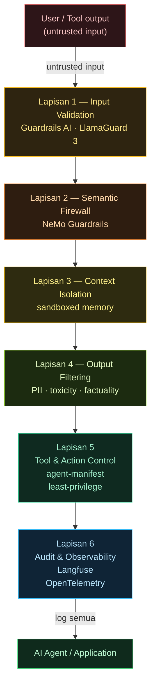
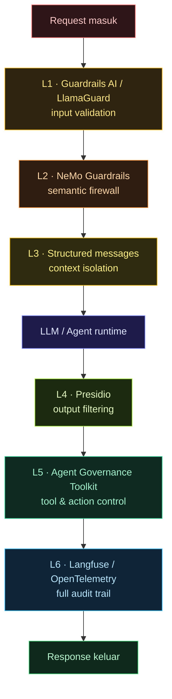

> Nota teknikal dalam Bahasa Melayu. Rujukan praktikal untuk engineer yang nak deploy LLM atau agent dalam production secara selamat.

## Pendahuluan

Kebanyakan team buat benda yang sama: pasang satu input filter, tambah system prompt yang cakap "jangan buat benda jahat", pastu declare sistem dah "secured".

Itu bukan security. Itu security theatre.

Guardrail production yang betul ada **6 lapisan berbeza** — setiap satu catch benda yang lapisan lain miss. Kalau kau ada kurang dari 4, kau ada gap yang boleh dieksploit.

Post ni: peta penuh 6 lapisan, tool mana untuk setiap lapisan, dan apa yang vendor selalu tak bagitau kau pasal kos false positive.

---

## Kenapa satu lapisan tak cukup

Prompt injection masih **OWASP LLM #1 untuk tahun ke-3 berturut-turut** (2024, 2025, 2026). Satu sebab: tiada single fix yang work.

```text
Attacker bypass input filter → inject via tool output (indirect injection)
Attacker bypass semantic check → use multi-step reasoning to leak data
Attacker bypass output filter → exfil via timing side-channel
```

**Defense-in-depth** = satu-satunya approach yang proven. Setiap lapisan independent. Kalau satu fail, lapisan lain still catch.

---

## 6 Lapisan Guardrail Production

Setiap input akan melalui semua 6 lapisan. Setiap lapisan tangkap apa yang terlepas dari lapisan sebelumnya. Kalau satu gagal, yang lain masih kawal.



### Lapisan 1: Input Validation

**Tangkap apa:** Malicious input, injection attempt, jailbreak pattern, PII dalam input.

**Tools:**

- `Guardrails AI` — Python library, validator chains untuk input schema
- `LlamaGuard 3` (Meta) — 8B classifier, detect unsafe content kategori
- `PromptGuard` — cut injection success rate by 67% (Scientific Reports 2025)
- Custom regex/blocklist — murah, fast, tapi brittle

**Kos false positive:** Input filter yang terlalu aggressive = user experience teruk. Benchmark kau sendiri dulu — jangan blind copy threshold dari docs.

```python
from guardrails import Guard
from guardrails.hub import DetectPII, DetectJailbreak

guard = Guard().use_many(
    DetectPII(["EMAIL_ADDRESS", "PHONE_NUMBER"], on_fail="exception"),
    DetectJailbreak(on_fail="exception"),
)

validated = guard.validate(user_input)
```

---

### Lapisan 2: Semantic Firewall

**Tangkap apa:** Indirect prompt injection (via tool output, retrieved docs), topic drift, policy violation yang tak nampak dari pattern matching.

**Tools:**

- **NVIDIA NeMo Guardrails** (`llama-3.1-nemoguard-8b-content-safety`) — model-based semantic check, bukan regex. Designed khusus untuk agentic flows.
- **Colang flows** (dalam NeMo) — define conversation rails secara deklaratif

```yaml
# NeMo Guardrails config
models:
  - type: main
    engine: openai
    model: gpt-4o

rails:
  input:
    flows:
      - check jailbreak
      - check injection
  output:
    flows:
      - check sensitive data
```

**Bila guna:** Lapisan 1 handle pattern. Lapisan 2 handle semantics. Dua benda berbeza — kena ada dua-dua.

**New (2026):** NeMo sekarang ada **Agentic Security** module khusus — detect code injection, SQL injection, XSS, template injection dalam agent tool calls.

---

### Lapisan 3: Context Isolation

**Tangkap apa:** System prompt leakage, data/instruction boundary confusion, cross-session contamination.

**Prinsip utama (OWASP cheat sheet):**

- Asingkan system prompt daripada user input secara struktural — bukan sekadar letak `---` dalam satu string
- Label setiap bahagian context: `[SYSTEM]`, `[USER]`, `[TOOL_OUTPUT]`
- Jangan inject user-controlled content terus dalam system prompt

```python
# Cara yang betul — structural separation
messages = [
    {"role": "system", "content": HARDCODED_SYSTEM_PROMPT},
    {"role": "user",   "content": sanitized_user_input},
    # Tool outputs masuk sebagai role="tool", bukan role="system"
    {"role": "tool",   "content": tool_output, "tool_call_id": call_id},
]
```

**Jangan buat:**

```python
# SALAH — user boleh escape dari context
prompt = f"System: {system_prompt}\nUser said: {user_input}\nNow answer:"
```

---

### Lapisan 4: Output Filtering

**Tangkap apa:** PII dalam output, toxic content, hallucination (untuk high-stakes use case), sensitive internal data leak.

**Tools:**

- `Guardrails AI` validators — `DetectPII`, `ToxicLanguage`, `ValidURL`
- `Microsoft Presidio` — PII detection + anonymization, enterprise-grade
- `LlamaGuard 3` — boleh guna untuk output screening jugak, bukan input je
- Custom output schema validation — kalau kau expect JSON, validate strict

**False positive math yang vendor selalu skip:**

> Kalau kau ada 10,000 request/hari dan output filter ada 2% false positive rate:
> 200 legitimate response kena block setiap hari.
> User experience degradation yang real.

Tune threshold berdasarkan use case kau, bukan default settings.

---

### Lapisan 5: Tool & Action Control

**Tangkap apa:** Tool misuse, excessive agency, unauthorized action, privilege escalation melalui tool chaining.

Ini lapisan yang **paling kerap diabaikan** — padahal agent dengan 47 tools = 47 attack surface.

**Framework baru (Apr 2026):**

**Microsoft Agent Governance Toolkit** (open source) — covers 10/10 OWASP Agentic Top 10:

```bash
pip install agent-governance
```

```python
from agent_governance import PolicyEngine, GovernanceGate

policy = PolicyEngine.from_manifest("agent-manifest.yaml")
gate = GovernanceGate(policy)

# Setiap tool call kena lalu gate
@gate.enforce
async def call_tool(tool_name: str, args: dict):
    return await tools[tool_name](**args)
```

**Manifest-based capability declaration:**

```yaml
# agent-manifest.yaml
agent: security-auditor-v1
capabilities:
  read:
    - s3://my-bucket/reports/**
    - github://org/repo/**.tf
  write: [] # read-only agent
  network:
    - api.github.com
    - api.aws.amazon.com
human_confirmation_required:
  - delete_resource
  - send_email
  - deploy_change
```

**OWASP Agentic Top 10 (Dec 2025) — 10 risiko yang tool control lapisan ni address:**

| #   | Risiko                          | Mitigasi                                        |
| --- | ------------------------------- | ----------------------------------------------- |
| 1   | Goal hijacking                  | Manifest validation setiap step                 |
| 2   | Tool misuse                     | Allowlist tool calls dalam Manifest             |
| 3   | Identity abuse                  | SPIFFE/SPIRE workload identity                  |
| 4   | Memory poisoning                | Validate memory store input/output              |
| 5   | Cascading failures              | Circuit breaker + timeout                       |
| 6   | Rogue agents                    | Agent creation requires explicit capability     |
| 7   | Data exfiltration via reasoning | Output + information-flow labeling              |
| 8   | Privilege escalation            | Least-privilege Manifest, no runtime escalation |
| 9   | Insecure tool chaining          | Composition analysis sebelum execution          |
| 10  | Audit evasion                   | Mandatory structured logging setiap call        |

---

### Lapisan 6: Audit & Observability

**Tangkap apa:** Anomaly dalam agent behavior, drift dari normal usage pattern, retroactive forensics bila ada incident.

**Tools:**

- `Langfuse` — open source LLM observability, trace setiap call + token usage
- `OpenTelemetry` + custom spans — untuk enterprise yang dah ada OTel stack
- `Helicone` — proxy-based logging, zero code change

**Minimum yang kena log:**

```python
{
  "timestamp": "2026-07-06T01:40:00Z",
  "agent_id": "security-auditor-v1",
  "session_id": "sess_abc123",
  "manifest_hash": "sha256:abc...",
  "tool_called": "read_s3_object",
  "capability_id": "cap_read_reports",
  "input_digest": "sha256:...",
  "output_digest": "sha256:...",
  "policy_decision": "ALLOW",
  "latency_ms": 234
}
```

**Red flag dalam log:**

- Agent call tool yang tak dalam manifest → immediate alert
- Output size tiba-tiba 10x normal → possible exfiltration
- Tool call sequence yang tak biasa → possible capability composition attack
- Agent create sub-agent → verify authorization

---

## Stack lengkap untuk production 2026



**Kos realiti:**

- L1 + L4: ~2-5ms latency tambahan
- L2 (NeMo 8B model): ~50-100ms — worth it untuk high-risk flows
- L5: ~1-3ms per tool call
- L6: async, near-zero impact

---

## Framework tambahan yang patut tahu

**AEGIS Framework (Forrester 2026)** — enterprise-level, integrasikan:

- Governance + Identity (SPIFFE/SPIRE)
- Data classification + information flow
- Zero Trust principles untuk agent runtime
- Threat operations (SOC integration)

Untuk startup/small team: start dengan L1 + L3 + L5. Build up dari situ.
Untuk enterprise: semua 6 lapisan, AEGIS untuk governance layer atas sekali.

---

## Penutup

Satu lapisan guardrail = satu point of failure. Enam lapisan = defense-in-depth yang real.

Start kecik. L1 + L3 + L6 minimum viable. Tambah L2, L4, L5 ikut risk profile use case kau.

Dan ingat: **audit trail (L6) wajib ada dari hari pertama** — bukan afterthought. Bila incident berlaku, kau nak trace apa agent buat, bukan teka-teki.

**Langkah seterusnya:** bila audit trail dah feed dalam SIEM kau, soalnya jadi siapa yang close the loop — siapa yang actually baiki misconfig yang flag guardrails? Dalam 2026, jawapannya makin ramai _AI agent_, bukan manusia. Landskap vendor penuh (Palo Alto Cortex Cloud 2.0, Wiz, Orca, Tenable, Aqua, Sysdig, Upwind, BigID, Check Point) dan model Cortex Cloud 3-stage (prevent → react → unify) ada dalam [**Shift-Left → Auto-Remediation → Agentic Remediation**](/posts/cse-03-shift-left-agentic/).

---

_Rujukan:_

- _OWASP Top 10 for LLM Applications 2025 + Agentic Applications Dec 2025_
- _NVIDIA NeMo Guardrails — Agentic Security module (2026)_
- _Microsoft Agent Governance Toolkit (Apr 2026, open source)_
- _Forrester AEGIS Framework for Agentic AI (2026)_
- _PromptArmor — ICLR 2026 (arxiv 2507.15219)_
- _LLM Guardrails: Production Safety Layers Reference 2026 — Digital Applied_
- _OWASP LLM Prompt Injection Prevention Cheat Sheet_
