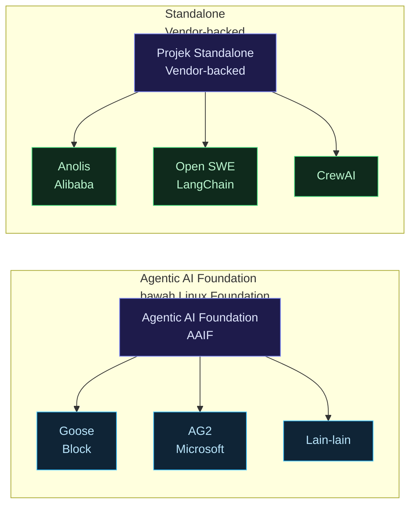
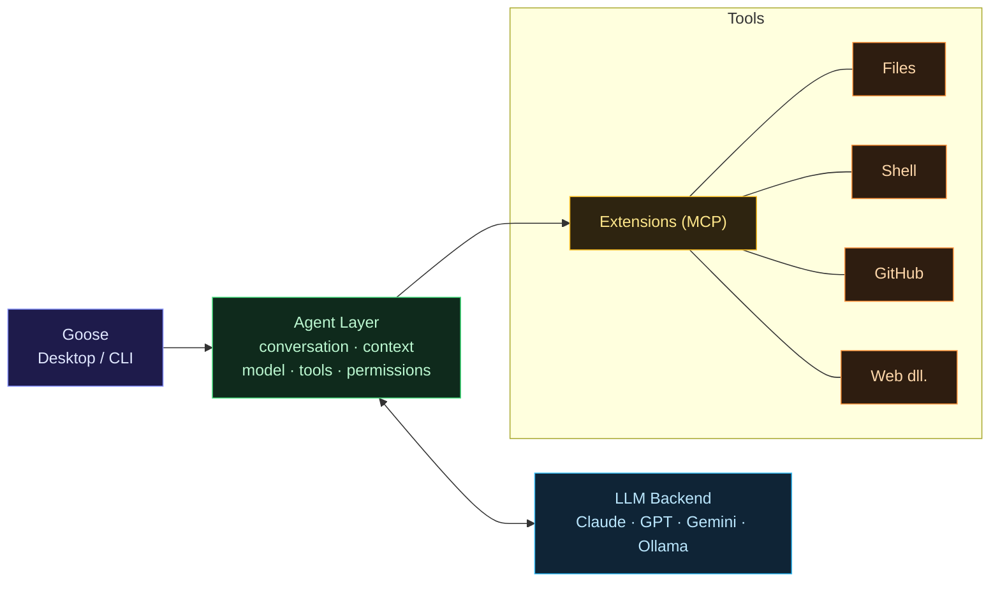
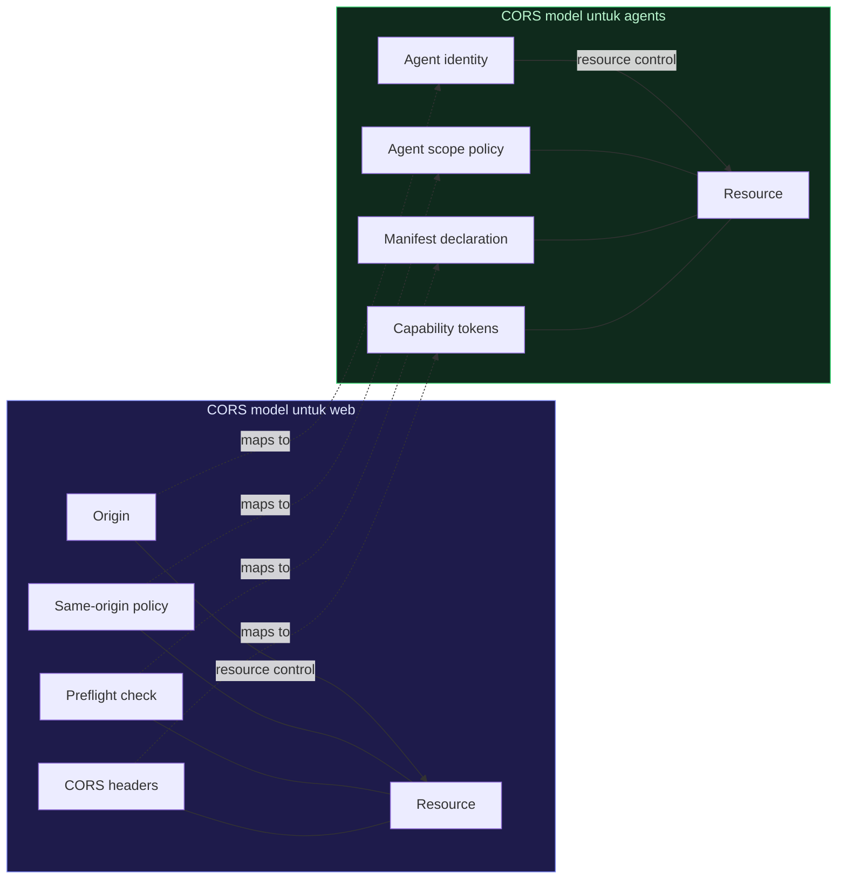
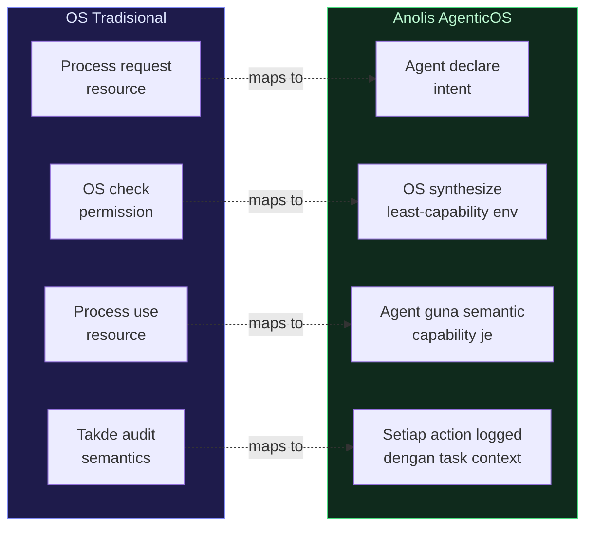

> Nota teknikal dalam Bahasa Melayu. Pasal ekosistem open source yang sedang bina infrastruktur untuk AI agent — dan apa yang perlu kita tahu dari sudut security.

## Pendahuluan

Dua tahun lepas, "AI agent" bermaksud AutoGPT yang kadang-kadang jalan, kadang-kadang loop sampai kau force kill.

Sekarang, 2026 — ada **open source AI agent operating system** yang serius, production-ready, dengan ribuan contributor dan corporate backing. Goose dari Block sudah 50,000+ GitHub stars. Alibaba dah release Anolis AgenticOS dalam production preview. Linux Foundation dah ada **Agentic AI Foundation (AAIF)** yang govern beberapa project serentak.

Ini bukan hype cycle lagi. Ini infrastruktur yang orang dah pakai dalam production.

Post ni: breakdown ekosistem, apa yang setiap project buat, dan yang paling penting — **apa security guardrail yang built-in dan apa yang kita kena tambah sendiri**.

---

## Landscape Open Source Agentic AI 2026



---

## 1. Goose (Block → Linux Foundation)

**GitHub:** `aaif-goose/goose` — 50,000+ stars, Apache 2.0
**Stack:** Rust (67%) + TypeScript (27%)
**Status:** Production — guna oleh Block internally, kini open source

### Apa itu Goose?

Goose bukan sekadar coding assistant. Ia adalah **on-machine AI agent** yang boleh:

- Install software, execute commands, edit files
- Run tests, debug, deploy
- Automate research, data analysis, writing
- Connect ke external APIs dan services melalui MCP (Model Context Protocol)

Berbeza dari kebanyakan AI tool lain — Goose **run kat machine kau sendiri**, bukan dalam cloud sandbox. Ini bermaksud dia ada akses kepada environment sebenar kau.

### Kenapa Block serahkan ke Linux Foundation?

Block released Goose sebagai internal tool, pastu open sourced. Selepas community grow dengan cepat, mereka serahkan governance ke **AAIF (Agentic AI Foundation)** under Linux Foundation — sebab:

1. Neutral governance — supaya vendor lain confident contribute tanpa takut lock-in
2. Interoperability standard — Goose implement **ACP (Agent Communication Protocol)** supaya agents boleh communicate antara satu sama lain
3. Long-term sustainability — Linux Foundation proven track record (Linux, Kubernetes, etc.)

### Arsitektur Goose



### Security guardrail dalam Goose — apa yang ada

Untuk rujukan penuh 6 lapisan architecture (dan kenapa satu lapisan tak pernah cukup), tengok [**AI guardrails — 6 lapisan yang wajib ada dalam production**](/posts/age-02-6-lapisan/).

**Built-in:**

- Permission checks sebelum setiap tool call
- Confirmation prompts untuk destructive actions (delete, deploy)
- Session isolation — setiap session ada context tersendiri
- Local execution — data tak pergi ke cloud tanpa explicit intent

**Discussion yang sedang berlaku dalam komuniti:**
GitHub Discussion #6328 — "Agent Guardrails and Controls: Applying the CORS Model to Agents" — Block engineer cadangkan pakai **CORS model** (Cross-Origin Resource Sharing) sebagai analogy untuk agent permission:



**Apa yang masih kurang (kena tambah sendiri):**

- Audit logging yang comprehensive
- Intent-based access control (AgenticOS style)
- Cross-agent communication security (bila agents call agents)
- Formal Manifest declaration

---

## 2. Anolis AgenticOS (Alibaba Cloud)

**Released:** Jun 2026, production preview
**Base:** Built on Anolis OS (Alibaba's RHEL-compatible Linux distro)
**Status:** First "agent-native OS" dalam production

### Apa yang beza dari traditional OS?

Anolis AgenticOS implement concept dari paper AgenticOS (Tencent Research, Jun 2026) — OS yang direka dari bawah untuk agent, bukan untuk manusia:



### Security feature yang built-in

**Intent Declaration (Manifest):**

```yaml
# agent-manifest.yaml dalam Anolis AgenticOS
agent: data-analyzer-v1
intent: 'analyze sales report Q2 2026 and generate summary'
capabilities:
  read:
    - /data/reports/q2-2026/**
  write:
    - /output/summaries/**
  network: [] # no network access needed for this task
human_confirmation:
  - any_delete_operation
  - any_external_write
```

**Ghost Kernel isolation:** Agent Capsule tak ada access ke raw syscalls. Semua melalui Logic Shutter → Semantic Boundary Gateway.

**Audit trail:**

```json
{
  "agent_id": "data-analyzer-v1",
  "manifest_hash": "sha256:abc...",
  "action": "ReadFile",
  "path": "/data/reports/q2-2026/sales.csv",
  "authorized_by": "cap_read_reports",
  "timestamp": "2026-07-06T01:00:00Z",
  "policy_decision": "ALLOW"
}
```

---

## 3. Open Source Agentic AI Stack (AAIF)

AAIF (Agentic AI Foundation) sekarang ada beberapa project:

| Project   | Dari mana | Fungsi                                  |
| --------- | --------- | --------------------------------------- |
| **Goose** | Block     | On-machine general agent                |
| **AG2**   | Microsoft | AutoGen 2.0 — multi-agent framework     |
| **ACP**   | Community | Agent Communication Protocol standard   |
| **MCP**   | Anthropic | Model Context Protocol (tool interface) |

**Open SWE** (LangChain, 2026) — untuk internal coding agents:

- Built on Deep Agents + LangGraph
- Focus pada software engineering tasks
- Security: built-in code review before execution

---

## 4. Security Guardrail untuk Open Source Agent OS — Apa kena buat

Ini bahagian yang paling penting untuk Cloud Security Engineer.

### Gap sekarang dalam open source agent OS

| Feature               | Goose              | Anolis AgenticOS             |
| --------------------- | ------------------ | ---------------------------- |
| Intent declaration    | ❌ Manual          | ✅ Built-in Manifest         |
| Audit logging         | ⚠️ Basic           | ✅ Structured, cryptographic |
| Capability isolation  | ⚠️ Extension-level | ✅ OS-level (Ghost Kernel)   |
| Cross-agent security  | ❌ In progress     | ⚠️ Partial                   |
| Guardrail integration | ❌ DIY             | ⚠️ Partial                   |

### Stack yang kena tambah untuk Goose (atau mana-mana open source agent)

**Layer 1: Wrap dengan NeMo Guardrails**

```python
# Goose extension wrapper dengan guardrail
from nemoguardrails import RailsConfig, LLMRails

config = RailsConfig.from_path("./guardrails_config")
rails = LLMRails(config)

async def guarded_goose_call(user_input: str) -> str:
    # Check input dulu
    response = await rails.generate_async(
        messages=[{"role": "user", "content": user_input}]
    )
    return response
```

**Layer 2: Microsoft Agent Governance Toolkit**

```bash
pip install agent-governance
```

```python
from agent_governance import PolicyEngine, GovernanceGate

# Define policy dari Manifest
policy = PolicyEngine.from_manifest("goose-manifest.yaml")
gate = GovernanceGate(policy)

@gate.enforce
async def execute_tool(tool_name: str, args: dict):
    return await goose.run_tool(tool_name, **args)
```

**Layer 3: Langfuse untuk audit trail**

```python
from langfuse import Langfuse
langfuse = Langfuse()

# Trace setiap Goose session
with langfuse.trace(name="goose-session") as trace:
    span = trace.span(name="tool-call", input={"tool": "shell", "cmd": cmd})
    result = await goose.execute(cmd)
    span.end(output=result)
```

**Layer 4: CORS-inspired permission model (dari Discussion #6328)**

```yaml
# goose-cors-policy.yaml
agent_scopes:
  - agent: 'goose-dev'
    allowed_origins:
      - local_filesystem: '/home/user/projects/**'
      - shell: ['npm', 'git', 'pytest'] # allowlist commands
      - network: ['api.github.com', 'registry.npmjs.org']
    denied:
      - shell: ['rm -rf', 'sudo', 'curl | bash']
      - network: ['*'] # deny all network except allowlist
    require_confirmation:
      - any_git_push
      - any_package_install
      - any_file_delete
```

---

## 5. Comparison: Goose vs Anolis AgenticOS dari security perspective

| Aspek              | Goose (AAIF)                  | Anolis AgenticOS                   |
| ------------------ | ----------------------------- | ---------------------------------- |
| **Maturity**       | Production (general agent)    | Production preview (OS-level)      |
| **Security model** | CORS-inspired, DIY guardrail  | Intent-based, OS-enforced          |
| **Use case**       | Developer on-machine tasks    | Cloud workload, multi-agent        |
| **Guardrail**      | External (kena setup sendiri) | Built-in (Manifest + Ghost Kernel) |
| **Audit**          | Langfuse (external)           | Native structured logging          |
| **Community**      | 50,000+ stars, active         | Smaller, newer                     |
| **License**        | Apache 2.0                    | TBD                                |
| **Best for**       | Dev productivity, automation  | Enterprise agent runtime           |

---

## 6. Apa security engineer patut buat sekarang

**Untuk team yang nak pakai Goose atau similar open source agent:**

1. **Jangan expose tanpa guardrail** — Default Goose install tak ada input guardrail. Tambah NeMo Guardrails atau Guardrails AI sebelum expose ke user.

2. **Define explicit Manifest** — Walaupun Goose tak enforce Manifest secara OS-level, tulis satu. Guna untuk review dan audit.

3. **Audit trail dari hari pertama** — Setup Langfuse atau OpenTelemetry sebelum production. Bila ada incident, kau nak trace apa agent buat.

4. **Test dengan red team suite** — Guna Garak untuk test agent kau sebelum deploy.

5. **Monitor tool call patterns** — Agent yang tiba-tiba banyak `shell` calls atau access luar normal = anomaly.

6. **Watch Anolis AgenticOS development** — Kalau kau nak agent runtime untuk cloud workload, Anolis akan jadi option yang proper dalam 6-12 bulan.

---

## Penutup

Ekosistem open source agentic AI sedang mature dengan cepat:

- **Goose** dah production-ready untuk developer tasks, perlu external guardrail
- **Anolis AgenticOS** bawa security ke OS level, built-in Manifest dan isolation
- **AAIF** bawah Linux Foundation bagi governance structure yang serius

Bagi Cloud Security Engineer: **ini adalah workload baru yang kau akan secure dalam 12-24 bulan**. Sama macam kau pernah kena belajar secure container (Docker/Kubernetes) — sekarang masa untuk belajar secure agent runtime.

Start dengan Goose. Faham architecture dia. Test guardrail. Pastu tengok bagaimana Anolis solve masalah yang sama kat OS level.

---

_Rujukan:_

- _GitHub: aaif-goose/goose — 50,000+ stars, Apache 2.0_
- _GitHub Discussion #6328 — Agent Guardrails and Controls: Applying the CORS Model to Agents_
- _The New Stack — Why Block handed Goose to the Linux Foundation_
- _Block Engineering Blog — Agent Guardrails (Jan 2026)_
- _Alibaba Cloud — Anolis AgenticOS release (Jun 2026)_
- _DEV Community — The Open Source Agentic AI Stack: What AAIF Projects Do_
- _LangChain — Open SWE: Open-Source Framework for Internal Coding Agents_
- _Microsoft Agent Governance Toolkit (Apr 2026)_
- _Tencent Research — AgenticOS paper (arxiv 2606.21129)_
