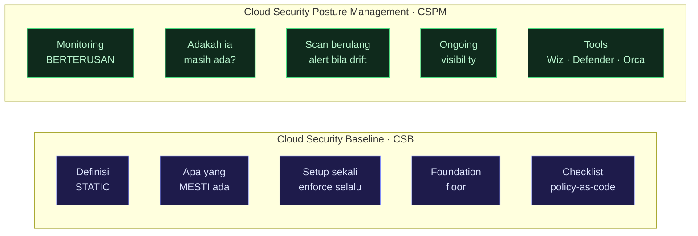
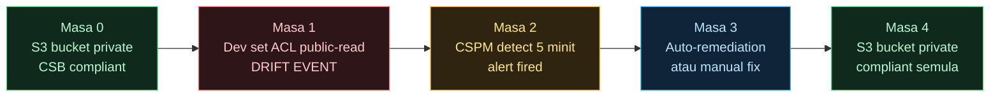
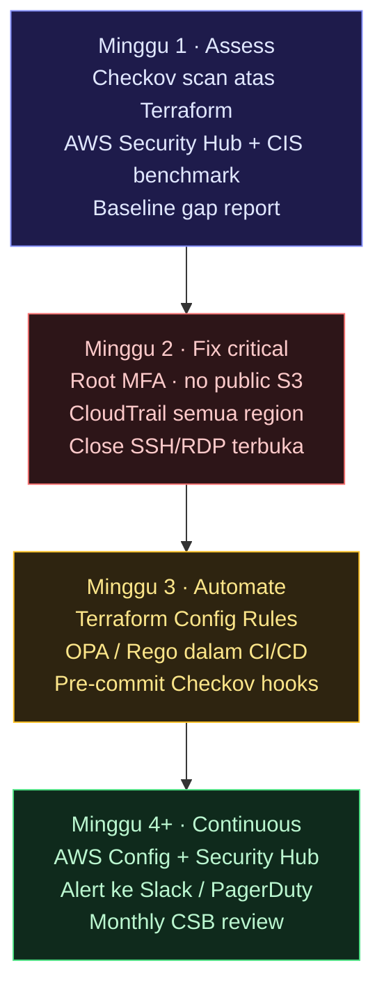

> Nota lapangan dalam Bahasa Melayu. Untuk Cloud Security Engineer yang nak faham hubungan antara Cloud Security Baseline, CSPM, dan cara enforce posture secara automated.

## Pendahuluan

Ada satu pattern yang berlaku hampir setiap kali organisasi kena breach melalui cloud:

> Bukan exploit zero-day. Bukan nation-state attacker dengan tools sophisticated.
> **Konfigurasi default yang tak pernah ditukar.**

Root account tanpa MFA. S3 bucket yang public by default. CloudTrail yang disabled. Security group yang allow `0.0.0.0/0`. Semua ni wujud sebab cloud provider set default yang convenient untuk onboarding — bukan default yang secure.

**Cloud Security Baseline (CSB)** adalah jawapan kepada masalah ini: satu set kontrol minimum yang kena ada dari hari pertama, sebelum workload pertama deploy.

---

## Apa itu Cloud Security Baseline?

Cloud Security Baseline = **set kontrol security yang kena enforce di setiap account/subscription/project**, tanpa exception, sebelum mana-mana workload dibenarkan run.

Bezanya dengan security hardening biasa:

```
Security Hardening:         Cloud Security Baseline:
- Per-workload               - Per-account/subscription
- Selepas deploy             - Sebelum workload pertama
- Specific to service        - Universal untuk semua resource
- Optional (best practice)   - Mandatory (non-negotiable floor)
```

**CSPM vs CSB:**



CSB adalah **apa yang kau define**. CSPM adalah **tool yang pastikan CSB tu masih dalam keadaan baik**.

---

## Benchmark yang jadi asas CSB

Kau tak perlu cipta CSB dari kosong. Ada benchmark established yang boleh jadi starting point:

### CIS Benchmarks (paling widely-used)

| Benchmark             | Versi terkini     | Platform |
| --------------------- | ----------------- | -------- |
| CIS AWS Foundations   | v7.0.0 (Apr 2026) | AWS      |
| CIS Azure Foundations | v6.0.0 (Apr 2026) | Azure    |
| CIS GCP Foundations   | v3.0.0            | GCP      |
| CIS Kubernetes        | v1.9.0            | K8s      |

AWS Security Hub sekarang support **CIS AWS Foundations Benchmark v5.0** (announced Oct 2025) — boleh enable terus dari console, auto-scan setiap resource.

### Microsoft Cloud Security Benchmark (MCSB)

Microsoft publish MCSB yang cover multi-cloud (AWS + Azure dalam satu framework). Bahagian "Posture and Vulnerability Management" dalam MCSB secara explicit define:

> _"Define the security configuration baselines for different resource types in the cloud. Use configuration management tools to establish the configuration baseline automatically before or during resource provisioning."_

### NIST SP 800-53 Rev 5

Untuk regulated industries (government, healthcare, finance) — NIST controls jadi mandatory. Boleh map CIS controls ke NIST untuk dual compliance.

---

## CSB Minimum — Apa kena ada di setiap account

Ini **floor yang tidak boleh dikompromikan** — berdasarkan CIS AWS v7.0 + MCSB + field experience:

### 1. Identity & Access (IAM)

```
✅ Root account MFA enabled
✅ Root account access keys DELETED (bukan disabled, deleted)
✅ MFA required untuk semua human users
✅ Password policy: min 14 chars, complexity, no reuse 24x
✅ Tiada inline policies (semua managed policies)
✅ Principle of least privilege enforced
✅ No wildcard (*) dalam Action atau Resource untuk production roles
✅ Access keys rotate setiap 90 hari
✅ Inactive users/roles disabled selepas 90 hari
```

### 2. Logging & Monitoring

```
✅ CloudTrail enabled — ALL regions, ALL management events
✅ CloudTrail log file validation enabled
✅ CloudTrail logs dihantar ke S3 + CloudWatch Logs
✅ S3 bucket untuk CloudTrail: private, versioning on, MFA delete
✅ VPC Flow Logs enabled untuk semua VPC
✅ Config Rules enabled (AWS Config)
✅ GuardDuty enabled semua region
✅ Security Hub enabled + CIS benchmark enabled
```

### 3. Networking

```
✅ Tiada Security Group dengan inbound 0.0.0.0/0 ke port 22 (SSH)
✅ Tiada Security Group dengan inbound 0.0.0.0/0 ke port 3389 (RDP)
✅ Default VPC tidak digunakan untuk production workload
✅ VPC endpoints untuk S3 dan DynamoDB (elak traffic keluar internet)
✅ Network ACLs reviewed, no allow-all rules
```

### 4. Storage & Data

```
✅ S3 Block Public Access enabled — account level
✅ S3 bucket versioning enabled untuk critical data
✅ EBS encryption by default enabled
✅ RDS encryption at rest enabled
✅ S3 Server-Side Encryption (SSE-S3 minimum, SSE-KMS untuk sensitive)
✅ Secrets dalam Secrets Manager / Parameter Store, bukan plaintext
```

### 5. Billing & Governance

```
✅ Billing alerts configured (threshold bukan nombor besar)
✅ Budget alerts configured
✅ Cost anomaly detection enabled
✅ Resource tagging policy enforced (Owner, Environment, CostCenter)
✅ AWS Organizations SCPs (Service Control Policies) untuk restrict regions
```

---

## Cara enforce CSB secara automated

Manual checklist tak sustainable. Ini cara buat CSB enforce itself:

### Option 1: AWS Config Rules (built-in, free tier ada)

```hcl
# Terraform — deploy CIS-aligned Config Rules
resource "aws_config_config_rule" "mfa_enabled_for_iam_console" {
  name = "mfa-enabled-for-iam-console-access"

  source {
    owner             = "AWS"
    source_identifier = "MFA_ENABLED_FOR_IAM_CONSOLE_ACCESS"
  }
}

resource "aws_config_config_rule" "root_mfa_enabled" {
  name = "root-account-mfa-enabled"

  source {
    owner             = "AWS"
    source_identifier = "ROOT_ACCOUNT_MFA_ENABLED"
  }
}

resource "aws_config_config_rule" "s3_block_public" {
  name = "s3-account-level-public-access-blocks"

  source {
    owner             = "AWS"
    source_identifier = "S3_ACCOUNT_LEVEL_PUBLIC_ACCESS_BLOCKS"
  }
}
```

### Option 2: OPA/Rego Policy-as-Code

```rego
# csb_baseline.rego — enforce CSB dalam CI/CD pipeline
package csb.baseline

# DENY: S3 bucket yang ada public access
deny[msg] {
    resource := input.resource.aws_s3_bucket[name]
    resource.acl == "public-read"
    msg := sprintf("CSB VIOLATION: S3 bucket '%v' kena private", [name])
}

# DENY: Security group yang allow SSH dari mana-mana
deny[msg] {
    resource := input.resource.aws_security_group[name]
    rule := resource.ingress[_]
    rule.from_port <= 22
    rule.to_port >= 22
    rule.cidr_blocks[_] == "0.0.0.0/0"
    msg := sprintf("CSB VIOLATION: Security group '%v' allow SSH dari 0.0.0.0/0", [name])
}

# DENY: IAM user tanpa MFA
deny[msg] {
    resource := input.resource.aws_iam_user[name]
    not resource.force_destroy
    not input.resource.aws_iam_user_login_profile[name]
    msg := sprintf("CSB VIOLATION: IAM user '%v' tiada MFA configured", [name])
}
```

### Option 3: Checkov pre-commit (paling senang untuk start)

```yaml
# .pre-commit-config.yaml
repos:
  - repo: https://github.com/bridgecrewio/checkov
    rev: 3.2.0
    hooks:
      - id: checkov
        args:
          - --framework
          - terraform
          - --check
          - CKV_AWS_1 # S3 bucket access logging
          - CKV_AWS_8 # EC2 no public IP
          - CKV_AWS_18 # S3 no public access
          - CKV_AWS_41 # CloudTrail enabled
          - --soft-fail # warn dulu, tukar ke hard-fail bila ready
```

---

## Drift Detection — CSPM untuk pantau CSB

CSB define baseline. Drift berlaku bila seseorang atau sesuatu tukar konfigurasi dari baseline tu. CSPM tool pantau drift ini secara real-time.

### Cara drift berlaku



Tanpa CSPM, drift mungkin tak dikesan selama berhari-hari atau berminggu-minggu.

### Tool untuk drift detection 2026

| Tool                   | Kekuatan                                                   | Free tier?            |
| ---------------------- | ---------------------------------------------------------- | --------------------- |
| **AWS Config**         | Native AWS, CIS benchmark built-in                         | Ya (limited rules)    |
| **AWS Security Hub**   | Aggregate findings, CIS v5.0 support                       | Ya (30 hari trial)    |
| **Checkov + CI/CD**    | Pre-deploy scan, policy-as-code                            | ✅ Open source        |
| **tfdrift-falco**      | Real-time Terraform drift detection via Falco + CloudTrail | ✅ Open source (2026) |
| **Wiz**                | Deep posture + graph-based risk                            | Enterprise (berbayar) |
| **Orca Security**      | Agentless, full stack visibility                           | Enterprise (berbayar) |
| **Defender for Cloud** | Azure-native + multi-cloud                                 | Sebahagian free       |

**Untuk small team / startup:** AWS Config + Checkov dalam CI/CD sudah cukup untuk CSB enforcement. Free, automated, dan coverage untuk 80% common misconfigs.

**Untuk enterprise:** Wiz atau Orca untuk visibility luas, Defender untuk Azure-native, tfdrift-falco untuk real-time IaC drift.

---

## CSB dan AI/Agentic workloads — gap baru 2026

CSB tradisional (CIS, NIST) tak cover AI/agent workloads. Ini **gap yang semakin kritikal**:

| Control tradisional | Gap untuk AI workload                                                  |
| ------------------- | ---------------------------------------------------------------------- |
| IAM least privilege | Agent ada identity — perlu scoped, time-bound capability               |
| S3 access control   | Agent boleh read/write S3 — perlu audit trail per-task, bukan per-user |
| CloudTrail logging  | Log "service_account_X accessed S3" — tapi kenapa? untuk task apa?     |
| Network restriction | Agent boleh call external APIs — perlu per-intent network policy       |

**CSB extension untuk AI workloads (praktik terbaik sekarang):**

```yaml
# ai-workload-baseline.yaml
ai_baseline:
  agent_identity:
    - setiap agent ada dedicated IAM role (bukan shared)
    - role tak boleh assume human user roles
    - session duration maximum 1 jam
  audit:
    - setiap agent action kena ada task_id dalam log
    - CloudTrail + Langfuse/OTel untuk full trace
  network:
    - agent roles dalam SCP — restrict ke allowed API endpoints
    - egress filter via VPC endpoint policy
  data_access:
    - agent tak boleh access production data tanpa explicit tag approval
    - S3 bucket policy: deny jika tag "ai-approved" tidak ada
```

Kawalan shift-left atas tangkap kebanyakan jurang agent identity dan audit. Tapi ia tak handle **apa yang berlaku bila misconfig terlepas dari CI dan landing dalam production** — di situ auto-remediation dan agentic remediation masuk. Tengok landskap vendor 2026 yang penuh dan Palo Alto Cortex Cloud deep dive dalam post seterusnya: [**Shift-Left → Auto-Remediation → Agentic Remediation**](/posts/cse-03-shift-left-agentic/).

---

## Workflow praktis: setup CSB dari kosong

Untuk account baru atau audit existing account:



---

## Penutup

CSB adalah **security floor**, bukan ceiling.

Kau boleh ada CSB yang perfect dan masih kena breach — kalau attacker exploit application layer, insecure code, atau zero-day. Tapi CSB memastikan kau tak kena breach kerana sebab-sebab yang boleh dielak: root tanpa MFA, S3 yang accidental public, CloudTrail yang off.

Dalam dunia cloud yang besar dan cepat berubah, CSB yang automated dan CSPM yang continuous adalah minimum viable security posture. Bukan optional. Bukan "nak buat nanti". **Dari hari pertama account wujud.**

---

_Rujukan:_

- _CIS AWS Foundations Benchmark v7.0.0 — Tenable Audits (Apr 2026)_
- _CIS Azure Foundations Benchmark v6.0.0 — NIST NCP (Apr 2026)_
- _AWS Security Hub — CIS AWS Foundations Benchmark v5.0 support (Oct 2025)_
- _Microsoft Cloud Security Benchmark — Posture and Vulnerability Management_
- _ISACA — Cloud Security Posture Management: Control Plane for Modern Cloud Risk (2026)_
- _CloudToolStack — Cloud Security Baseline 2026: What Every Account Should Have_
- _higakikeita/tfdrift-falco — Real-time Terraform Drift Detection via Falco (2026)_
- _OpenMalo — CSPM Practical Guide 2026_
