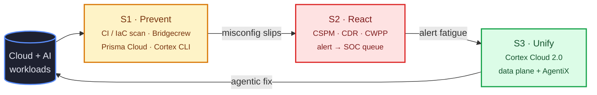

> Nota lapangan analyst industri. Positioning vendor setakat Julai 2026 — setiap claim ada source inline.

## TL;DR

Cloud security 2026 ada tiga operating model — shift-left (prevent), auto-remediation (react), dan agentic remediation (unify). Setiap vendor berada di titik berlainan dalam line ni, dan setiap satu jawab soalan "should the AI be allowed to touch production?" dengan jawapan yang berbeza. **Palo Alto Cortex Cloud 2.0** adalah platform pertama yang claim *end-to-end* agentic remediation merentasi code-to-cloud-to-SOC, dengan published metric **90% MTTR reduction** dan FedRAMP High+Moderate authorization. **Wiz** (sekarang Google Cloud) paling hampir dari segi scope tapi condong ke *recommend-with-deep-context* melalui Green Agent. **Orca** sengaja letak human dalam loop dan tolak full autonomy. Peralihan dari CSPM-as-ticket-queue ke CNAPP-as-agent-workforce adalah defining industry move 2026.

---

## Part A — Vendor Landscape

Tiga model 2026: shift-left (prevent), auto-remediation (react), agentic (unify). Setiap vendor jawab "should AI touch production?" dengan jawapan berbeza.

### Palo Alto — Cortex Cloud 2.0

Prisma Cloud + Cortex CDR merged Feb 13 2025 ([PR](https://investors.paloaltonetworks.com/news-releases/news-release-details/palo-alto-networks-introduces-cortex-cloud-future-real-time)); **Cortex AgentiX** ditambah awal 2026 ([blog](https://www.paloaltonetworks.com/blog/cloud-security/cloud-security-platform-cortex-cloud-2-0/)). Bina atas Redlock, Twistlock, Bridgecrew, Cider. Autonomy: agent propose, execute on approved scope. Metric: **90% MTTR** (4d → 1–2h).

> "Driven by autonomy from Cortex AgentiX—trained on more than a billion real-world responses—Cortex Cloud turns analysis into action while keeping you in control. Every step is visible and auditable."
> — [Introducing Cortex Cloud 2.0](https://www.paloaltonetworks.com/blog/cloud-security/cloud-security-platform-cortex-cloud-2-0/)

### Wiz (Google Cloud)

**$32B Wiz acquisition** closed March 11 2026 — Google's paling besar setakat ini ([PR](https://www.googlecloudpresscorner.com/2026-03-11-Google-Completes-Acquisition-of-Wiz)). Agentic layer: **Green Agent** (remediation), **Red Agent** (exploitability), **MCP server** atas **Security Graph** ([blog](https://www.wiz.io/blog/introducing-wiz-mcp)). Autonomy: deep-context recommendation, one-click human execution. Metric: "Zero Criticals".

> "By delivering the right context and guidance to the person best positioned to fix the issue, the Green Agent helps turn every team member into a security expert and every finding into a fix."
> — [Introducing the Green Agent](https://www.wiz.io/blog/introducing-wiz-green-agent)

### Orca Security

**Opus acquisition** (May 2025) tambah orchestration ([BusinessWire](https://www.businesswire.com/news/home/20250513831405/en/Orca-Security-Acquires-Opus-to-Pioneer-Agentic-AI-Powered-Cloud-Security-Remediation-and-Prevention)). Bina atas **Unified Data Model**. Autonomy: **recommend-first, autonomous-later**. Metric: not disclosed.

> "Orca's AI agents start with recommending action, backed by transparent reasoning. This keeps a human in the loop, in the near term, to validate conclusions and next steps."
> — [Agentic Cloud Security Platform](https://orca.security/resources/blog/introducing-agentic-cloud-security-platform/)

### Tenable — Hexa AI

**Hexa AI** (RSAC 2026) adalah agentic engine untuk **Tenable One** ([PR](https://investors.tenable.com/news-releases/news-release-details/introducing-tenable-hexa-ai-agentic-engine-supercharges-security)). Bina atas **Exposure Data Fabric** (40,000+ deployment). Autonomy: **dial-it-yourself** per workflow.

> "Hexa AI combines machine speed with human control, to the extent desired by customers. Everything Tenable Hexa AI does is logged, so you can always audit any action it takes."
> — [Tenable Hexa AI blog](https://www.tenable.com/blog/hexa-ai-agentic-ai-for-exposure-management)

### 1-liner

- **Aqua — Compass** (Apr 22 2026): MCP server; eBPF runtime → agentic containment; agent investigate, human approve. Not disclosed.
- **Sysdig — Sage** (Aug 2025): "first agentic AI cloud security analyst"; runtime multi-step reasoning. Not disclosed.
- **Upwind — Agentic Pack** (May 13 2026): Blue/Green/Red/Choppy agent atas runtime-first data layer. Runtime-first, human execute.
- **BigID — Agentic Risk Remediation** (DSPM): AI-guided prioritization; **GigaOm DSPM Leader 2025**. Recommendation-first.
- **Check Point — CloudGuard**: rule-based auto-remediation; ~70% alert-volume drop. Skop sempit, bukan LLM-driven.

> "The agent performs investigation, correlation, and policy generation, while the final decision remains with the security team."
> — [Aqua Security blog](https://www.aquasec.com/blog/autonomous-runtime-security-turning-runtime-intelligence-into-agentic-response/)

### Comparison Table

| Vendor | Shift-Left Maturity (1-5) | Auto-Remediation (1-5) | Agentic Capability (1-5) | Human-in-Loop Model | 2026 Position |
|---|---|---|---|---|---|
| **Palo Alto Cortex Cloud 2.0** | 5 (Bridgecrew lineage, ASPM, Cortex CLI) | 5 (one-click + AI-generated playbooks) | 5 (Cortex AgentiX, trained on 1B+ responses) | Tiered: SAFE/RISKY/UNSAFE scoring, full audit trail | **Leader** — satu-satunya unified code-cloud-SOC stack dengan FedRAMP High+Mod |
| **Wiz** (Google Cloud) | 5 (IDE-to-prod, AI-BOM) | 4 (Green Agent one-click + MCP) | 4 (Green/Red/MCP agents) | Recommend-with-deep-context, human execute | **Leader** — context model terkuat, agent ecosystem paling luas |
| **Orca** | 4 (Unified Data Model, code repo scans) | 3 (auto-remediation rules + PR-gen) | 4 (Threat Investigation, AppSec Triage agents) | Recommend-first, human validate (deliberate) | **Leader** — stance yang opinionated; Unified Data Model terkuat |
| **Tenable Hexa AI** | 4 (Tenable Cloud Security, IaC scans) | 4 (orchestrated workflows, MCP) | 4 (mission-ready + custom agents) | **Dial-it-yourself** — per-workflow toggle | **Strong Challenger** — exposure dataset paling luas, opt-in autonomy |
| **Aqua Compass** | 3 (Secure AI, image scanning) | 4 (runtime containment policies) | 4 (MCP server, agentic runtime response) | Agent investigate, human approve enforcement | **Niche Leader** — runtime-first, angle containment yang unik |
| **Sysdig Sage** | 3 (Falco, image scanning) | 3 (multi-step reasoning on threats) | 3 (collaborative agent workflows) | Conversational, human-driven | **Challenger** — runtime-focused, agent UX differentiator |
| **Upwind Agentic Pack** | 3 (runtime context layer) | 3 (Green agent for remediation guidance) | 4 (Blue/Green/Red/Choppy named agents) | Runtime-context-first, human execute | **Niche Challenger** — runtime-first data layer |
| **BigID** | 2 (DSPM focus) | 4 (agentic remediation routing) | 3 (Agentic Risk Remediation) | Recommendation-first | **DSPM Leader** — specialization data-layer |
| **Check Point CloudGuard** | 4 (IaC, CI/CD hooks) | 4 (rule-based auto-remediation) | 2 (AI-native exposure, bukan agentic) | Rule-based, skop sempit | **Legacy Leader** — install base paling luas, autonomy konservatif |

---

## Part B — Palo Alto Cortex Cloud: Peta 3-Stage

Palo Alto adalah satu-satunya vendor yang organize journey secara eksplisit sebagai **prevent → react → unify** — strategy yang "Traditional CNAPPs only react after an issue emerges, creating a dangerous lag in the era of AI-driven development" ([Palo Alto, Cortex Cloud 2.0](https://www.paloaltonetworks.com/blog/cloud-security/cloud-security-platform-cortex-cloud-2-0/)).

### Stage 1 — Prevent (shift-left)

Surface area **Bridgecrew / Prisma Cloud / Cortex CLI**. Goal: tangkap misconfig sebelum PR merge.

| Produk | Fungsi | Data Feeds Forward |
|---|---|---|
| **Cortex CLI for Code Security** | Scan IaC, SCA, secrets, OSS license compliance locally | Finding tagged by policy → API server |
| **IaC misconfiguration scanner** | Terraform, CloudFormation, ARM, Kubernetes, Dockerfile | Finding flow ke ASPM Command Center |
| **ASPM (Application Security Posture Mgmt)** | Cross-repo PR/CI posture, policy-as-code | Pre-deployment gate + post-deployment verification |
| **Cortex CLI** + IDE plugin | VS Code, JetBrains inline remediation hint | Developer-accepted fix auto-commit |
| **CI/CD hook** (GitHub Actions, GitLab, Jenkins, HCP Terraform) | Block merge atas critical finding | "Fix PR" auto-generated untuk human review |
| **SCA scanner** | Open-source dependency CVE check, license risk | Vulnerability signal ke runtime engine |

### Stage 2 — React (legacy rule-based)

Tempat **Prisma Cloud CSPM** + **Cortex CDR** duduk sebelum merger. Limit yang Stage 3 direka untuk baiki:

- **Reactive** — alert fire selepas deploy
- **Siloed** — CSPM tak nampak CDR runtime signal
- **Ticket-closure ≠ root-cause** — close Jira tak halang re-introduction
- **One-alert-at-a-time** — tiada attack-path correlation, tiada blast-radius

### Stage 3 — Unify (Cortex Cloud 2.0)

**Pembeza 2026**. Single data plane merentasi code, supply chain, cloud, dan SOC.

| Capability | Fungsi | Data Source |
|---|---|---|
| **Cortex Agentic Assistant** | LLM-powered investigation, threat hunting, playbook generation | Native MCP integration, XQL queries |
| **Cortex AgentiX** | Agent runtime — trained on **1B+ real-world security responses** | All Cortex Cloud signals |
| **AI-Powered Prioritization (Urgency)** | Ganti CVSS dengan exploitability + reachability + KEV + EPSS + business context | Vulnerability Risk Score (CVRS, 0-100) |
| **Attack-path analysis** | Correlate identities + network + vulns → crown-jewel reachability | Graph model merentasi semua layer |
| **One-click remediation + auto-fix** | `POST /public_api/appsec/v1/issues/fix/trigger_fix_pull_request` ([API docs](https://docs-cortex.paloaltonetworks.com/r/Cortex-Cloud-Platform-APIs/Trigger-Fix-Pull-Request)) | Bulk PR creation dari mana-mana issue set |
| **Cortex XSIAM (SOC integration)** | Cloud alert → XSIAM case; SOC analyst nampak finding yang sama dengan cloud engineer | Unified XDR/XSIAM data plane |
| **NHI / machine-identity context** | IAM analysis at workload level (service account, role, permission) | Cloud IAM APIs + audit log |
| **AI-coding-assistant integration** | Code fix via Cody/Sourcegraph + Claude (per [AWS case study](https://aws.amazon.com/partners/success/palo-alto-networks-anthropic-sourcegraph/)) | IDE + repo |
| **OSS / build coverage** | SCA, license compliance, supply-chain SBOM | npm, PyPI, Maven, Go registries |

### Data-Flow Narrative (S1 → S2 → S3)

Developer tulis Terraform pada Isnin. **Stage 1** scan PR dalam CI — jumpa overpermissive IAM role, block merge, suggest fix, developer accept. **Stage 2** monitor deployed role pada runtime terhadap baseline least-privilege. Kalau developer click "override", **Stage 3** correlate role tu dengan exploitable CVE atas publicly-exposed container, kira attack path ke crown-jewel S3 bucket, rank Critical bawah **Cortex Vulnerability Risk Score**, dan **Agentic Assistant** generate one-click auto-fix PR. Whole loop: detection → root-cause → fix-PR → verification, dalam minit.

### Human-in-Loop Checkpoints

Checkpoint yang didokumenkan:

- **Issue Exception Approval Workflow** — admin-configurable approval chain ([AgentiX docs](https://docs-cortex.paloaltonetworks.com/r/Cortex-AgentiX/Cortex-AgentiX-Documentation/Configure-the-issue-exception-approval-workflow?contentId=cJaBFcoPu7%7EYZiQlMLjqpQ))
- **RCI (Remediation Confidence Indicator)** — SAFE / RISKY / UNSAFE per finding
- **RBAC-aligned execution** — agent run bawah user IAM
- **Management audit log** — Action Center / Issue Rules / Auth event ([docs](https://docs-cortex.paloaltonetworks.com/r/Cortex-CLOUD/Cortex-Cloud-Runtime-Security-Documentation/Management-audit-log-messages))
- **XQL Resolution SLA + Timer** — track via XQL ([notes](https://docs-cortex.paloaltonetworks.com/r/Cortex-CLOUD/Cortex-Cloud-Posture-Management-Release-Notes/Investigation-and-Response?contentId=8HWL5YBUIxPgTMdBraviiQ))

### Metrics & Certifications

- **90% MTTR reduction** (Feb 2025 launch blog): 4 days → 1–2 hours ([Palo Alto blog](https://www.paloaltonetworks.com/blog/2025/02/announcing-innovations-cortex-cloud/))
- **75% decrease in analyst workload** (same source)
- **100% incident close rates** (vendor benchmark, not third-party validated)
- **FedRAMP High + Moderate** — **satu-satunya CNAPP dalam FedRAMP Marketplace** dengan kedua-dua designation, dalam 3 bulan dari launch ([May 2025 blog](https://www.paloaltonetworks.com/blog/cloud-security/cortex-cloud-stands-alone-to-secure-mission-critical-workloads-with-fedramp-high-and-moderate/))
- **100% MITRE ATT&CK detection, zero FP** — vendor claim, tiada independent methodology

### Critical Gaps (apa yang masih black-box)

Palo Alto's claim "every step is visible and auditable" ada practical limit. Cortex AgentiX's training corpus "1B+ real-world responses" adalah opaque — tiada model card, tiada third-party hallucination benchmark. Formula CVRS document input (EPSS, KEV, Reachability) tapi **bukan weighting**. MITRE ATT&CK 100% detection claim tiada independent methodology. Audit log wujud; **aggregate agent decision quality dashboard** (false-positive rate, auto-fix rollback rate, override frequency) tak publish secara terbuka. Untuk platform "trust", public trust dashboard akan close the loop — dan ketidakhadirannya adalah jurang antara marketing dengan verifiable guarantee.

---

## Strategic Take

Tiga falsafah trust dalam 2026:

1. **Full autonomy, opinionated** — Palo Alto Cortex Cloud 2.0. Trained on a billion responses; you can override; we execute.
2. **Deep context, human-led** — Wiz Green Agent. Every signal to the right person; the click is safe.
3. **Recommend-first, deliberate** — Orca, Aqua Compass. AI propose; human approve; tiada production touch tanpa permission.

Pilihan yang betul bergantung pada **risk tolerance** (regulated industry condong #3), **headcount pressure** (understaffed team condong #1), dan **audit requirement**. Apa yang dah tak boleh diterima dalam 2026 ialah posture Stage-2 yang lama: CSPM yang generate 10,000 alert, hantar ke SOC analyst, dan panggil ia "security operations". Agentic shift adalah real, vendor consensus adalah jelas — soalnya bukan lagi *sama ada* nak delegate remediation pada AI, tapi *falsafah autonomy yang mana* organisasi kau boleh defend dalam post-mortem.

---

## Penafian (Disclaimer)

Artikel ini ialah **komen analyst industri**, bendorong endorsement vendor, nasihat kewangan, atau opinion undang-undang. Semua nama produk (Palo Alto Networks, Cortex Cloud, Prisma Cloud, Cortex AgentiX, Wiz, Orca Security, Tenable, Aqua Security, Sysdig, Upwind, BigID, Check Point, Bridgecrew, Twistlock, Redlock, Cider, NeMo Guardrails, LlamaGuard, AWS Config, AWS Security Hub, Cloudflare, Google Cloud, GitHub, dan lain-lain) adalah trademark pemilik masing-masing; penyebutan di sini adalah untuk rujukan industri secara fakta sahaja.

**Metric vendor yang dipetik dalam artikel ni (90% MTTR reduction, 75% analyst workload reduction, 100% incident close rate, 100% MITRE ATT&CK detection, ~70% alert-volume drop, $32B acquisition price, FedRAMP authorization, dll.) diambil dari sumber yang publish oleh vendor masing-masing, dengan citation inline.** Ini adalah vendor-reported benchmark melainkan dinyatakan sebaliknya; penulis tak verify secara bebas. Pembaca patut rujuk documentation semasa setiap vendor untuk claim yang terkini.

**Petikan adalah excerpt verbatim** dari blog vendor, press release, dan laporan analyst yang boleh diakses orang awam, digunakan di bawah prinsip fair-use untuk komen industri, dengan attribution dikekalkan.

**Tiada material conflict of interest untuk didedahkan.** Penulis tak pegang jawatan, ekuiti, advisory, atau engagement berbayar dengan mana-mana vendor yang dinamakan dalam artikel ni. Laman ni tak run affiliate link atau content yang ditaja vendor.

Untuk keputusan procurement enterprise, sentiasa buat vendor evaluation sendiri, minta benchmark data terkini bawah NDA, dan rujuk profesional security serta undang-undang yang berkelayakan sebelum deployment.