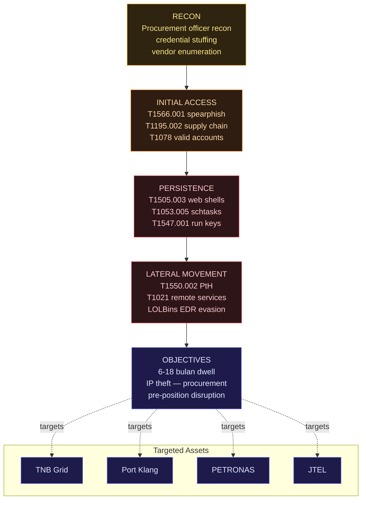

## Konteks: Peralihan Pertahanan Terbesar Malaysia Dalam Satu Dekad

Pada Jun 2026, Malaysia melancarkan dua dokumen yang membentuk strategi pertahanan lima tahun hadapan: **Pelan Strategik Pertahanan Negara (PSPN) 2026-2030** dan **Rancangan Tenaga Kapasiti Pertahanan (RTKP)**. Buat pertama kali dalam sejarah pertahanan Malaysia, kedua-dua dokumen ini secara eksplisit memasukkan AI sebagai komponen operasi, bukan hanya alat sokongan.

Ini adalah kajian kes tentang apa yang sedang dibina, ancaman yang dihadapi, dan jurang yang masih wujud.

---

## Bahagian 1 — Apa Yang Malaysia Bina

### PSPN 2026-2030: Tiga Teras AI

PSPN menggariskan tiga teras AI dalam konteks pertahanan:

**Teras 1 — Situational Awareness (SA) Enhancement**

Integrasi AI untuk real-time intelligence fusion daripada pelbagai sumber:

- SIGINT (Signals Intelligence) daripada radar coastal surveillance
- IMINT (Imagery Intelligence) daripada satelit Razak-1 dan MEASAT partnership
- HUMINT feeds daripada CGSS (Central Government Security Service)
- Open-source intelligence aggregation

Sistem yang dibangunkan: **TINDAK (Tactical Intelligence Network for Defence and Kinetic operations)** — platform fusion yang dalam fasa piloting dengan ATM (Angkatan Tentera Malaysia).

**Teras 2 — Unmanned Systems Integration**

Malaysia adopt rangka kerja **STRIDE** untuk kawalan dron:

- **S**urveillance — ISR drones untuk maritime patrol
- **T**ransport — logistic UAVs untuk forward operating bases
- **R**esponse — rapid deployment drones untuk SAR
- **I**ntelligence — persistent surveillance platforms
- **D**efense — counter-UAS systems
- **E**ngagement — armed UAV capability (terhad, untuk Ops Pasukan Khas sahaja)

Kontrak utama: BAE Systems Malaysia untuk C2 (Command and Control) infrastructure, Deftech untuk ground stations.

**Teras 3 — Cyber Defence AI**

**PSEP (Pelan Strategik Eksekutif Pertahanan) Cyber Command** — ditubuhkan secara formal Ogos 2025 dengan mandate:

- Protect Rangkaian Sulit Pertahanan (RSP)
- Monitor dan respond kepada cyber threats terhadap pertahanan assets
- Offensive cyber capability development (terhad dan highly classified)

---

### NACSA Cryptology Centre — Hub Teknikal

**National Cyber Security Agency (NACSA)** menjalankan **Cryptology Centre** yang berfungsi sebagai:

1. **Key Management Infrastructure** — untuk encrypted comms dalam ATM
2. **AI-assisted threat detection** — anomaly detection pada rangkaian pertahanan
3. **Crypto research** — post-quantum cryptography readiness
4. **Standards development** — Malaysian Cybersecurity Standards (MCS) untuk sektor kritikal

Cryptology Centre adalah juga hub untuk collaboration dengan **GCSC (Global Commission on the Stability of Cyberspace)** dan pertukaran maklumat dengan Five Eyes partners secara terhad.

---

### TNB AI Grid — Infrastruktur Kritikal Yang Kadang Dilupakan

Tenaga Nasional Berhad (TNB) adalah komponen pertahanan yang tidak disebut dalam dokumen pertahanan — tapi ia adalah critical dependency.

**TNB Grid AI System (2025):**

- Predictive maintenance untuk 33kV transmission lines
- Anomaly detection untuk substation operations
- Load balancing AI untuk peak demand management
- Integration dengan Emergency Response Centre (ERC)

Kenapa ini relevan dalam konteks pertahanan? **Power grid adalah Priority Target 1** dalam state-level cyber attacks. Semua sistem pertahanan — komunikasi, surveillance, command centres — bergantung kepada grid yang stabil.

Dan TNB grid mempunyai internet-facing components. Ini adalah attack surface.

---

## Bahagian 2 — Ancaman Yang Dihadapi

### CL-STA-1062: Ancaman ASEAN Critical Infrastructure

**CL-STA-1062** adalah threat actor yang didokumentasikan oleh beberapa firma cybersecurity (termasuk CrowdStrike dan Mandiant) sebagai kemungkinan state-sponsored group yang beroperasi dengan kepentingan China, dengan fokus kepada ASEAN critical infrastructure.

**Kill chain yang didokumentasikan** (5 stages, 6–18 bulan dwell):



**TTPs (Tactics, Techniques, Procedures) yang didokumentasikan:**

```
Initial Access:
- Spearphishing terhadap procurement officers (T1566.001)
- Supply chain compromise melalui third-party software vendors (T1195.002)
- Valid accounts melalui credential stuffing terhadap VPN portals (T1078)

Persistence:
- Web shells pada internet-facing servers (T1505.003)
- Scheduled tasks dengan disguised names (T1053.005)
- Registry run keys (T1547.001)

Lateral Movement:
- Pass-the-hash (T1550.002)
- Remote services exploitation (T1021)
- Living-off-the-land binaries (LOLBins) untuk evade EDR

Objectives:
- Long-term persistence (6-18 bulan dwell time)
- Intellectual property theft (procurement plans, technical specifications)
- Pre-positioning untuk future disruption
```

**Malaysia Exposure:**

Infrastruktur yang identified sebagai high-risk berdasarkan public threat intel:

- Port Klang Authority systems (maritime logistics)
- PETRONAS upstream operations
- TNB grid management systems
- Jabatan Telekomunikasi (JTEL) systems

Dalam context pertahanan: **pre-positioning untuk wartime disruption** adalah concern utama. Bukan disruption sekarang — tapi "left of boom" positioning.

---

### Drone Threat Landscape

ASEAN sedang experience peningkatan drone incidents yang dramatic:

**2025 Incidents (Public Record):**

- Myanmar: Multiple documented drone strikes oleh non-state actors
- Philippines: Commercial drone surveillance near military installations (suspected)
- Malaysia: 3 reported incidents of unregistered drones near Labuan air base (RMAF confirmed)

**Technical threat untuk Malaysia:**

STRIDE framework yang Malaysia adopt assume benign atau semi-benign drone environment. **Realistic 2026 threat** include:

1. **Swarm attacks** — multiple low-cost drones untuk overwhelm point defences
2. **AI-guided kamikaze drones** — commercial hardware, modified for impact
3. **EW (Electronic Warfare) disruption** — GPS spoofing, comms jamming
4. **ISR drones** — persistent surveillance yang murah dan sukar di-detect

**Counter-UAS gap:** Malaysia ada Rada RPS-42 radar systems untuk certain installations. Tapi coverage adalah tidak comprehensive, dan soft-kill options (jamming, spoofing) memerlukan lebih banyak procurement.

---

### Supply Chain Risk untuk Defence AI

Ini adalah less-discussed tapi highly material risk.

**Scenario:** ATM procurement AI systems yang menggunakan components dari third-party vendors. Vendor tersebut ada sub-vendors. Satu sub-vendor ada insider dengan akses kepada firmware.

Bukan hypothetical — ini adalah **documented attack pattern** dalam Ukraine conflict dan multiple Middle East operations.

**Malaysia-specific concern:**

Defence procurement untuk AI systems sering involve:

- Hardware dari multiple origins (termasuk dari jurisdictions dengan interests yang potentially berbeza)
- Software dari international vendors dengan global supply chains
- Integration done by local system integrators dengan varying security maturity

NACSA ada supply chain security guidelines. Tapi enforcement dan verification dalam defence procurement adalah area yang perlu lebih investment.

---

## Bahagian 3 — Gap Analysis

### Gap 1: Talent Pipeline

**Masalah:** Malaysia perlu anggaran 2,000+ AI-specialized cybersecurity engineers untuk defence sector dalam 5 tahun. Current pipeline tidak cukup.

**Kenapa:** STEM graduates yang qualified sering pilih private sector (higher salary), bukan GLC atau ATM. Brain drain kepada Singapore juga berterusan.

**Apa yang sedang dilakukan:** UTM dan UPM ada MoU dengan ATM untuk defence AI research. Tapi time-to-deployment untuk academic pipeline adalah 4-6 tahun.

**Gap:** Interim capacity — apa yang ATM buat untuk next 4 tahun sambil tunggu pipeline mature?

### Gap 2: Classified Network Segmentation

**Masalah:** RSP (Rangkaian Sulit Pertahanan) dan commercial networks ada crossing points. Tiap crossing point adalah potential lateral movement vector.

**Example:** ATM logistics system yang kena integrate dengan commercial shipping platforms untuk procurement. Interface point ini — kalau tidak dikawal dengan betul — boleh jadi entry untuk CL-STA-1062 style intrusion.

**Status:** NACSA ada technical standards untuk network crossing. Implementation audit adalah proses yang berterusan.

### Gap 3: AI Model Integrity

**Masalah:** AI models yang digunakan dalam defence applications (threat classification, image recognition, anomaly detection) boleh diserang melalui:

- **Model poisoning** — corrupt training data
- **Adversarial examples** — inputs yang fool classifier
- **Model extraction** — steal model capabilities

Vendor guardrails tidak address ini kerana ia berlaku pada model level, bukan application level.

**Status:** MINDEF ada AI security guidelines tapi adversarial ML testing adalah nascent capability dalam Malaysia's defence establishment.

---

## Bahagian 4 — Pelajaran Untuk Security Engineers

Apa yang boleh civilian AI security engineers pelajari dari Malaysia's defence AI journey?

### 1. Threat Model Anda Mesti Include State Actors

Kebanyakan corporate threat models focus pada opportunistic cybercriminals dan ransomware groups. Defence experience tunjukkan bahawa **state-sponsored actors beroperasi dengan dwell time 6-18 bulan** dan beroperasi dengan kesabaran yang jauh berbeza.

Kalau anda bina critical infrastructure AI — cloud security platforms, financial AI, healthcare AI — threat model anda perlu include patient, well-resourced adversaries.

### 2. AI Systems Adalah Soft Target Dalam Supply Chain

Defence procurement belajar ini dengan cara yang susah. Untuk enterprise AI:

- Audit semua third-party components dalam AI stack
- Verify integrity daripada model artifacts (hash checking)
- Monitor unusual behaviour dari AI systems yang suggest model compromise

### 3. Power dan Connectivity Assumptions

Defence planning highlight bahawa AI depends on power and connectivity yang boleh fail. Enterprise AI resilience planning perlu include:

- Degraded mode operations (bila AI tidak available)
- Offline fallback procedures
- Human override protocols yang dilatih, bukan hanya documented

### 4. Transparency vs Security Trade-off

Explainable AI adalah regulatory requirement. Tapi dalam defence, explainability boleh leak tactical information. Dalam enterprise context yang lebih mundane — explainability dalam fraud detection boleh leak detection logic kepada adversaries.

**Balance yang perlu dicari:** Explainability untuk compliance dan oversight, dengan protection untuk detection logic.

---

## Status Summary

| Komponen                     | Status             | Maturity   |
| ---------------------------- | ------------------ | ---------- |
| PSPN AI Teras 1 (SA)         | Piloting           | Medium     |
| STRIDE Drone Framework       | Deployed (partial) | Low-Medium |
| PSEP Cyber Command           | Operational        | Medium     |
| NACSA Cryptology Centre      | Operational        | High       |
| TNB Grid AI                  | Production         | Medium     |
| Counter-CL-STA-1062 measures | In progress        | Low-Medium |
| Counter-UAS coverage         | Partial            | Low        |
| AI Model Security            | Nascent            | Low        |
| Talent Pipeline              | Development        | Low        |

---

## Kesimpulan

Malaysia sedang membuat pelaburan serius dalam AI untuk pertahanan. PSPN 2026-2030 memberikan framework, PSEP Cyber Command memberikan institutional home, dan NACSA memberikan technical backbone.

Tapi gap yang wujud adalah real:

- Talent pipeline tidak cukup untuk 5 tahun ke hadapan
- Supply chain security untuk defence AI perlu lebih rigour
- Counter-UAS adalah genuinely behind the threat curve
- AI model integrity testing adalah nascent

Untuk security engineers yang bukan dalam pertahanan — pelajaran yang relevan adalah sama: threat models perlu lebih sophisticated, supply chain perlu diaudit, dan AI systems perlu ada offline fallback.

Pertahanan bukan hanya tentang tentera. Ia juga tentang infrastruktur, grid, dan sistem AI yang kita bina hari ini.

---

_Sumber: MINDEF Malaysia PSPN 2026-2030 (public summary), NACSA Annual Report 2025, CrowdStrike Adversary Intelligence (CL-STA-1062 TTP documentation), Mandiant APT40 and Related Groups Analysis, Jane's Defence Weekly Malaysia reporting, TNB Annual Report 2025, ASEAN Counter-UAS Working Group documentation_
