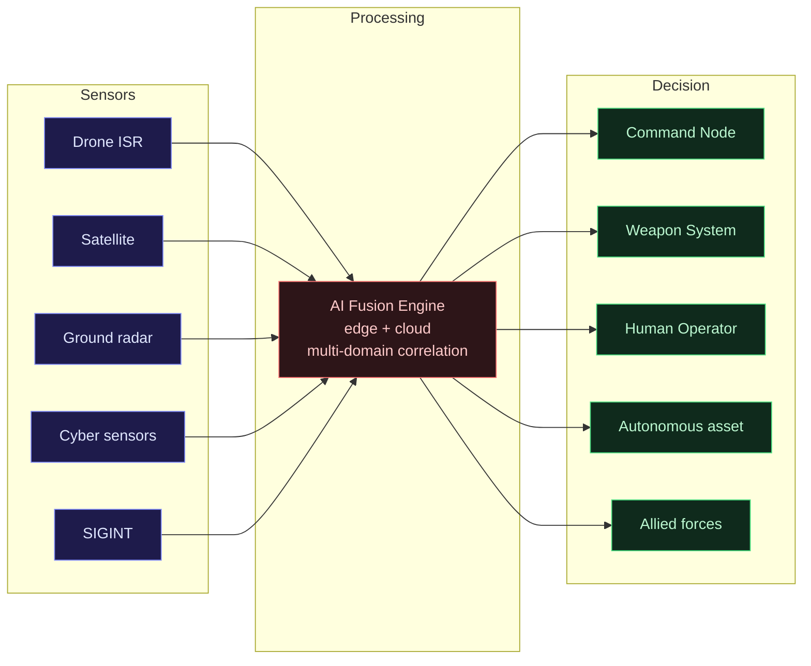

> Ini bukan post tentang fiksyen dystopia atau teori konspirasi. Ini breakdown teknikal tentang sistem AI ketenteraan yang dah deployed, dah tested, dan dah digunakan dalam konflik nyata.

## Perang Dah Berubah — Dan Kau Mungkin Miss It

Tahun 2016, US Department of Defense (**DoD**) melancarkan satu program yang nampak biasa: automate analisis footage drone. Nama dia **Project Maven**.

Lapan tahun kemudian, kita ada AI yang boleh terbang F-16 dan menang 5-0 lawan pilot manusia terbaik. China deploy swarm 1,000+ drone dalam satu masa. Ukraine guna drone murah dengan AI flight assist untuk bunuh kereta perisai bernilai jutaan dolar. Nation-state hackers guna GPT untuk research attack vectors.

Kalau kau engineer dalam bidang AI, cloud, atau security — semua ni bukan "isu orang lain". Ini adalah landscape di mana teknologi yang kau build, deploy, dan maintain boleh jadi dual-use tanpa kau sedar.

---

## Project Maven — Bila Silicon Valley Jumpa Pentagon

**Project Maven** (nama rasmi: Algorithmic Warfare Cross-Functional Team) dimulakan DoD pada April 2016 dengan objektif yang nampak straightforward: guna computer vision untuk analisis video daripada drone surveillance.

Masalahnya? Footage drone yang military kumpul setiap hari dalam operasi di Iraq dan Syria — beribu-ribu jam. Analyst manusia tak mampu process semua tu. AI boleh.

Google dapat kontrak ni pada 2018. Total contract value: anggaran USD 9 juta. Tak besar dari segi angka, tapi implikasinya besar.

> **Apa yang berlaku:** 4,000+ Google employees tandatangan petition untuk henti projek. Lebih 10 senior engineers buat keputusan resign. Alasan: Google tak patut build teknologi warfare. Letter itu sebut: _"We believe Google should not be in the business of war."_

Google umumkan mereka tak akan renew kontrak selepas tamat pada 2019.

Tapi Project Maven tak berhenti. **Palantir Technologies** ambil alih. Platform mereka — **Palantir AIP** dan **Gotham** — sekarang jadi infrastructure untuk AI-assisted targeting dan intelligence analysis dalam DoD. Contract terbaru 2023: USD 463 juta untuk NATO Special Operations Command.

**Apa yang kita belajar:**

- Commercial AI company boleh exit. Program tak akan stop.
- Bila kau build general-purpose AI tools, kau tak boleh fully control macam mana ia digunakan.
- Engineer yang buat keputusan resign tu bukan salah — tapi gap yang mereka tinggalkan diisi oleh vendor lain.

---

## JADC2 — Bila Semua Domain Bercakap Antara Satu Sama Lain

**JADC2** (Joint All-Domain Command & Control) adalah mungkin program AI ketenteraan yang paling ambitious yang sedang berlaku sekarang — dan paling kurang dibincangkan dalam kalangan tech community.

Konsepnya: connect semua sensor, asset, dan decision-maker merentasi semua domain — darat, laut, udara, angkasa, dan cyberspace — dalam satu network yang boleh share data secara real-time dan buat keputusan lebih laju dari manusia.



Dulu setiap service ada network sendiri: Army ada ABMS (Advanced Battle Management System), Air Force ada benda lain, Navy ada benda lain. JADC2 adalah usaha nak unify semua ni.

**Kenapa AI kritikal dalam JADC2:**

Modern battlefield generate data dalam terabytes per hari. Missile baru boleh travel Mach 5+. Manusia tak boleh process dan react dalam timeframe yang relevant. AI bukan "nice to have" dalam konteks ni — ia adalah keperluan fizikal.

**DoD Directive 3000.09** (Autonomous Weapon Systems, dikemaskini 2023) establish polisi bahawa sistem senjata autonomi mesti ada "appropriate levels of human judgment over the use of force" — tapi ia juga acknowledge bahawa dalam certain scenarios, kelajuan operasi mungkin melebihi kemampuan human-in-the-loop.

Dalam erti kata lain: polisi dah acknowledge trade-off antara human oversight dan operational speed. Ini bukan hypothetical dilemma lagi.

---

## DARPA ACE — AI Menang 5-0 Lawan Pilot Terbaik

Ogos 2020, **DARPA** (Defense Advanced Research Projects Agency) buat satu tournament yang akan jadi sejarah: **ACE** (Air Combat Evolution) program.

Heron Systems' AI agent lawan Colonel Dan "Torch" Lehoski — one of the top F-16 pilots dalam Air Force.

Keputusan: **AI menang 5-0**.

> _"It was the most aggressive, creative, and dynamic flying I've ever seen,"_ — Dan Lehoski selepas kalah.

AI guna taktik yang pilot manusia tak akan guna — terbang sangat dekat, tukar arah dengan cara yang secara fisiologi akan knock out manusia (high-G maneuvers), dan exploit setiap microsecond advantage.

**Apa yang ini bermakna secara praktikal:**

- Air-to-air combat mungkin akan fully autonomous dalam dekad ini.
- Kelebihan manusia dalam physical combat — reaction time, spatial reasoning — dah outpaced oleh AI.
- Fokus sekarang bergerak ke domain yang AI masih belum dominate: **strategic judgment**, **ethical decision-making**, dan **coalition operations** di mana politics dan trust matter.

DARPA ACE sekarang dalam Phase 2: test AI dalam real aircraft (F-16 "Vista" — Variable In-flight Simulator Test Aircraft), bukan simulator sahaja.

---

## Drone Swarm — 1,000 Unit Terbang Serentak

Kalau satu drone bahaya, seribu drone terbang dalam koordinasi adalah masalah yang lain sama sekali.

### China: CASC Swarm Program

**China Aerospace Science and Technology Corporation (CASC)** demonstrate 1,000+ drone swarm pada 2017 (record masa itu) dan terus scale up. **PLA** (People's Liberation Army) integrate swarm doctrine dalam apa yang mereka panggil **Intelligentized Warfare (智能化战争)** — doktrin perang di mana AI, big data, dan autonomous system jadi core warfighting capability, bukan supplementary tool.

### US: Replicator Initiative

Pentagon launch **Replicator Initiative** pada Ogos 2023 — target deploy lebih 1,000 autonomous systems (darat, laut, udara) menjelang 2025. Budget: berbilion dollar. Tujuan: counter China's numerical advantage dengan smaller, cheaper, attritable (boleh rugi/ganti) autonomous assets.

> _"Replicator is meant to help us field attritable autonomous systems at scale."_ — Deputy Secretary of Defense Kathleen Hicks, Ogos 2023.

### Ukraine: Komersial-ke-Ketenteraan

Konflik Ukraine-Russia adalah case study paling konkrit untuk military drone technology dalam combat nyata:

- Ukraine guna **FPV (First Person View) drones** yang harganya serendah USD 400 untuk destroy kereta perisai harga USD 2-4 juta.
- AI flight assist — pada mulanya dari commercial drone tech seperti **DJI**, kemudian custom firmware — enable stabilization, target-lock, dan autonomous navigation dalam GPS-denied environment (Russia guna GPS jamming secara aggressif).
- Russia respond dengan **electronic warfare** dan AI-powered counter-drone systems.
- Ukraine develop **Saker Scout** dan sistem lain yang guna computer vision untuk autonomous targeting.

**Pseudocode konseptual untuk swarm coordination:**

```python
# Swarm coordination — conceptual model
# (bukan implementation sebenar, illustrative sahaja)

class DroneAgent:
    def __init__(self, id, role):
        self.id = id
        self.role = role  # scout | striker | jammer | relay
        self.state = {}

    def sense(self, environment) -> dict:
        # process sensor data: radar, optical, IR, RF
        return self.filter_relevant(environment)

    def communicate(self, swarm_peers: list):
        # gossip protocol — broadcast state ke neighbours
        # consensus atas target prioritization
        for peer in swarm_peers:
            peer.receive_update(self.id, self.state)

    def decide(self, threat_map: dict) -> Action:
        # distributed decision — no central commander
        # jika central node down, swarm still function
        if self.role == "striker" and threat_map.has_priority_target():
            return Action.ENGAGE
        return Action.HOLD_PATTERN
```

**Kenapa ini penting untuk cloud/security engineer:**

- Swarm software adalah distributed system dengan fault tolerance dan consensus requirements.
- Swarm communication channel adalah attack surface — jamming, spoofing, takeover.
- Commercial drone firmware (DJI, ArduPilot) yang digunakan dalam military context adalah supply chain risk.

---

## AI Cyber Warfare — Battlespace Digital

Medan perang bukan sahaja fizikal. Dan dalam domain cyber, AI sudah digunakan sebagai senjata.

### GhostWriter — Russia Disinformation AI

**GhostWriter** adalah operasi pengaruh yang dikaitkan dengan Belarus/Russia intelligence yang guna AI-generated content untuk create fake narratives, impersonate real journalists, dan manipulate information dalam Poland, Lithuania, dan Ukraine. Ia combine AI content generation dengan compromised websites untuk credibility.

### Volt Typhoon — China Stealthy Recon

**Volt Typhoon** adalah China state-sponsored threat actor yang identified oleh **CISA**, **NSA**, dan Five Eyes intelligence agencies pada 2023. Taktik mereka: **living-off-the-land** — guna legitimate tools (LOLbins), minimise malware footprint, maintain persistent access dalam US critical infrastructure untuk pre-positioning dalam case of conflict.

AI guna dalam analisis network data yang besar untuk identify target dan maintain stealth. Bukan AI yang buat hacking — AI yang buat intelligence analysis dan evasion lagi sophisticated.

### OpenAI/Microsoft: Nation-States Guna GPT

**February 2024**: OpenAI dan Microsoft publish disclosure bahawa mereka terminate accounts for five nation-state affiliated groups yang detected menggunakan GPT untuk:

- Research cybersecurity tools dan exploit techniques
- Generate phishing content
- Debug malware code
- Translate technical documents untuk intelligence analysis

Groups yang involved: **Forest Blizzard** (Russia/GRU), **Emerald Sleet** (North Korea), **Crimson Sandstorm** (Iran), **Charcoal Typhoon** dan **Salmon Typhoon** (China).

> _"These actors generally sought to use OpenAI services for querying open-source information, translating, finding coding errors, and running basic coding tasks."_ — Microsoft Threat Intelligence, February 2024.

Ni bukan cerita "AI akan ganti hacker". Ini cerita tentang AI sebagai **force multiplier** untuk adversaries yang dah ada capability — buat kerja lagi laju, lagi murah, lagi scale.

---

## Apa yang Engineer Kena Faham

Kalau kau buat AI, cloud security, atau software engineering — ini bukan "bukan masalah aku" territory.

### 1. Dual-Use Technology adalah Reality

PyTorch, Kubernetes, Kafka, computer vision libraries — semua ni boleh digunakan dalam sistem ketenteraan. Kau tak boleh fully control downstream usage. Tapi kau boleh:

- Baca export control laws (US EAR, EU dual-use regulation)
- Faham macam mana company kau approach military contracts
- Buat keputusan yang informed tentang di mana kau nak kerja dan apa yang kau nak build

### 2. AI Safety dalam Sistem Kritikal

**DoD Directive 3000.09** require human judgment dalam lethal decision-making. Tapi implementation detail penting:

- Human-in-the-loop vs human-on-the-loop (very different)
- Latency requirement dalam real combat mungkin incompatible dengan meaningful human review
- Kalau kau design AI systems yang boleh jadi kritikal, safety architecture bukan optional

### 3. Supply Chain Risk dalam Military AI

Ukraine conflict tunjuk: commercial drone tech masuk battlefield tanpa vetting. DJI firmware, ArduPilot, commercial batteries — semua ada supply chain yang complex.

Sama dalam software: model weights, open source frameworks, cloud infrastructure yang digunakan dalam military AI system ada supply chain exposure yang tak berbeza dengan civilian system — tapi consequence berbeza jauh.

---

## Ini Bukan Masa Depan

Setiap perkara dalam post ni dah berlaku. Project Maven dah deployed. DARPA ACE dah selesai. Replicator Initiative dah launched. Volt Typhoon dah dalam US critical infrastructure. Nation-states dah guna GPT.

AI ketenteraan bukan topik yang boleh kita defer ke "nanti bila teknologi lagi mature". Ia sedang mature sekarang, dalam real deployment, dalam konflik nyata.

Sebagai engineer, kau ada dua pilihan: faham landscape ni dan buat keputusan yang informed, atau ignore dia dan biarkan keputusan dibuat tanpa perspektif teknikal yang betul.

Field ni perlukan orang yang faham teknologi dan faham implikasi. Bukan satu atau lain.

---

_Rujukan:_

- _DoD Directive 3000.09 — Autonomous Weapon Systems (2023 revision)_
- _DARPA ACE Program — AlphaDogfight Trials results, August 2020_
- _Pentagon Replicator Initiative — Deputy SecDef Hicks announcement, August 2023_
- _OpenAI/Microsoft Threat Intelligence Report — Nation-state actors using LLMs, February 2024_
- _PLA Intelligentized Warfare doctrine — CMC Science and Technology Commission_
- _CISA/NSA Advisory — Volt Typhoon, May 2023_
- _Mandiant/Google TAG — GhostWriter attribution, multiple reports 2020-2024_
